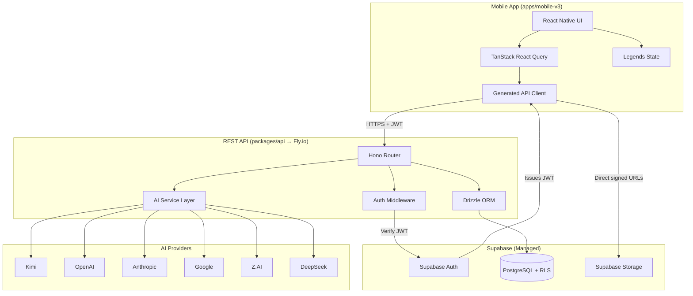

# Mobile v3 + REST API Architecture

> **Status**: Planning document — North-star reference for `apps/mobile-v3` and `packages/api`.
>
> **Last updated**: 2026-05-10

## System Architecture Overview

### High-Level Component Diagram

### Responsibility Split

| Component | Responsibilities | What Stays with Supabase |
|-----------|-----------------|-------------------------|
| **Supabase Auth** | JWT issuance, phone OTP, session management | ✅ All auth flows |
| **Supabase Storage** | File storage, signed URLs | ✅ All file storage |
| **Supabase Postgres** | Data persistence, RLS enforcement | ✅ Database hosting |
| **Hono API** | Business logic, validation, AI orchestration, rate limiting | N/A |
| **Mobile App** | UI, local state, caching, offline queue | N/A |

## Section Index

| # | Section | File | Description |
|---|---------|------|-------------|
| 2 | API Design | [arch-api-design.md](./arch-api-design.md) | Endpoints, auth model, error format, pagination, rate limiting, OpenAPI strategy |
| 3 | Mobile Architecture | [arch-mobile.md](./arch-mobile.md) | Directory structure, navigation, state management, component patterns, upload queue, audio |
| 4 | Shared Packages | [arch-shared-packages.md](./arch-shared-packages.md) | report-core, api-contract, shared constants |
| 5 | Data Layer Design | [arch-data-layer.md](./arch-data-layer.md) | Generated API client, React Query hooks, optimistic updates, error handling, cache invalidation |
| 6 | File & Line Count Reduction | [arch-reduction.md](./arch-reduction.md) | Current vs target file counts, specific reduction techniques |
| 7 | Testing Architecture | [arch-testing.md](./arch-testing.md) | Test pyramid, distribution, mock strategy, Maestro E2E |
| 8 | Migration Path | [arch-migration.md](./arch-migration.md) | Parallel development, EAS builds, feature flags, migration checklist, appendices |
