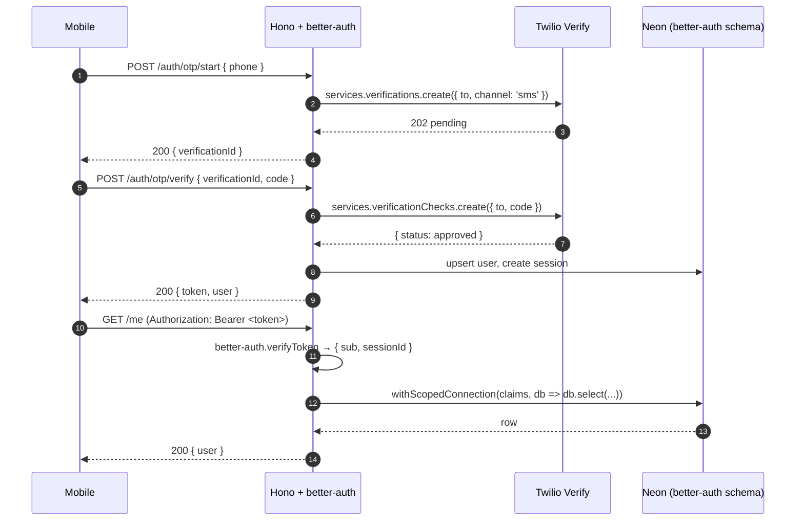

# Auth + per-request DB scope (RLS replacement)

> Resolves [Pitfall 5](pitfalls.md#pitfall-5--auth-glue-done-late-env-handling-brittle)
> and [Pitfall 6](pitfalls.md#pitfall-6--per-request-db-scope-rls-replacement-added-late).

## Why this is its own doc

We're moving off Supabase entirely, which means losing two things at
once:

1. **Supabase Auth** — JWT issuance, OTP, session management.
2. **Postgres RLS as the last line of defence** — Supabase's
   PostgREST forwards a per-request JWT into PG via `set_config`,
   so RLS policies see the actual user. With a Hono API connecting
   as a service role, RLS would be bypassed entirely.

Replacements:

1. **better-auth** in the Hono API issues JWTs and runs the OTP
   flow (delegating SMS to Twilio Verify).
2. **`withScopedConnection`** wraps every authenticated DB call,
   acquires a connection from a per-request pool, and runs
   `SET LOCAL role = '<scoped_role>'` and
   `SET LOCAL app.user_id = '<jwt sub>'` so PG sees the user. RLS
   policies use `current_setting('app.user_id')`.

## Auth flow



### Why Twilio (not Supabase Auth, not in-house SMS)

- Free tier covers dev.
- Verify is a managed OTP service — no need to roll our own
  rate-limiting / lockout / replay protection.
- Has a sandbox mode (`TWILIO_VERIFY_FAKE_CODE=000000`) that we
  use in tests + `:mock` builds. Real SMS is gated behind
  `TWILIO_LIVE=1`.

## better-auth integration

- Mounted at `/auth/*` inside Hono via `betterAuth().handler`.
- Schema lives in `packages/api/src/db/schema/auth.ts` (users,
  sessions, accounts, verification tokens) — managed by Drizzle, NOT
  by better-auth's CLI. We pin the schema and add migrations
  manually so it's diffable.
- Session model: opaque session IDs in the DB; the issued JWT
  carries `sub` (user id) and `sid` (session id). Server validates
  `sid` against the DB on each request via the auth middleware.
- Token TTL: 7 days. Refresh on activity (last 24 h). Logout =
  delete session row.

## Per-request DB scope (RLS replacement)

### Postgres setup (in `packages/api/migrations/0001_scope.sql`)

```sql
-- Application role with no table grants by default.
CREATE ROLE app_authenticated NOLOGIN;
GRANT app_authenticated TO app_api; -- the Fly.io connection role

-- Set-and-forget: every authed connection runs SET LOCAL role.
-- Tables grant USAGE/SELECT/INSERT/UPDATE/DELETE to app_authenticated.
GRANT USAGE ON SCHEMA app TO app_authenticated;
GRANT SELECT, INSERT, UPDATE, DELETE ON ALL TABLES IN SCHEMA app
  TO app_authenticated;

-- RLS policies use the per-request user id.
ALTER TABLE app.projects ENABLE ROW LEVEL SECURITY;
CREATE POLICY projects_member_read ON app.projects
  FOR SELECT TO app_authenticated
  USING (id IN (
    SELECT project_id FROM app.project_members
    WHERE user_id = current_setting('app.user_id')::uuid
  ));
-- … and so on per table.
```

### `withScopedConnection` (in `packages/api/src/db/scope.ts`)

```ts
export async function withScopedConnection<T>(
  claims: { sub: string; sid: string },
  fn: (tx: NodePgDatabase) => Promise<T>,
): Promise<T> {
  const conn = await pool.connect();
  try {
    await conn.query('BEGIN');
    await conn.query(`SET LOCAL role = 'app_authenticated'`);
    await conn.query(`SET LOCAL app.user_id = '${escapeUuid(claims.sub)}'`);
    await conn.query(`SET LOCAL app.session_id = '${escapeUuid(claims.sid)}'`);
    const result = await fn(drizzle(conn, { schema }));
    await conn.query('COMMIT');
    return result;
  } catch (err) {
    await conn.query('ROLLBACK');
    throw err;
  } finally {
    conn.release();
  }
}
```

### Auth middleware (in `packages/api/src/middleware/auth.ts`)

```ts
export const authMiddleware = createMiddleware(async (c, next) => {
  const token = c.req.header('authorization')?.replace('Bearer ', '');
  if (!token) throw new HTTPException(401);
  const claims = await betterAuth.verifyToken(token); // throws on invalid
  c.set('claims', claims);
  c.set('db', (fn) => withScopedConnection(claims, fn));
  await next();
});
```

Route handlers use `c.get('db')(fn)` — the raw `db` import is
ESLint-banned in the routes layer.

## Lint guards

- `no-restricted-imports` for `@/db/client` outside
  `packages/api/src/db/` — forces use of the scoped accessor.
- `no-restricted-syntax` for `.set('role'` outside the scope module.
- `no-restricted-syntax` for `setTimeout` inside `apps/mobile/app/(auth)/`.

## Test gates (per Pitfall 1 + 6)

For each authed route, the integration suite ships **two paired tests**:

```ts
test('actor A reads their own project', async () => { /* expect 200 */ });
test('actor A cannot read actor B project', async () => { /* expect 404 */ });
```

There is also a **negative-control** test per resource that runs the
same query *without* the scope wrapper and asserts it returns the
other actor's row — proving the scope wrapper is the thing
protecting it. These live in `packages/api/src/__tests__/scope/`.

CI fails if any new authed route lacks both tests
(grep gate: `scripts/check-scope-tests.sh`).

## Env vars

| Var | Where | Purpose |
|---|---|---|
| `BETTER_AUTH_SECRET` | API | JWT signing key |
| `BETTER_AUTH_URL` | API | issuer / audience |
| `TWILIO_ACCOUNT_SID` | API | Twilio API |
| `TWILIO_AUTH_TOKEN` | API | Twilio API |
| `TWILIO_VERIFY_SID` | API | Verify service |
| `TWILIO_LIVE` | API | `1` to allow real SMS in this env |
| `TWILIO_VERIFY_FAKE_CODE` | API tests / `:mock` | Bypass code |
| `DATABASE_URL` | API | Neon connection (pooled) |
| `EXPO_PUBLIC_API_URL` | Mobile | API base URL (validated by `lib/env.ts`) |

`apps/mobile/lib/env.ts` is the only place that reads
`EXPO_PUBLIC_*` — see [Pitfall 5](pitfalls.md#pitfall-5--auth-glue-done-late-env-handling-brittle).
