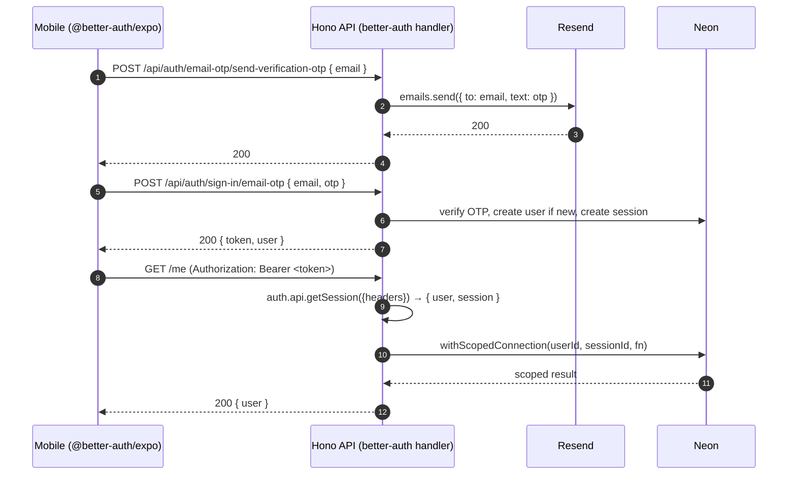

# Auth + per-request DB scope

> Resolves [Pitfall 5](pitfalls.md#pitfall-5--auth-glue-done-late-env-handling-brittle)
> and [Pitfall 6](pitfalls.md#pitfall-6--per-request-db-scope-rls-replacement-added-late).

## Overview

Mobile application auth is handled by
**[better-auth](https://www.better-auth.com)** running inside the Hono API.
The library manages session issuance, email-OTP sign-in, and (in future
specs) SIWA + Google Sign-In. It writes into four `public.*` tables
(`user`, `session`, `account`, `verification`) using a Drizzle adapter.

The browser admin console deliberately does not use Better Auth. Its
explicitly provisioned identities and revocable sessions live in the
independent `harpa-pro-admin` Neon project, reached through
`ADMIN_DATABASE_URL`. An app user or session never grants access to the
business-activity console.

Separately, every authenticated DB call goes through
**`withScopedConnection`**, which sets a per-request Postgres role and
`app.user_id` GUC so RLS policies on `app.*` tables see the correct
user. These two concerns are independent: better-auth owns the session
lifecycle; `withScopedConnection` owns query isolation.

Admin authentication is a third, isolated concern. `withAdminSession`
validates the dedicated browser cookie against the admin database before
`GET /admin/activity` reads the application database. The two databases have
no joins or cross-database foreign keys.

## Auth flow


```mermaid
sequenceDiagram
  autonumber
  participant App as Mobile (@better-auth/expo)
  participant API as Hono API (better-auth handler)
  participant R as Resend
  participant DB as Neon

  App->>API: POST /api/auth/email-otp/send-verification-otp { email }
  API->>R: emails.send({ to: email, text: otp })
  R-->>API: 200
  API-->>App: 200

  App->>API: POST /api/auth/sign-in/email-otp { email, otp }
  API->>DB: verify OTP, create user if new, create session
  API-->>App: 200 { token, user }

  App->>API: GET /me  (Authorization: Bearer <token>)
  API->>API: auth.api.getSession({headers}) → { user, session }
  API->>DB: withScopedConnection(userId, sessionId, fn)
  DB-->>API: scoped result
  API-->>App: 200 { user }
```

## better-auth server config

Location: `packages/api/src/auth/auth.ts`

Key decisions (full rationale in the design spec):

- **Drizzle adapter** (`@better-auth/drizzle-adapter`) pointed at a
  CLI-generated schema (`packages/api/src/db/auth-schema.ts`). The
  adapter uses the **unscoped** connection pool (`rawDb()`) — not
  `withScopedConnection` — because it needs to read sessions before it
  knows which user to scope to.
- **`expo()` plugin** (`@better-auth/expo`) manages bearer-token
  storage and `trustedOrigins` for the Expo client. Admin browser origins are
  intentionally absent. No separate `bearer` plugin is needed.
- **`emailOTP` plugin** — Resend as transport, 6-digit code, 10-minute
  expiry, 5 allowed attempts. `disableSignUp: false` — the first
  verified email creates the user automatically.
- **Demo account access** — public demo emails (`demo@harpapro.com`,
  `demo2@harpapro.com`, `demo3@harpapro.com`) use better-auth's
  email/password endpoint with exact server-side allowlist checks.
  Normal users stay on email-OTP, and the email-OTP route keeps its
  standard six-digit behavior.
- **`emailAndPassword`** — `enabled: true`, `disableSignUp: true`.
  Only for test-account smoke tests and demo accounts; a `before` hook
  401s any email not in the union of `TEST_ACCOUNT_EMAILS` and
  `DEMO_ACCOUNT_EMAILS`. We keep `TEST_ACCOUNT_EMAILS` set on
  production too so smoke tests run against the live deploy; emails not
  on the allowlist always fail before the hash compare.
- **`advanced.database.generateId({model})`** — mints `usr_…` /
  `ses_…` / `vrf_…` / `idn_…` slugs for each better-auth table via
  `newId()`. IDs are stored as bare `text`; slug format is enforced at
  write time, not by a DB domain.

## Admin console authentication

The dedicated browser-admin design is specified in
[design-separate-admin-auth.md](design-separate-admin-auth.md).

### Identity and password boundary

- The Neon project is `harpa-pro-admin`; `main` serves production and the
  long-lived `dev` branch serves development.
- `ADMIN_DATABASE_URL` points at database `harpa_admin`. In every
  environment it must not identify the same Postgres endpoint as
  `DATABASE_URL`.
- `admin.identities` accepts only lowercase, explicitly provisioned
  `@harpapro.com` addresses. There is no signup endpoint.
- Passwords are 20–128 characters; operators should generate at least 32
  random characters and store them in a password manager.
- The database stores only versioned, salted scrypt hashes. Provisioning
  reads the password from standard input:

  ```sh
  read -rs HARPA_ADMIN_PASSWORD
  printf '%s' "$HARPA_ADMIN_PASSWORD" | \
    pnpm --filter @harpa/api admin:set-password \
    --email person@harpapro.com --password-stdin
  unset HARPA_ADMIN_PASSWORD
  ```

The password is not a Doppler or Fly secret. The database connection string
is. `ADMIN_DATABASE_URL` must already select the intended migrated branch.
Deployments never auto-seed a real administrator; provisioning is an explicit
operator mutation after the admin migration succeeds. The provisioning CLI
checks both endpoint identity and the absence of the application
`app._migrations` ledger before it hashes or writes the password.

### Session boundary

`POST /admin/auth/login` verifies the dedicated identity and stores a
SHA-256 hash of a random 256-bit session token in `admin.sessions`.
`GET /admin/auth/session` validates it, and
`POST /admin/auth/logout` revokes it. Password reset revokes all sessions for
that identity.

The production browser receives a host-only,
`HttpOnly; Secure; Path=/; SameSite=Strict` cookie named
`__Host-harpa_admin_session`. Local HTTP uses an unprefixed non-secure cookie.
The stable cross-site development origin uses
`SameSite=None; Secure; Partitioned`. No password or raw session token enters
browser storage, URLs, application logs, or the application database.

`withAdminSession()` is the sole authorization middleware for
`GET /admin/activity`. It does not inspect `public."user".is_admin` and
rejects Better Auth bearer tokens and cookies. Existing programmatic admin
routes retain their app-admin authorization until their app-user audit
foreign keys receive a separate design and migration.

## Drizzle schema (CLI-generated)

`packages/api/src/db/auth-schema.ts` is produced by:

```bash
pnpm --filter @harpa/api auth:schema:generate
```

Re-run whenever a better-auth plugin is added or removed. Commit the
output. CI re-runs the generator and verifies no diff (`git diff
--exit-code`). Do not edit by hand — declare `additionalFields` in
`auth.ts` and let the CLI pick them up.

The API and mobile manifests pin `better-auth`, `@better-auth/expo`, and the
official `auth` CLI to the same exact stable release. Upgrade all of them
together. Version ranges or the retired `@better-auth/cli` package can let
pnpm satisfy the Expo plugin with an older `@better-auth/core`, even when the
top-level runtime package looks current.

The mobile workspace pins Zod 4 because Better Auth's client and Expo plugin
declarations use Zod 4 through `better-call`. The shared API contract retains
its own Zod 3 dependency. `apps/mobile/lib/auth/client.ts` also normalises the
Expo plugin's generated `BetterFetch` generic signature at the plugin boundary;
the adapter changes types only and preserves Expo's `getCookie` action.

The file is imported by the Drizzle adapter and by the migration
numbering tool; it is **not** imported directly by route handlers or
the scope layer.

## Public schema layout

Better-auth tables live in `public` (Postgres default schema):

| Table                 | Owner       | Notes                                          |
| --------------------- | ----------- | ---------------------------------------------- |
| `public.user`         | better-auth | `id text` (slug: `usr_…`)                      |
| `public.session`      | better-auth | `id text` (slug: `ses_…`)                      |
| `public.account`      | better-auth | `id text` (slug: `idn_…`), used by SIWA/Google |
| `public.verification` | better-auth | `id text` (slug: `vrf_…`), OTP store           |
| `app.*`               | application | RLS enforced, `app.usr_id` domain on FK cols   |

**No RLS on `public.session`, `public.account`, or `public.verification`.**
The better-auth adapter queries these with the unscoped pool; RLS
would block its own session lookups.

**`public.user` does have an RLS policy** — see migration snippet
below. Better-auth's adapter bypasses RLS by setting the unscoped
role explicitly, but `app_authenticated` queries (i.e. anything that
reaches `public.user` from a route handler through
`withScopedConnection`) are restricted to the calling user's row.
This means accidental `db.select().from(user)` in route code returns
at most one row instead of leaking the whole user table.

Defence-in-depth controls for these tables:

1. App code never imports `db/auth-schema.ts` directly — `no-restricted-
imports` ESLint rule enforced.
2. `/me` reads the user from `auth.api.getSession()` (returns the user
   alongside the session), not from a raw `db.select()` call.
3. The `public.user` RLS policy described above is the last-line
   defence if (1) and (2) are bypassed.

## Per-request DB scope

### Postgres setup

```sql
-- Application role (no login, no table grants by default).
CREATE ROLE app_authenticated NOLOGIN;
GRANT app_authenticated TO app_api;

GRANT USAGE ON SCHEMA app TO app_authenticated;
GRANT SELECT, INSERT, UPDATE, DELETE ON ALL TABLES IN SCHEMA app
  TO app_authenticated;

-- public.user gets RLS to limit app_authenticated reads to the
-- caller's own row. Better-auth's adapter uses the unscoped role
-- and bypasses these policies (BYPASSRLS not granted to that role).
GRANT SELECT ON public.user TO app_authenticated;
GRANT UPDATE (display_name, company_name, updated_at) ON public.user
  TO app_authenticated;
ALTER TABLE public.user ENABLE ROW LEVEL SECURITY;
CREATE POLICY user_self_read ON public.user
  FOR SELECT TO app_authenticated
  USING (id = current_setting('app.user_id'));
CREATE POLICY user_self_update ON public.user
  FOR UPDATE TO app_authenticated
  USING      (id = current_setting('app.user_id'))
  WITH CHECK (id = current_setting('app.user_id'));

-- RLS policies on app.* tables read the per-request GUC.
ALTER TABLE app.projects ENABLE ROW LEVEL SECURITY;
CREATE POLICY projects_member_read ON app.projects
  FOR SELECT TO app_authenticated
  USING (id IN (
    SELECT project_id FROM app.project_members
    WHERE user_id = current_setting('app.user_id')::app.usr_id
  ));
-- … and so on per table.
```

### `withScopedConnection` (`packages/api/src/db/scope.ts`)

```ts
export async function withScopedConnection<T>(
  claims: { sub: string; sid: string },
  fn: (tx: NodePgDatabase) => Promise<T>,
): Promise<T> {
  const conn = await pool.connect();
  try {
    await conn.query('BEGIN');
    await conn.query(`SET LOCAL role app_authenticated`);
    await conn.query(`SET LOCAL app.user_id = '${assertId('usr', claims.sub)}'`);
    await conn.query(`SET LOCAL app.session_id = '${assertId('ses', claims.sid)}'`);
    const result = await fn(drizzle(conn, { schema }));
    await conn.query('COMMIT');
    return result;
  } catch (err) {
    await conn.query('ROLLBACK');
    throw err;
  } finally {
    conn.release();
  }
}
```

### Auth middleware (`packages/api/src/middleware/auth.ts`)

```ts
export function withAuth(): MiddlewareHandler<AppEnv> {
  return async (c, next) => {
    const session = await auth.api.getSession({ headers: c.req.raw.headers });
    if (!session?.user || !session?.session) {
      throw new HTTPException(401, { message: 'Unauthorized.' });
    }
    c.set('userId', session.user.id);
    c.set('sessionId', session.session.id);
    c.set('user', session.user);
    c.set('db', (fn) =>
      withScopedConnection({ sub: session.user.id, sid: session.session.id }, fn),
    );
    await next();
  };
}
```

Route handlers use `c.get('db')(fn)`. The raw `db` import is ESLint-
banned in the routes layer.

## Files: project-inherited RLS

`app.files` allows project members (not just the owner) to SELECT
and UPDATE attached files. Migration `0011_files_project_scope.sql`
defines four discriminated policies:

| Policy                | Action | Rule                                        |
| --------------------- | ------ | ------------------------------------------- |
| `files_member_read`   | SELECT | owner OR `app.is_member(project_id)`        |
| `files_owner_insert`  | INSERT | `owner_id = current_setting('app.user_id')` |
| `files_member_write`  | UPDATE | owner OR `app.is_member(project_id)`        |
| `files_member_delete` | DELETE | owner OR `app.is_member(project_id)`        |

Personal-scoped files (`project_id IS NULL`) collapse to owner-only
because the membership branch short-circuits to false.

See [`arch-storage.md` §Security](arch-storage.md#security) and
[`docs/bugs/README.md` R8](../bugs/README.md#bugs).

## Lint guards

- `no-restricted-imports` for `@/db/client` outside `packages/api/src/db/`.
- `no-restricted-imports` for `@/db/auth-schema` outside
  `packages/api/src/auth/auth.ts`.
- `no-restricted-syntax` for `.set('role'` outside the scope module.
- `no-restricted-syntax` for `setTimeout` inside `apps/mobile/app/(auth)/`.

## Test gates

For each authed route the integration suite ships **two paired tests**:

```ts
test('actor A reads their own project', async () => {
  /* expect 200 */
});
test('actor A cannot read actor B project', async () => {
  /* expect 404 */
});
```

Plus a **negative-control** test per resource that runs the same query
without the scope wrapper and asserts it returns the other actor's row —
proving the wrapper is what protects it. Lives in
`packages/api/src/__tests__/scope/`. CI enforces coverage via
`scripts/check-scope-tests.sh`.

Auth-specific test requirements (Pitfall 13 — test the **default
wiring**, not a DI stub):

- Email-OTP integration test runs against the **default**
  `betterAuth({...})` instance with `EMAIL_OTP_LIVE=1`. The real
  `sendVerificationOTP` callback executes and calls Resend; `nock` (or
  equivalent) intercepts the outbound HTTPS request and asserts the
  payload. The `sendVerificationOTP` function is **not** swapped out
  via DI — that would test a stub, not the wiring.
- Test-account password tests exercise the real better-auth password
  compare and real DB lookup — no DI stubs on the hot path.

## Test-account password bypass

For **live-deployment smoke tests** we need a way to log in without
waiting on email OTP delivery.

**Mechanism:** better-auth's `emailAndPassword` plugin with
`disableSignUp: true` and a `before` hook that 401s any email not in
`TEST_ACCOUNT_EMAILS`. The test accounts are seeded at deploy time by
`packages/api/scripts/seed-test-account.ts`.

Journey scripts authenticate via:

```bash
curl -X POST "$API/api/auth/sign-in/email" \
  -H 'Content-Type: application/json' \
  -d '{"email":"test@harpapro.com","password":"…"}'
```

Then use the returned `token` as `Authorization: Bearer …`.

Env vars (Doppler `dev` and `prd`):

| Var                     | Purpose                                                                                            |
| ----------------------- | -------------------------------------------------------------------------------------------------- |
| `TEST_ACCOUNT_EMAILS`   | Comma-separated allowlist. Use `test@harpapro.com`, `test2@harpapro.com`, and `test3@harpapro.com` |
| `TEST_ACCOUNT_PASSWORD` | Shared password, min 16 chars                                                                      |

Env-Zod enforces both-or-neither. `TEST_ACCOUNT_EMAILS` is set in
both `dev` and `prd` so smoke-test logins keep working on live
deployments; the before-hook still rejects any email not on the
allowlist. The deploy seed is credential-level idempotent: if an
allowlisted user already exists, it creates or refreshes that user's
`credential` account password instead of assuming the user is ready.

## Demo account access

Demo users, including App Store reviewers, use the normal email screen.
When the email is one of `demo@harpapro.com`, `demo2@harpapro.com`, or
`demo3@harpapro.com`, mobile skips requesting an OTP and the next screen
accepts a password instead. There is no visible demo or reviewer-only
button in the mobile app.

The production API may set:

| Var                     | Purpose                                                                                                              |
| ----------------------- | -------------------------------------------------------------------------------------------------------------------- |
| `DEMO_ACCOUNT_EMAILS`   | Comma-separated exact demo emails. Supported values: `demo@harpapro.com`, `demo2@harpapro.com`, `demo3@harpapro.com` |
| `DEMO_ACCOUNT_PASSWORD` | Server-only demo password, min 16 chars                                                                              |

`DEMO_ACCOUNT_EMAILS` and `DEMO_ACCOUNT_PASSWORD` must be set together.
The demo emails are not secrets; the strong password is the secret.
The password is never bundled into mobile code and should not be committed.

`packages/api/src/auth/auth.ts` keeps `emailAndPassword.disableSignUp`
enabled and uses a before-hook to reject every password sign-in email
except the union of `TEST_ACCOUNT_EMAILS` and `DEMO_ACCOUNT_EMAILS`.
The deploy seed script (`packages/api/scripts/seed-test-account.ts`)
creates or refreshes credential accounts for both groups. Successful
demo password sign-in creates a normal better-auth session, so all
authenticated API routes behave the same as they do for a regular user.

Normal users still receive and enter six-digit email OTPs. The demo
password path does not change the email-OTP route; if that route is
called directly, better-auth still generates standard six-digit OTPs.
Demo password attempts are logged with `{email, outcome}` and never log
the password.

There is currently no production demo-data seeding script. Before
submitting to App Review, create or prepare data under the stable
demo account manually, or extend the seed script in the same PR that
introduces that data contract.

## Env vars

| Var                              | Where     | Purpose                                                                              |
| -------------------------------- | --------- | ------------------------------------------------------------------------------------ |
| `BETTER_AUTH_SECRET`             | API       | Session signing key; production requires an explicit value of at least 32 characters |
| `BETTER_AUTH_URL`                | API       | Base URL for better-auth handler                                                     |
| `ADMIN_CORS_ORIGINS`             | API       | Exact browser origins trusted only for credentialed `/admin/*` requests              |
| `ADMIN_DATABASE_URL`             | API       | Direct Neon connection to the independent `harpa_admin` database                     |
| `ADMIN_MIGRATIONS_REQUIRED_HEAD` | API image | Admin migration filename expected by `/admin/readyz`                                 |
| `RESEND_API_KEY`                 | API       | Resend transport for OTP emails                                                      |
| `EMAIL_OTP_LIVE`                 | API       | `1` = real Resend send; `0` = redacted delivery diagnostics only (dev/test)          |
| `TEST_ACCOUNT_EMAILS`            | API       | Password-bypass allowlist (set in dev + prd)                                         |
| `TEST_ACCOUNT_PASSWORD`          | API       | Shared smoke-test password (set in dev + prd)                                        |
| `DEMO_ACCOUNT_EMAILS`            | API       | Comma-separated exact demo account emails                                            |
| `DEMO_ACCOUNT_PASSWORD`          | API       | Server-only demo password                                                            |
| `DATABASE_URL`                   | API       | Application Neon connection (pooled)                                                 |
| `EXPO_PUBLIC_API_URL`            | Mobile    | API base URL (validated by `lib/env.ts`)                                             |

## App session lifecycle

- **`expiresIn`: 7 days** — total session lifetime. After this point,
  `auth.api.getSession()` returns null and `withAuth` throws 401,
  forcing the user to sign in again.
- **`updateAge`: 1 day** — better-auth bumps `session.expires_at`
  forward at most once per 24 hours of activity. A user using the app
  daily holds a rolling 7-day session; a user idle for 7+ days is
  signed out.
- **Sign-out** (`POST /api/auth/sign-out`) deletes the session row;
  the bearer token cannot be reused after.
- **`@better-auth/expo` client** persists the bearer token in
  `expo-secure-store` (encrypted at rest on iOS/Android). The session
  survives app restarts; force-quitting does not log the user out.

## Admin session lifecycle

- **Absolute expiry: 12 hours.** The server will not extend it.
- **Idle expiry: 2 hours.** Valid activity advances the idle deadline only
  inside the fixed absolute window.
- **Logout:** revokes the matching `admin.sessions` row before clearing the
  browser cookie.
- **Password reset:** revokes every session for the identity.
- **Database restore:** an admin-database restore can change credential and
  session state without rolling back application data. An application
  database restore cannot restore or revoke admin sessions.

## Account deletion

Mobile exposes account deletion from Account Details, satisfying App
Store guideline 5.1.1(v)'s requirement that users can initiate
whole-account deletion in-app. The API surface lives under `/me`:

- `GET /me/deletion-preview` returns the signed-in user's email plus
  the projects that will be deleted, transferred, or left, and the
  count of file rows owned by the account.
- `DELETE /me` deletes the current account and returns `204`.

Both routes use `withAuth()` and the scoped `c.get('db')(fn)` accessor.
The destructive route calls the SECURITY DEFINER helper
`app.delete_current_user()`. It reads `current_setting('app.user_id')`,
locks the account/project/membership/file/lease rows, creates durable R2
delete jobs, and performs the database deletion in the same transaction
as the request scope.

Deletion removes the better-auth `public."user"` row. That cascades
`public."session"`, `public."account"`, `app.user_settings`,
`app.user_limit_overrides` where the deleted user is the subject, and
file rows with existing FKs. The helper also deletes the user's
`app.llm_usage_events` rows and email-OTP verification rows. Since all
session rows are gone, the bearer token used for the deletion call
authenticates as 401 on the next request.

Account deletion cannot delete or alter an administrator identity. Admin
identities have no app-user foreign key and live in a different Neon project.
Disabling an administrator or changing an admin password is a separate
operator action.

Business activity rows are retained, but a privileged database trigger
nulls any matching `actor_user_id` and user `subject_id` before the user
row is deleted. It also replaces a signup's user-derived dedupe key with
`redacted:<activity_event_id>`. Event type, timestamp, and non-user
subjects remain for aggregate history without retaining the deleted
account ID.

Project records follow the collaboration rules in
[`arch-project-members.md`](arch-project-members.md#account-deletion).
Solo projects are deleted. Shared projects keep their reports and notes
for remaining members, while the deleted account is removed from
membership and ownership is transferred if needed.

The same transaction persists an immediate and, when live upload leases
exist, delayed cleanup job in `app.storage_delete_jobs`. After commit
the route drains one due job; an always-on Fly worker handles retry and
the final pass after presign expiry. Shared-project prefixes are never
swept. Storage failures remain durable, emit worker logs/Sentry, and do
not change the route's `204` because the account deletion already
committed.

The fast path normally completes immediate cleanup. The worker sleeps until
the next known due job, capped at a ten-minute idle poll, and prunes expired
leases hourly. This permits idle gaps for Neon suspension at the cost of up to
ten minutes of retry latency for a job inserted after sleep begins and up to
one hour of expired-lease cleanup latency.

The initial lease rollout fails account deletion closed with `503`
until all URLs minted by old machines have expired. CI arms the
monotonic grace only after a successful deploy. Preview deployments
enforce leases but leave account deletion disabled because they do not
run the worker. See
[`arch-storage.md`](arch-storage.md#account-deletion-cleanup).

## Maestro password-login wiring

Maestro E2E uses the same `emailAndPassword` better-auth endpoint as
the smoke-test scripts. `.maestro/helpers/sign-in.yaml` deep-links to
the dev-only mobile route `harpa://e2e-password-login` with the test
email and a local broker URL. The broker
(`scripts/dev-e2e-auth-broker.cjs`) reads `TEST_ACCOUNT_PASSWORD` from
the developer shell or `.env.local`, returns it only to the mobile app
process, and never exposes it in Maestro YAML/env logs.

`mo up` starts the broker on `127.0.0.1:8790`; `mo down` stops the
tracked broker process. The API no longer exposes a `/api/dev/last-otp`
route, and normal users still use six-digit email OTPs.

The following are deliberately not covered by the current auth
architecture and have follow-on specs:

1. **Sign in with Apple** — better-auth `apple` provider; iOS-only
   button; required for App Store on apps that offer third-party
   sign-in.
2. **Google Sign-In** — same provider pattern as Apple.
3. **Phone-OTP reinstatement** — better-auth has a phone plugin if a
   user segment ever needs SMS sign-in.
