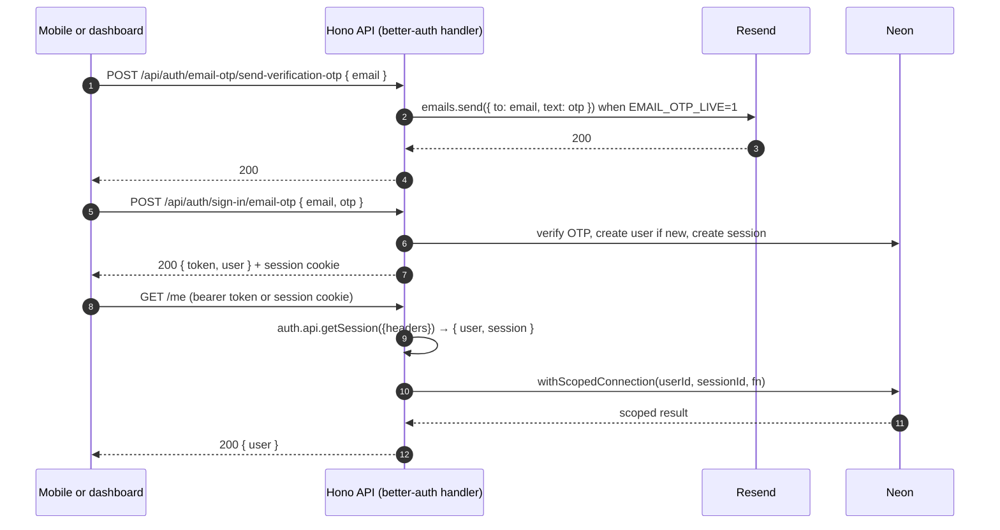

# Auth + per-request DB scope

> Resolves [Pitfall 5](pitfalls.md#pitfall-5--auth-glue-done-late-env-handling-brittle)
> and [Pitfall 6](pitfalls.md#pitfall-6--per-request-db-scope-rls-replacement-added-late).

The Fly inventory and Harpa-recorded AI usage additions below are unmerged
draft stacks.

## Overview

Mobile application and office-dashboard auth is handled by
**[better-auth](https://www.better-auth.com)** running inside the Hono API.
The library manages session issuance, email-OTP sign-in, and (in future
specs) SIWA + Google Sign-In. Mobile sends a bearer session token, while
the dashboard sends the Better Auth session cookie. Better Auth writes
into four `public.*` tables (`user`, `session`, `account`,
`verification`) using a Drizzle adapter.

The browser admin console deliberately does not use Better Auth. Its
explicitly provisioned identities and revocable sessions live in the
independent `harpa-pro-admin` Neon project, reached through
`ADMIN_DATABASE_URL`. An app user or session never grants access to the
browser-admin console.

Separately, every authenticated DB call goes through
**`withScopedConnection`**, which sets a per-request Postgres role and
`app.user_id` GUC so RLS policies on `app.*` tables see the correct
user. These two concerns are independent: better-auth owns the session
lifecycle; `withScopedConnection` owns query isolation.

Admin authentication is a third, isolated concern. `withAdminSession`
validates the dedicated browser cookie against the admin database before a
browser-admin data route runs. `GET /admin/activity` then reads the application
database. `GET /admin/operations/neon` requests bounded provider metadata. The
`GET /admin/operations/neon-usage` route requests bounded Neon Free-plan usage.
The `GET /admin/operations/r2-capacity` route requests bounded R2 measurements.
The draft `GET /admin/operations/sentry` route requests bounded Sentry
issue-group and mobile-session aggregates. The draft
`GET /admin/operations/fly-inventory` route requests bounded Fly inventory.
The draft `GET /admin/operations/ai-usage` route reads one bounded aggregate
from the application usage ledger without a provider request.
`GET /admin/operations/storage-lifecycle` reads bounded lifecycle state from
the application database. The
manual `POST /admin/operations/report-generate` can authenticate one fixed
synthetic application user and exercise the real report routes in live mode.
The two
databases have no joins or cross-database foreign keys.

## Auth flow


```mermaid
sequenceDiagram
  autonumber
  participant App as Mobile or dashboard
  participant API as Hono API (better-auth handler)
  participant R as Resend
  participant DB as Neon

  App->>API: POST /api/auth/email-otp/send-verification-otp { email }
  API->>R: emails.send({ to: email, text: otp }) when EMAIL_OTP_LIVE=1
  R-->>API: 200
  API-->>App: 200

  App->>API: POST /api/auth/sign-in/email-otp { email, otp }
  API->>DB: verify OTP, create user if new, create session
  API-->>App: 200 { token, user } + session cookie

  App->>API: GET /me (bearer token or session cookie)
  API->>API: auth.api.getSession({headers}) → { user, session }
  API->>DB: withScopedConnection(userId, sessionId, fn)
  DB-->>API: scoped result
  API-->>App: 200 { user }
```

Mobile stores the bearer token in SecureStore through
`@better-auth/expo`. The dashboard browser keeps the session in the
better-auth `HttpOnly` cookie. Dashboard API requests include credentials.
The dashboard does not copy the token into browser storage.

## better-auth server config

Location: `packages/api/src/auth/auth.ts`

Key decisions (full rationale in the design spec):

- **Drizzle adapter** (`@better-auth/drizzle-adapter`) pointed at a
  CLI-generated schema (`packages/api/src/db/auth-schema.ts`). The
  adapter uses the **unscoped** connection pool (`rawDb()`) — not
  `withScopedConnection` — because it needs to read sessions before it
  knows which user to scope to. The lazy database proxy returns `undefined`
  for Drizzle's `_` metadata probe because the adapter receives the auth
  schema explicitly and relational joins are disabled. Adapter construction
  and module import must not initialize the database.
- **`expo()` plugin** (`@better-auth/expo`) supports Expo origins and
  mobile session storage.
- **`bearer()` plugin** accepts the mobile session token and the
  password-login smoke-test token. It returns the `set-auth-token` header
  used by mobile and smoke-test clients. The dashboard uses the standard
  better-auth browser cookie instead.
- **`trustedOrigins`** contains the mobile schemes and every parsed
  `DASHBOARD_CORS_ORIGINS` entry. This includes the production dashboard,
  Cloudflare Pages previews, and local dashboard development.
- **`advanced.defaultCookieAttributes`** derives browser cookie settings
  from `BETTER_AUTH_URL`. HTTPS uses `HttpOnly`, `Secure`,
  `SameSite=None`, and `Partitioned`. Local HTTP development uses
  `HttpOnly`, `SameSite=Lax`, and no `Secure` flag.
- Admin browser origins are intentionally absent from Better Auth
  `trustedOrigins`; admin authentication uses its isolated session system.
- **`emailOTP` plugin** — Resend as transport, 6-digit code, 10-minute
  expiry, 5 allowed attempts. `disableSignUp: false` — the first
  verified email creates the user automatically.
- **Demo account access** — public demo emails (`demo@harpapro.com`,
  `demo2@harpapro.com`, `demo3@harpapro.com`) use better-auth's
  email/password endpoint with exact server-side allowlist checks.
  Normal users stay on email-OTP, and the email-OTP route keeps its
  standard six-digit behavior.
- **`emailAndPassword`** — `enabled: true`, `disableSignUp: true`.
  Only for test-account smoke tests and demo accounts; a `before` hook
  401s any email not in the union of `TEST_ACCOUNT_EMAILS` and
  `DEMO_ACCOUNT_EMAILS`. The deployment design supplies test accounts in
  production so live smoke tests can sign in. Emails outside the configured
  allowlist fail before the hash compare.
- **`advanced.database.generateId({model})`** — mints `usr_…` /
  `ses_…` / `vrf_…` / `idn_…` slugs for each better-auth table via
  `newId()`. IDs are stored as bare `text`; slug format is enforced at
  write time, not by a DB domain.

## Admin console authentication

The dedicated browser-admin design is specified in
[design-separate-admin-auth.md](design-separate-admin-auth.md).

### Identity and password boundary

- Repository workflows target the independent `harpa-pro-admin` Neon
  project. They map `main` to production and the long-lived `dev` branch to
  development. The current provider-side project, branch, and restore state
  is **UNKNOWN** until it is verified through Neon.
- `ADMIN_DATABASE_URL` points at database `harpa_admin`. In every
  environment it must not identify the same Postgres endpoint as
  `DATABASE_URL`.
- `admin.identities` accepts only lowercase, explicitly provisioned
  `@harpapro.com` addresses. There is no signup endpoint.
- Passwords are 20–128 characters; operators should generate at least 32
  random characters and store them in a password manager.
- The database stores only versioned, salted scrypt hashes. Provisioning
  reads the password from standard input:

  ```sh
  read -rs HARPA_ADMIN_PASSWORD
  printf '%s' "$HARPA_ADMIN_PASSWORD" | \
    pnpm --filter @harpa/api admin:set-password \
    --email person@harpapro.com --password-stdin
  unset HARPA_ADMIN_PASSWORD
  ```

The password is not a Doppler or Fly secret. The database connection string
is. `ADMIN_DATABASE_URL` must already select the intended migrated branch.
Deployments never auto-seed a real administrator; provisioning is an explicit
operator mutation after the admin migration succeeds. The provisioning CLI
checks both endpoint identity and the absence of the application
`app._migrations` ledger before it hashes or writes the password.
It selects IPv4 first and disables Node's network-family autoselection inside
this one-off process, avoiding connection stalls on machines whose DNS
advertises IPv6 but whose network has no usable IPv6 route. The deployed API
keeps the runtime default.

### Session boundary

`POST /admin/auth/login` verifies the dedicated identity and stores a
SHA-256 hash of a random 256-bit session token in `admin.sessions`.
`GET /admin/auth/session` validates it, and
`POST /admin/auth/logout` revokes it. Password reset revokes all sessions for
that identity.

The production browser receives a host-only,
`HttpOnly; Secure; Path=/; SameSite=Strict` cookie named
`__Host-harpa_admin_session`. Local HTTP uses an unprefixed non-secure cookie.
The stable cross-site development origin uses
`SameSite=None; Secure; Partitioned`. No password or raw session token enters
browser storage, URLs, application logs, or the application database.

`withAdminSession()` is the sole authorization middleware for browser-admin
data routes. It protects `GET /admin/activity`,
`GET /admin/operations/neon`, `GET /admin/operations/neon-usage`, and
`GET /admin/operations/r2-capacity`. It also protects
`GET /admin/operations/sentry`,
`GET /admin/operations/fly-inventory` and
`GET /admin/operations/storage-lifecycle`. It protects the draft
`GET /admin/operations/ai-usage` route. It is one required gate on
`POST /admin/operations/report-generate`. It does not inspect
`public."user".is_admin` and rejects Better Auth bearer tokens and cookies.
Existing programmatic admin routes retain their app-admin authorization until
their app-user audit foreign keys receive a separate design and migration.

Successful admin login and session lookup also return a session-derived
`csrfToken`. The API computes it as HMAC-SHA256 over the versioned
`harpa-pro:admin-csrf:v1` domain, using the opaque admin session token as the
key. The browser keeps the base64url value in memory and sends it only as
`X-Admin-CSRF` on the report generation live canary. The API compares equal-length
digests in constant time. Rotating, revoking, expiring, or clearing the
HttpOnly session cookie invalidates the CSRF token without another database
column or browser-storage secret.

### Neon observer boundary

The inventory and Free-plan usage routes use one fixed, dedicated Neon
observer. The observer has organization role `Viewer`, or role `Collaborator`
with explicit project-level `Viewer` grants. Every visible project must belong
to `ADMIN_NEON_ORG_ID` and report
`effective_project_permission=VIEWER` before the API requests branch or usage
details. Missing permission evidence or any higher permission fails closed as
`Unknown` and prevents detail calls.

`ADMIN_NEON_VIEWER_API_KEY` and `ADMIN_NEON_ORG_ID` are optional server-only
variables. They must be both set or both absent. Partial configuration fails
environment validation at boot. When both variables are absent, both routes
return a typed `Unknown` result without contacting Neon.

The observer key is a personal key for the dedicated user. It is not the CI
`NEON_API_KEY`, which can manage branches and connection URIs. The observer
variables never enter browser storage, URLs, response bodies, or logs.

`GET /admin/operations/neon-usage` has its own 12-request-per-minute identity
and session budget after the shared trusted-Fly-IP gate and admin-session
lookup. One observation makes at most 22 fixed Neon `GET` requests. It does not
retry, follow project pagination, or use a provider write method. The browser
calls it once after session confirmation and again only on manual **Refresh**.
It does not poll. Across the full stacked operations page, that is 16 fixed GET
reads on load and 32 total after one Refresh.

The Neon percentages use published Free-plan references and are not credit
balances. R2 operation percentages remain estimates, and the public GitHub
percentage describes only the primary REST request budget for the current
browser and IP. Unsupported provider money, token, invoice, and credit values
stay `Unknown`.

### Cloudflare R2 observer boundary

The R2 capacity route uses one fixed Cloudflare account and observer token.
`ADMIN_CLOUDFLARE_ACCOUNT_ID` and
`ADMIN_CLOUDFLARE_R2_OBSERVER_API_TOKEN` are optional server-only variables.
They must be both set or both absent. A partial pair fails environment parsing
at boot. An absent pair returns `Unknown` without a Cloudflare request.

The dedicated token requires `Workers R2 Storage Read` and
`Account Analytics: Read` for the intended account. The analytics permission
has a broader read scope than R2. Use an account scope, a bounded lifetime, and
a reviewed rotation date. Use Client IP filtering when the environment has
stable egress. Record the exception when stable egress is not available.

Do not reuse R2 S3 credentials, Pages tokens, CI tokens, or write tokens. The
route uses fixed Cloudflare origins and fixed read queries. Browser input cannot
select a provider method or resource. The account ID, token, raw errors, and
provider envelopes never enter the response or logs. See
[`design-admin-r2-capacity.md`](design-admin-r2-capacity.md).

### Sentry observer boundary

The draft Sentry route requires the shared trusted-Fly-IP gate before
`withAdminSession()`. A separate 12-request-per-minute bucket uses the admin
identity and session after authentication. Better Auth and the retired
application-admin bit cannot authorize the route. Every response sets
`Cache-Control: private, no-store`.

`ADMIN_SENTRY_ORG_SLUG`, `ADMIN_SENTRY_READ_TOKEN`,
`ADMIN_SENTRY_PROJECT_SLUGS`, `ADMIN_SENTRY_MOBILE_PROJECT_SLUG`, and
`ADMIN_SENTRY_ENVIRONMENT` are one optional server-only set.
`ADMIN_SENTRY_REGION` is optional, defaults to `global`, and accepts only
`global`, `us`, or `de`. The first five values must be absent or present
together. A partial or blank configuration fails API environment parsing. An
absent full set returns `Unknown` without contacting Sentry.

The project list contains one to three unique reviewed projects. The mobile
project must be one of them. The token is one dedicated organization
integration token with only `event:read` and `org:read`. Do not reuse a DSN,
the source-map upload `SENTRY_AUTH_TOKEN`, a personal token, or a token with
write or admin permission.

The route uses only two fixed Sentry `GET` requests under one shared
10-second deadline. The requests run in parallel, never retry, and never
follow pagination. The response exposes only aggregate unresolved error
issue-group counts, bounded mobile-session totals, reviewed caveats, and
bounded unknown reasons. It never returns issue titles, event data, people,
project names, provider diagnostics, raw pagination data, or the token itself.
See [`design-admin-sentry-observer.md`](design-admin-sentry-observer.md).

### Fly observer boundary

The draft Fly inventory route requires the shared trusted-Fly-IP gate before
`withAdminSession()`. A separate 12-request-per-minute bucket uses the admin
identity and session after authentication. Better Auth and the retired
application-admin bit cannot authorize the route.

`ADMIN_FLY_ORG_SLUG`, `ADMIN_FLY_READ_ONLY_API_TOKEN`, and
`ADMIN_FLY_APP_NAMES` are optional server-only variables. All three must be
absent or present together. A partial or blank triplet fails API environment
parsing. An absent triplet returns `Unknown` without contacting Fly.

The app list contains one to ten unique, exact names. The route returns only
configured apps that Fly reports in the configured organization. Provision a
dedicated organization token with `fly tokens create readonly`. The API cannot
infer the token policy from successful `GET` requests, so the operator must
review its organization and read-only scope.

Do not reuse a deploy token, CI token, or `fly auth login` token. The route uses
only fixed `GET` requests to `https://api.machines.dev`. It has no request body,
query, provider selector, write method, or polling path.

The token, raw provider errors, unconfigured app data, and excluded Machine or
Volume fields never enter browser storage, responses, URLs, or logs. The
nullable process group comes only from the reviewed Machine metadata field.
Machine state and process group do not prove Harpa readiness or worker
liveness. Remaining Fly credit stays `Unknown`. See
[`design-admin-fly-inventory.md`](design-admin-fly-inventory.md).

### Storage lifecycle observer boundary

`GET /admin/operations/storage-lifecycle` uses the shared trusted-Fly-IP gate,
the dedicated admin session, and a separate 12-request-per-minute identity and
session budget. Anonymous, Better Auth, and legacy app-admin sessions fail
before any application-database read.

One observation runs exactly one fixed application-database statement under a
five-second deadline. It reads the singleton rollout row, calls the existing
lease-enforcement function, and aggregates durable deletion jobs. The route
accepts no body or query. It makes no mutation or provider call.

The response excludes queue payloads, user IDs, object keys, raw errors, and
Fly machine data. Its rollout and queue values are database evidence only. A
green rollout row or empty queue does not prove current storage worker
liveness. See
[`design-admin-storage-lifecycle-observer.md`](design-admin-storage-lifecycle-observer.md).

### AI usage aggregate boundary

The draft AI usage route requires the shared trusted-Fly-IP gate before
`withAdminSession()`. A separate 12-request-per-minute bucket uses the admin
identity and session after authentication. Better Auth and the retired
application-admin bit cannot authorize the route.

After authentication, an admin service uses the application database pool for
one reviewed cross-user aggregate. The query uses fixed current-month and
previous-24-hour UTC windows. The route layer does not import `rawDb()`. The
admin database proves identity before the application database runs the
aggregate. The two databases do not join.

The response groups only normalized provider category, operation, fixture
mode, and status. It returns no user, project, report, model, prompt,
transcript, raw vendor, provider response, or database error details. `live`
and `record` are provider-attributable. Replay remains separate. The ledger is
best-effort and excludes deleted history. It is not a billing or immutable
audit record.

The route adds no provider credential and makes no OpenAI, Groq, or Kimi
request. Provider balance, quota, free-tier capacity, and remaining credit all
stay `Unknown`. See
[`design-admin-ai-usage.md`](design-admin-ai-usage.md).

### Report generation live canary boundary

`ADMIN_REPORT_LIVE_CANARY_ENABLED` defaults to `0`. A disabled configured
route returns `unknown/not_enabled` without an application request or
application-database query. An absent target returns `unknown/not_configured`.

The parser accepts an enabled canary only when `BETTER_AUTH_URL` is
`https://harpa-pro-api-dev.fly.dev` and `ADMIN_CORS_ORIGINS` is
`https://dev.harpa-pro-admin.pages.dev`. It also requires `NODE_ENV=production`,
`HARPAPRO_PR_BUILD=0`, `AI_LIVE=1`, `AI_FIXTURE_MODE=live`, and a complete
fixed target. Pull-request previews and production cannot enable the canary.
The target email must be an exact member of `TEST_ACCOUNT_EMAILS`. The existing
`TEST_ACCOUNT_PASSWORD` remains server-only.

After the admin Origin, cookie, CSRF, and rate-limit gates pass, the runner
signs in through Better Auth. It calls the real report GET, generate, debug,
limits, and sign-out HTTP routes at the fixed `BETTER_AUTH_URL`. It omits
`fixtureName` and rejects replay, record mode, and idempotent replay.

One 75-second signal covers functional work. Sign-out and exact-session
verification share one separate five-second cleanup grace period. Cleanup
succeeds only when `GET /api/auth/get-session` returns HTTP 200 with a complete
JSON body of `null` for the same Bearer token. No functional request retries.

A pass requires one matching live `app.llm_usage_events` row and a validated
report body. The response retains bounded token counts, fixed target data,
provider metadata, structural counts, a report hash, and an escaped synthetic
preview. It discards prompts, notes, transcripts, raw responses, credentials,
tokens, and arbitrary errors before the admin response or logs. See
[`design-admin-report-live-canary.md`](design-admin-report-live-canary.md).

## Drizzle schema (CLI-generated)

`packages/api/src/db/auth-schema.ts` is produced by:

```bash
pnpm --filter @harpa/api auth:schema:generate
```

Re-run whenever a better-auth plugin is added or removed. Commit the output.
Do not edit it by hand. Declare `additionalFields` in `auth.ts` and let the
CLI pick them up. The dependency-policy test pins the related packages and
checks the exact generation command. No current CI job regenerates the file
and compares the result, so schema drift still needs a direct review check.

Migration `0032_better_auth_account_issuer.sql` was the deliberate expand-stage
bridge deployed before the Better Auth 1.7 runtime update. Its checked-in mirror
was generated independently with 1.7.2 while the 1.6.28 runtime remained live.
The runtime and CLI now use 1.7.2; regenerating with the pinned CLI must leave
the mirror byte-for-byte unchanged. The `local:credential` database default
remains only for rollback compatibility until a later physical-contract
migration removes it.

The API and mobile manifests pin `better-auth`, `@better-auth/expo`, and the
official `auth` CLI to the same exact stable release. Upgrade all of them
together. Version ranges or the retired `@better-auth/cli` package can let
pnpm satisfy the Expo plugin with an older `@better-auth/core`, even when the
top-level runtime package looks current.

Better Auth 1.7 identifies an account by `(issuer, accountId)`. Harpa Pro is
credential-only, so every current account uses
`issuer = 'local:credential'`, `account_id = user_id`, and
`provider_id = 'credential'`. Direct seed and test writers derive the issuer
with `createLocalAccountIssuer('credential')`. The 1.7.2 package does not
implement the upgrade guide's `identityStrategy` option, so the server must
not add or cast through that unsupported setting. Any live account with a
different provider blocks deployment and requires a separately designed
identity migration.

The mobile workspace pins Zod 4 because Better Auth's client and Expo plugin
declarations use Zod 4 through `better-call`. The shared API contract retains
its own Zod 3 dependency. `apps/mobile/lib/auth/client.ts` also normalises the
Expo plugin's generated `BetterFetch` generic signature at the plugin boundary;
the adapter changes types only and preserves Expo's `getCookie` action.

The file is imported by the Drizzle adapter and re-exported by
`packages/api/src/db/schema.ts`. Route handlers do not import it directly.

## Public schema layout

Better-auth tables live in `public` (Postgres default schema):

| Table                 | Owner       | Notes                                            |
| --------------------- | ----------- | ------------------------------------------------ |
| `public.user`         | better-auth | `id text` (slug: `usr_…`)                        |
| `public.session`      | better-auth | `id text` (slug: `ses_…`)                        |
| `public.account`      | better-auth | `id text` (slug: `idn_…`), issuer-keyed identity |
| `public.verification` | better-auth | `id text` (slug: `vrf_…`), OTP store             |
| `app.*`               | application | RLS enforced, `app.usr_id` domain on FK cols     |

**No RLS on `public.session`, `public.account`, or `public.verification`.**
The better-auth adapter queries these with the unscoped pool; RLS
would block its own session lookups.

The only currently supported account provider is `credential`. Its canonical
identity is `issuer = 'local:credential'` and `account_id = user_id`, enforced
by the unique `(issuer, account_id)` index. The physical issuer default is a
temporary compatibility extension for Better Auth 1.6 writers and rollback;
it is intentionally absent from the generated Drizzle declaration. Any live
non-credential account blocks the 1.7 rollout. SIWA, Google, or another
provider requires a separately reviewed identity migration rather than an
inferred issuer.

**`public.user` does have an RLS policy** — see the migration snippet
below. Better Auth uses the raw application connection before a request has
an app role or user scope. The configured database owner can bypass the
owner-enforced policy. Queries through `withScopedConnection` switch to
`app_authenticated`, so reads of `public.user` are restricted to the current
user.

Defence-in-depth controls for these tables:

1. Route modules use the scoped database accessor. The current route-layer
   ESLint rule blocks direct imports of `db/client` and `db/scope` in most
   authenticated routes.
2. `/me` reads the user from `auth.api.getSession()` (returns the user
   alongside the session), not from a raw `db.select()` call.
3. The `public.user` RLS policy described above is the last-line
   defence for queries that run under `app_authenticated`.

## Per-request DB scope

### Postgres setup

```sql
-- Application role (no login, no table grants by default).
CREATE ROLE app_authenticated NOLOGIN;
GRANT app_authenticated TO CURRENT_USER;

GRANT USAGE ON SCHEMA app TO app_authenticated;
GRANT SELECT, INSERT, UPDATE, DELETE ON ALL TABLES IN SCHEMA app
  TO app_authenticated;

-- public.user gets RLS to limit app_authenticated reads to the
-- caller's own row. Better Auth uses the raw owner connection before
-- an authenticated request scope exists.
GRANT SELECT ON public.user TO app_authenticated;
GRANT UPDATE (display_name, company_name, updated_at) ON public.user
  TO app_authenticated;
ALTER TABLE public.user ENABLE ROW LEVEL SECURITY;
CREATE POLICY user_self_read ON public.user
  FOR SELECT TO app_authenticated
  USING (id = current_setting('app.user_id'));
CREATE POLICY user_self_update ON public.user
  FOR UPDATE TO app_authenticated
  USING      (id = current_setting('app.user_id'))
  WITH CHECK (id = current_setting('app.user_id'));

-- RLS policies on app.* tables read the per-request GUC.
ALTER TABLE app.projects ENABLE ROW LEVEL SECURITY;
CREATE POLICY projects_member_read ON app.projects
  FOR SELECT TO app_authenticated
  USING (id IN (
    SELECT project_id FROM app.project_members
    WHERE user_id = current_setting('app.user_id')::app.usr_id
  ));
-- … and so on per table.
```

### `withScopedConnection` (`packages/api/src/db/scope.ts`)

```ts
export async function withScopedConnection<T>(
  claims: { sub: string; sid: string },
  fn: (db: ScopedDb) => Promise<T>,
): Promise<T> {
  assertId('usr', claims.sub, 'claims.sub');
  assertId('ses', claims.sid, 'claims.sid');

  const pool = getPool();
  const conn = await pool.connect();
  try {
    await conn.query('BEGIN');
    await conn.query(`SET LOCAL role app_authenticated`);
    await conn.query(`SET LOCAL app.user_id = '${claims.sub}'`);
    await conn.query(`SET LOCAL app.session_id = '${claims.sid}'`);
    const result = await fn(drizzle(conn, { schema }));
    await conn.query('COMMIT');
    return result;
  } catch (err) {
    try {
      await conn.query('ROLLBACK');
    } catch {
      // Ignore a secondary rollback failure.
    }
    throw err;
  } finally {
    conn.release();
  }
}
```

### Auth middleware (`packages/api/src/middleware/auth.ts`)

```ts
export function withAuth(): MiddlewareHandler<AppEnv> {
  return async (c, next) => {
    const session = await auth.api.getSession({ headers: c.req.raw.headers });
    if (!session?.user || !session?.session) {
      throw new HTTPException(401, { message: 'Unauthorized.' });
    }
    c.set('userId', session.user.id);
    c.set('sessionId', session.session.id);
    c.set('db', (fn) =>
      withScopedConnection({ sub: session.user.id, sid: session.session.id }, fn),
    );
    await next();
  };
}
```

Route handlers use `c.get('db')(fn)`. The raw `db` import is ESLint-
banned in the routes layer.

## Dashboard origins and CORS

`DASHBOARD_CORS_ORIGINS` is a comma-separated API allowlist. Its default
value is:

```text
https://app.harpapro.com,https://harpa-pro-dashboard.pages.dev,https://*.harpa-pro-dashboard.pages.dev,http://localhost:3003,http://127.0.0.1:3003
```

The API uses this same list for better-auth `trustedOrigins` and Hono
CORS. A `*` matches characters inside one origin and does not cross a
`/`. This lets immutable Cloudflare Pages preview subdomains use browser
sessions without allowing arbitrary origins.

Cloudflare Pages previews and Fly API previews use different site domains.
For an HTTPS `BETTER_AUTH_URL`, better-auth sets a partitioned,
cross-site cookie with `SameSite=None` and `Secure`. The `Partitioned`
flag isolates that cookie to the current top-level preview site. Local
HTTP development keeps `SameSite=Lax` and omits `Secure`, so browsers can
use the cookie on `localhost`.

Allowed dashboard responses echo the matched origin and set
`Access-Control-Allow-Credentials: true`. Preflight allows the normal
HTTP methods plus `Authorization`, `Content-Type`, `Idempotency-Key`, and
`X-Requested-With`. The API exposes `Set-Auth-Token` and
`X-Usage-Warning`.

The public `/waitlist` routes keep their separate,
non-credentialed `WAITLIST_CORS_ORIGINS` policy. An unknown dashboard
origin receives no dashboard CORS headers.

## Project role RLS

Migration `0027_project_write_roles.sql` adds
`app.can_edit_project(project_id)`. It returns true only for the current
project owner or editor. The project, report, note, note-file, and file
write policies use this helper.

Project membership still grants reads. Owners and editors can write
project content. Viewers cannot update project metadata, reports, notes,
note-file links, or ordinary project files. A note author can edit or
delete their note only while they remain a project writer. Membership
management and project deletion remain owner-only.

Route role checks remain the first authorization boundary. The matching
Postgres policies prevent a missing route check from granting a viewer
write.

## Files: project-inherited RLS

`app.files` lets every current project member read attached files.
Migration `0027_project_write_roles.sql` narrows all other file actions:

| Action | Rule                                                                     |
| ------ | ------------------------------------------------------------------------ |
| SELECT | File owner or `app.is_member(project_id)`                                |
| INSERT | Current owner of a personal file, or current owner/editor of the project |
| UPDATE | Current owner of a personal file, or current owner/editor of the project |
| DELETE | Current owner of a personal file, or current owner/editor of the project |

PDF export is the only viewer write exception. A current member may insert
a generated project PDF that they own. The security-definer function
`app.attach_report_pdf(report_id, file_id)` then checks the exact member,
project, report, file owner, and `pdf` kind before it changes only
`reports.pdf_file_id`. It does not grant a viewer general report update
access.

Personal files (`project_id IS NULL`) remain owner-only.

See [`arch-storage.md` §Security](arch-storage.md#security) and
[`docs/bugs/README.md`](../bugs/README.md).

## Lint guard

`packages/api/eslint.config.mjs` blocks direct imports of `db/client` and
`db/scope` from most route modules. Public auth, health, waitlist, admin, and
readiness routes are explicit exceptions because they cannot use an
authenticated request scope. Tests are also excluded. The current config does
not enforce import rules for `db/auth-schema`, direct SQL role changes, or
mobile timers.

## Test gates

Scope suites commonly pair an allowed request with a cross-user request:

```ts
test('actor A reads their own project', async () => {
  /* expect 200 */
});
test('actor A cannot read actor B project', async () => {
  /* expect 404 */
});
```

Some resource suites also include an unscoped negative control. Scope tests
live under `packages/api/src/__tests__/scope/`.
`scripts/check-scope-tests.sh` checks that each non-empty route source file has
a non-empty test file with the expected name. It does not prove paired
cross-user coverage or inspect assertions.

Auth-specific test requirements (Pitfall 13 — test the **default
wiring**, not a DI stub):

- Email-OTP journey tests use the default Better Auth instance and a real
  database with fake delivery enabled. A focused unit test captures the
  configured callback and checks redacted preview logging. There is no
  current test that runs the default live callback through an intercepted
  Resend request. That remains a default-wiring coverage gap.
- Test-account password tests exercise the real better-auth password
  compare and real DB lookup — no DI stubs on the hot path.
- Dashboard integration tests cover the production origin, an immutable
  Cloudflare Pages preview origin, local email-OTP wiring, and an unknown
  origin. Cookie tests cover the HTTPS cross-site attributes and local
  HTTP fallback. The waitlist CORS tests protect its separate public
  policy.
- The admin operations scope test rejects anonymous, Better Auth, and legacy
  app-admin sessions before an observer reads its database, runs an aggregate,
  or calls a provider. It allows only a dedicated browser-admin session.
- The storage lifecycle integration tests prove one bounded statement, the
  separate 12-request budget, strict redaction, and the worker-liveness caveat.
- The report live-canary integration tests also require the exact
  Origin and session-bound CSRF token, exercise the default HTTP runner, and
  prove live usage, exact cleanup, and strict redaction.
- Project role scope tests run owner, editor, viewer, and non-member
  writes against Postgres. Viewer denials do not rely only on hidden UI.

## Test-account password bypass

For **live-deployment smoke tests** we need a way to log in without
waiting on email OTP delivery.

**Mechanism:** better-auth's `emailAndPassword` plugin with
`disableSignUp: true` and a `before` hook that 401s any email not in
`TEST_ACCOUNT_EMAILS`. The test accounts are seeded at deploy time by
`packages/api/scripts/seed-test-account.ts`.

Journey scripts authenticate via:

```bash
curl -X POST "$API/api/auth/sign-in/email" \
  -H 'Content-Type: application/json' \
  -d '{"email":"test@harpapro.com","password":"…"}'
```

Then use the returned `token` as `Authorization: Bearer …`.

Deployment configuration expects these variables in Doppler `dev` and `prd`.
Their current provider-side values are **UNKNOWN** until Doppler and a live
smoke test verify them.

| Var                     | Purpose                                                                                            |
| ----------------------- | -------------------------------------------------------------------------------------------------- |
| `TEST_ACCOUNT_EMAILS`   | Comma-separated allowlist. Use `test@harpapro.com`, `test2@harpapro.com`, and `test3@harpapro.com` |
| `TEST_ACCOUNT_PASSWORD` | Shared password, min 16 chars                                                                      |

Env-Zod enforces both-or-neither. The deployment design configures both
`dev` and `prd` so smoke-test logins work after deployment. Confirm that
provider state before relying on it. The before-hook rejects any email not on
the configured allowlist. The deploy seed is credential-level idempotent: if
an allowlisted user already exists, it creates or refreshes that user's
`credential` account password instead of assuming the user is ready. During
the 1.7 expand stage, the retained database default assigns
`issuer = 'local:credential'` to this unchanged 1.6 writer; integration
coverage asserts the stored issuer and canonical account ID.

The report generation live canary may use a dedicated allowlisted identity such as
`report-canary@e2e.harpapro.com`. Account seeding supplies credentials only;
an operator must separately provision its synthetic project, draft report,
and notes before a separately authorized development enablement.

## Demo account access

Demo users, including App Store reviewers, use the normal email screen.
When the email is one of `demo@harpapro.com`, `demo2@harpapro.com`, or
`demo3@harpapro.com`, mobile and the office dashboard skip requesting an OTP
and the next screen accepts a password instead. There is no visible demo or
reviewer-only button in either client. The dashboard behavior is specified in
[`design-dashboard-demo-password-sign-in.md`](design-dashboard-demo-password-sign-in.md).
Because the server-side demo-password configuration is optional, the dashboard
password screen also lets the user explicitly request a standard email OTP.
No OTP is sent until the user selects that fallback.

The production API may set:

| Var                     | Purpose                                                                                                              |
| ----------------------- | -------------------------------------------------------------------------------------------------------------------- |
| `DEMO_ACCOUNT_EMAILS`   | Comma-separated exact demo emails. Supported values: `demo@harpapro.com`, `demo2@harpapro.com`, `demo3@harpapro.com` |
| `DEMO_ACCOUNT_PASSWORD` | Server-only demo password, min 16 chars                                                                              |

`DEMO_ACCOUNT_EMAILS` and `DEMO_ACCOUNT_PASSWORD` must be set together.
The demo emails are not secrets; the strong password is the secret.
The password is never bundled into mobile code and should not be committed.

`packages/api/src/auth/auth.ts` keeps `emailAndPassword.disableSignUp`
enabled and uses a before-hook to reject every password sign-in email
except the union of `TEST_ACCOUNT_EMAILS` and `DEMO_ACCOUNT_EMAILS`.
The deploy seed script (`packages/api/scripts/seed-test-account.ts`)
creates or refreshes credential accounts for both groups. Successful
demo password sign-in creates a normal better-auth session, so all
authenticated API routes behave the same as they do for a regular user.

Normal users still receive and enter six-digit email OTPs. The demo
password path does not change the email-OTP route; if that route is
called directly, better-auth still generates standard six-digit OTPs.
The dashboard exposes that route as an explicit fallback from its demo
password screen, so demo emails remain usable without password configuration.
Demo password attempts are logged with `{email, outcome}` and never log
the password.

There is currently no production demo-data seeding script. Before
submitting to App Review, create or prepare data under the stable
demo account manually, or extend the seed script in the same PR that
introduces that data contract.

## Env vars

| Var                                      | Where     | Purpose                                                                              |
| ---------------------------------------- | --------- | ------------------------------------------------------------------------------------ |
| `BETTER_AUTH_SECRET`                     | API       | Session signing key; production requires an explicit value of at least 32 characters |
| `BETTER_AUTH_URL`                        | API       | Base URL for better-auth handler                                                     |
| `ADMIN_CORS_ORIGINS`                     | API       | Exact browser origins trusted only for credentialed `/admin/*` requests              |
| `ADMIN_DATABASE_URL`                     | API       | Direct Neon connection to the independent `harpa_admin` database                     |
| `ADMIN_MIGRATIONS_REQUIRED_HEAD`         | API image | Admin migration filename expected by `/admin/readyz`                                 |
| `ADMIN_CLOUDFLARE_ACCOUNT_ID`            | API       | Optional fixed Cloudflare account paired with the R2 observer token                  |
| `ADMIN_CLOUDFLARE_R2_OBSERVER_API_TOKEN` | API       | Optional dedicated token for the read-only R2 capacity observer                      |
| `ADMIN_FLY_APP_NAMES`                    | API       | Optional list of one to ten exact Fly apps in the observer allowlist                 |
| `ADMIN_FLY_ORG_SLUG`                     | API       | Optional Fly organization paired with the observer token and app allowlist           |
| `ADMIN_FLY_READ_ONLY_API_TOKEN`          | API       | Optional dedicated organization token for the read-only Fly observer                 |
| `ADMIN_NEON_ORG_ID`                      | API       | Optional Neon scope paired with the Viewer key for inventory and Free usage          |
| `ADMIN_NEON_VIEWER_API_KEY`              | API       | Optional personal key for the fixed inventory and Free-usage Viewer                  |
| `ADMIN_SENTRY_ENVIRONMENT`               | API       | Optional exact Sentry environment for the read-only Sentry observer                  |
| `ADMIN_SENTRY_MOBILE_PROJECT_SLUG`       | API       | Optional reviewed mobile Sentry project paired with the observer token               |
| `ADMIN_SENTRY_ORG_SLUG`                  | API       | Optional Sentry organization paired with the observer token and project list         |
| `ADMIN_SENTRY_PROJECT_SLUGS`             | API       | Optional list of one to three reviewed Sentry projects in the observer allowlist     |
| `ADMIN_SENTRY_READ_TOKEN`                | API       | Optional dedicated integration token for the read-only Sentry observer               |
| `ADMIN_SENTRY_REGION`                    | API       | Optional fixed Sentry API region: `global`, `us`, or `de`                            |
| `ADMIN_REPORT_LIVE_CANARY_ENABLED`       | API       | `0` by default. `1` is valid only for the exact live development deployment          |
| `ADMIN_REPORT_DIAGNOSTIC_EMAIL`          | API       | Optional fixed canary email; must be an exact test-account member                    |
| `ADMIN_REPORT_DIAGNOSTIC_PROJECT_ID`     | API       | Optional fixed synthetic project ID, paired with the other canary target values      |
| `ADMIN_REPORT_DIAGNOSTIC_REPORT_NUMBER`  | API       | Optional fixed draft report number, paired with the other canary target values       |
| `RESEND_API_KEY`                         | API       | Resend transport for OTP emails                                                      |
| `EMAIL_OTP_LIVE`                         | API       | `1` = real Resend send; `0` = redacted delivery diagnostics only (dev/test)          |
| `TEST_ACCOUNT_EMAILS`                    | API       | Password-bypass allowlist                                                            |
| `TEST_ACCOUNT_PASSWORD`                  | API       | Shared smoke-test password                                                           |
| `DEMO_ACCOUNT_EMAILS`                    | API       | Comma-separated exact demo account emails                                            |
| `DEMO_ACCOUNT_PASSWORD`                  | API       | Server-only demo password                                                            |
| `DASHBOARD_CORS_ORIGINS`                 | API       | Credentialed office-dashboard origins trusted by Better Auth and Hono                |
| `DATABASE_URL`                           | API       | Pooled application Neon Postgres connection                                          |
| `EXPO_PUBLIC_API_URL`                    | Mobile    | API base URL (validated by `lib/env.ts`)                                             |

## App session lifecycle

- **`expiresIn`: 7 days** — total session lifetime. After this point,
  `auth.api.getSession()` returns null and `withAuth` throws 401,
  forcing the user to sign in again.
- **`updateAge`: 1 day** — better-auth bumps `session.expires_at`
  forward at most once per 24 hours of activity. A user using the app
  daily holds a rolling 7-day session; a user idle for 7+ days is
  signed out.
- **Sign-out** (`POST /api/auth/sign-out`) deletes the session row;
  the bearer token and browser session cookie cannot be reused after.
- **`@better-auth/expo` client** persists the bearer token in
  `expo-secure-store` on signed builds, so the session survives app restarts.
  The storage adapter exposes both sync and async reads and writes. Bearer
  acquisition awaits Better Auth's async cookie read before constructing an
  API request. Development builds fall back to one shared process-local cache
  when either SecureStore path fails because the build lacks Keychain
  entitlement. Production uses SecureStore directly, so failures surface
  instead of silently creating a volatile session. The development fallback
  does not survive a restart.
- **Dashboard browser client** sends the better-auth `HttpOnly` cookie
  with `credentials: include`. Dashboard code does not persist the
  session token in local storage.

## Admin session lifecycle

- **Absolute expiry: 12 hours.** The server will not extend it.
- **Idle expiry: 2 hours.** Valid activity advances the idle deadline only
  inside the fixed absolute window.
- **Logout:** revokes the matching `admin.sessions` row before clearing the
  browser cookie.
- **Password reset:** revokes every session for the identity.
- **Database restore:** an admin-database restore can change credential and
  session state without rolling back application data. An application
  database restore cannot restore or revoke admin sessions.

## Account deletion

Mobile exposes account deletion from Account Details, satisfying App
Store guideline 5.1.1(v)'s requirement that users can initiate
whole-account deletion in-app. The API surface lives under `/me`:

- `GET /me/deletion-preview` returns the signed-in user's email plus
  the projects that will be deleted, transferred, or left, and the
  count of file rows owned by the account.
- `DELETE /me` deletes the current account and returns `204`.

Both routes use `withAuth()` and the scoped `c.get('db')(fn)` accessor.
The destructive route calls the SECURITY DEFINER helper
`app.delete_current_user()`. It reads `current_setting('app.user_id')`,
locks the account/project/membership/file/lease rows, creates durable R2
delete jobs, and performs the database deletion in the same transaction
as the request scope.

Deletion removes the better-auth `public."user"` row. That cascades
`public."session"`, `public."account"`, `app.user_settings`,
`app.user_limit_overrides` where the deleted user is the subject, and
file rows with existing FKs. The helper also deletes the user's
`app.llm_usage_events` rows and email-OTP verification rows. Since all
session rows are gone, the bearer token used for the deletion call
authenticates as 401 on the next request.

Account deletion cannot delete or alter an administrator identity. Admin
identities have no app-user foreign key and live in a different Neon project.
Disabling an administrator or changing an admin password is a separate
operator action.

Business activity rows are retained, but a privileged database trigger
nulls any matching `actor_user_id` and user `subject_id` before the user
row is deleted. It also replaces a signup's user-derived dedupe key with
`redacted:<activity_event_id>`. Event type, timestamp, and non-user
subjects remain for aggregate history without retaining the deleted
account ID.

Project records follow the collaboration rules in
[`arch-project-members.md`](arch-project-members.md#account-deletion).
Solo projects are deleted. Shared projects keep their reports and notes
for remaining members, while the deleted account is removed from
membership and ownership is transferred if needed.

The same transaction persists an immediate and, when live upload leases
exist, delayed cleanup job in `app.storage_delete_jobs`. After commit
the route drains one due job; an always-on Fly worker handles retry and
the final pass after presign expiry. Shared-project prefixes are never
swept. Storage failures remain durable, emit worker logs/Sentry, and do
not change the route's `204` because the account deletion already
committed.

The fast path normally completes immediate cleanup. In the current low-traffic
mode, the worker sleeps until the next known due job, capped at 24 hours, and
prunes expired leases on startup and once per 24 hours while running. This
permits long idle gaps for Neon suspension at the cost of up to one day of
retry latency for a job inserted after sleep begins and up to one day of
expired-lease cleanup latency.

The initial lease rollout fails account deletion closed with `503`
until all URLs minted by old machines have expired. CI arms the
monotonic grace only after a successful deploy. Preview deployments
enforce leases but leave account deletion disabled because they do not
run the worker. See
[`arch-storage.md`](arch-storage.md#account-deletion-cleanup).
The current rollout row in any deployed database is **UNKNOWN** until a
readiness check or direct operational query verifies it.

## Maestro password-login wiring

Maestro E2E uses the same `emailAndPassword` better-auth endpoint as
the smoke-test scripts. `.maestro/helpers/sign-in.yaml` deep-links to
the dev-only mobile route `harpa://e2e-password-login` with the test
email and a local broker URL. The broker
(`scripts/dev-e2e-auth-broker.cjs`) reads `TEST_ACCOUNT_PASSWORD` from
the developer shell or `.env.local`, returns it only to the mobile app
process, and never exposes it in Maestro YAML/env logs.

`mo up` starts the broker on `127.0.0.1:8790`; `mo down` stops the
tracked broker process. The API no longer exposes a `/api/dev/last-otp`
route, and normal users still use six-digit email OTPs.

The following are deliberately not covered by the current auth
architecture and have follow-on specs:

1. **Sign in with Apple** — better-auth `apple` provider; iOS-only
   button; required for App Store on apps that offer third-party
   sign-in.
2. **Google Sign-In** — same provider pattern as Apple.
3. **Phone-OTP reinstatement** — better-auth has a phone plugin if a
   user segment ever needs SMS sign-in.
