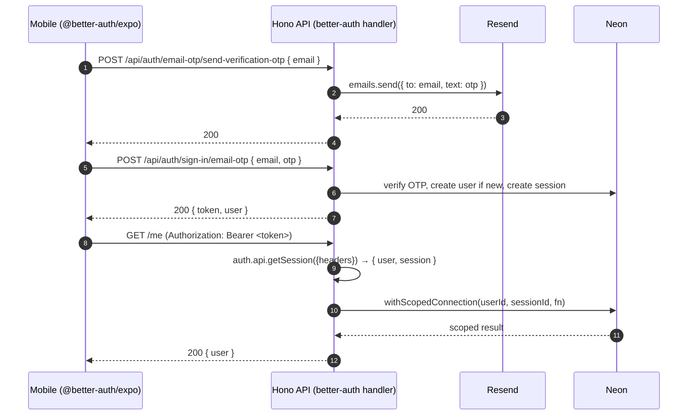

# Auth + per-request DB scope

> Resolves [Pitfall 5](pitfalls.md#pitfall-5--auth-glue-done-late-env-handling-brittle)
> and [Pitfall 6](pitfalls.md#pitfall-6--per-request-db-scope-rls-replacement-added-late).

## Overview

Auth is handled by **[better-auth](https://www.better-auth.com)** running
inside the Hono API. The library manages session issuance, email-OTP
sign-in, and (in future specs) SIWA + Google Sign-In. It writes into
four `public.*` tables (`user`, `session`, `account`, `verification`)
using a Drizzle adapter.

Separately, every authenticated DB call goes through
**`withScopedConnection`**, which sets a per-request Postgres role and
`app.user_id` GUC so RLS policies on `app.*` tables see the correct
user. These two concerns are independent: better-auth owns the session
lifecycle; `withScopedConnection` owns query isolation.

## Auth flow


```mermaid
sequenceDiagram
  autonumber
  participant App as Mobile (@better-auth/expo)
  participant API as Hono API (better-auth handler)
  participant R as Resend
  participant DB as Neon

  App->>API: POST /api/auth/email-otp/send-verification-otp { email }
  API->>R: emails.send({ to: email, text: otp })
  R-->>API: 200
  API-->>App: 200

  App->>API: POST /api/auth/sign-in/email-otp { email, otp }
  API->>DB: verify OTP, create user if new, create session
  API-->>App: 200 { token, user }

  App->>API: GET /me  (Authorization: Bearer <token>)
  API->>API: auth.api.getSession({headers}) → { user, session }
  API->>DB: withScopedConnection(userId, sessionId, fn)
  DB-->>API: scoped result
  API-->>App: 200 { user }
```

## better-auth server config

Location: `packages/api/src/auth/auth.ts`

Key decisions (full rationale in the design spec):

- **Drizzle adapter** (`@better-auth/drizzle-adapter`) pointed at a
  CLI-generated schema (`packages/api/src/db/auth-schema.ts`). The
  adapter uses the **unscoped** connection pool (`rawDb()`) — not
  `withScopedConnection` — because it needs to read sessions before it
  knows which user to scope to.
- **`expo()` plugin** (`@better-auth/expo`) manages bearer-token
  storage and `trustedOrigins` for the Expo client. No separate
  `bearer` plugin needed.
- **`emailOTP` plugin** — Resend as transport, 6-digit code, 10-minute
  expiry, 5 allowed attempts. `disableSignUp: false` — the first
  verified email creates the user automatically.
- **App Store Review access** — the stable `app-review@harpapro.com`
  reviewer email uses better-auth's email/password endpoint with exact
  server-side allowlist checks. Normal users stay on email-OTP, and the
  email-OTP route keeps its standard six-digit behavior.
- **`emailAndPassword`** — `enabled: true`, `disableSignUp: true`.
  Only for test-account smoke tests; a `before` hook 401s any email
  not in `TEST_ACCOUNT_EMAILS`. We keep `TEST_ACCOUNT_EMAILS` set on
  production too so smoke tests run against the live deploy; emails
  not on the allowlist always fail before the hash compare.
- **`advanced.database.generateId({model})`** — mints `usr_…` /
  `ses_…` / `vrf_…` / `idn_…` slugs for each better-auth table via
  `newId()`. IDs are stored as bare `text`; slug format is enforced at
  write time, not by a DB domain.

## Drizzle schema (CLI-generated)

`packages/api/src/db/auth-schema.ts` is produced by:

```bash
pnpm exec @better-auth/cli generate --output packages/api/src/db/auth-schema.ts
```

Re-run whenever a better-auth plugin is added or removed. Commit the
output. CI re-runs the generator and verifies no diff (`git diff
--exit-code`). Do not edit by hand — declare `additionalFields` in
`auth.ts` and let the CLI pick them up.

The file is imported by the Drizzle adapter and by the migration
numbering tool; it is **not** imported directly by route handlers or
the scope layer.

## Public schema layout

Better-auth tables live in `public` (Postgres default schema):

| Table | Owner | Notes |
|---|---|---|
| `public.user` | better-auth | `id text` (slug: `usr_…`) |
| `public.session` | better-auth | `id text` (slug: `ses_…`) |
| `public.account` | better-auth | `id text` (slug: `idn_…`), used by SIWA/Google |
| `public.verification` | better-auth | `id text` (slug: `vrf_…`), OTP store |
| `app.*` | application | RLS enforced, `app.usr_id` domain on FK cols |

**No RLS on `public.session`, `public.account`, or `public.verification`.**
The better-auth adapter queries these with the unscoped pool; RLS
would block its own session lookups.

**`public.user` does have an RLS policy** — see migration snippet
below. Better-auth's adapter bypasses RLS by setting the unscoped
role explicitly, but `app_authenticated` queries (i.e. anything that
reaches `public.user` from a route handler through
`withScopedConnection`) are restricted to the calling user's row.
This means accidental `db.select().from(user)` in route code returns
at most one row instead of leaking the whole user table.

Defence-in-depth controls for these tables:

1. App code never imports `db/auth-schema.ts` directly — `no-restricted-
   imports` ESLint rule enforced.
2. `/me` reads the user from `auth.api.getSession()` (returns the user
   alongside the session), not from a raw `db.select()` call.
3. The `public.user` RLS policy described above is the last-line
   defence if (1) and (2) are bypassed.

## Per-request DB scope

### Postgres setup

```sql
-- Application role (no login, no table grants by default).
CREATE ROLE app_authenticated NOLOGIN;
GRANT app_authenticated TO app_api;

GRANT USAGE ON SCHEMA app TO app_authenticated;
GRANT SELECT, INSERT, UPDATE, DELETE ON ALL TABLES IN SCHEMA app
  TO app_authenticated;

-- public.user gets RLS to limit app_authenticated reads to the
-- caller's own row. Better-auth's adapter uses the unscoped role
-- and bypasses these policies (BYPASSRLS not granted to that role).
GRANT SELECT ON public.user TO app_authenticated;
GRANT UPDATE (display_name, company_name, updated_at) ON public.user
  TO app_authenticated;
ALTER TABLE public.user ENABLE ROW LEVEL SECURITY;
CREATE POLICY user_self_read ON public.user
  FOR SELECT TO app_authenticated
  USING (id = current_setting('app.user_id'));
CREATE POLICY user_self_update ON public.user
  FOR UPDATE TO app_authenticated
  USING      (id = current_setting('app.user_id'))
  WITH CHECK (id = current_setting('app.user_id'));

-- RLS policies on app.* tables read the per-request GUC.
ALTER TABLE app.projects ENABLE ROW LEVEL SECURITY;
CREATE POLICY projects_member_read ON app.projects
  FOR SELECT TO app_authenticated
  USING (id IN (
    SELECT project_id FROM app.project_members
    WHERE user_id = current_setting('app.user_id')::app.usr_id
  ));
-- … and so on per table.
```

### `withScopedConnection` (`packages/api/src/db/scope.ts`)

```ts
export async function withScopedConnection<T>(
  claims: { sub: string; sid: string },
  fn: (tx: NodePgDatabase) => Promise<T>,
): Promise<T> {
  const conn = await pool.connect();
  try {
    await conn.query('BEGIN');
    await conn.query(`SET LOCAL role app_authenticated`);
    await conn.query(`SET LOCAL app.user_id = '${assertId('usr', claims.sub)}'`);
    await conn.query(`SET LOCAL app.session_id = '${assertId('ses', claims.sid)}'`);
    const result = await fn(drizzle(conn, { schema }));
    await conn.query('COMMIT');
    return result;
  } catch (err) {
    await conn.query('ROLLBACK');
    throw err;
  } finally {
    conn.release();
  }
}
```

### Auth middleware (`packages/api/src/middleware/auth.ts`)

```ts
export function withAuth(): MiddlewareHandler<AppEnv> {
  return async (c, next) => {
    const session = await auth.api.getSession({ headers: c.req.raw.headers });
    if (!session?.user || !session?.session) {
      throw new HTTPException(401, { message: 'Unauthorized.' });
    }
    c.set('userId', session.user.id);
    c.set('sessionId', session.session.id);
    c.set('user', session.user);
    c.set('db', (fn) =>
      withScopedConnection({ sub: session.user.id, sid: session.session.id }, fn),
    );
    await next();
  };
}
```

Route handlers use `c.get('db')(fn)`. The raw `db` import is ESLint-
banned in the routes layer.

## Files: project-inherited RLS

`app.files` allows project members (not just the owner) to SELECT
and UPDATE attached files. Migration `0011_files_project_scope.sql`
defines four discriminated policies:

| Policy | Action | Rule |
|---|---|---|
| `files_member_read` | SELECT | owner OR `app.is_member(project_id)` |
| `files_owner_insert` | INSERT | `owner_id = current_setting('app.user_id')` |
| `files_member_write` | UPDATE | owner OR `app.is_member(project_id)` |
| `files_member_delete` | DELETE | owner OR `app.is_member(project_id)` |

Personal-scoped files (`project_id IS NULL`) collapse to owner-only
because the membership branch short-circuits to false.

See [`arch-storage.md` §Security](arch-storage.md#security) and
[`docs/bugs/README.md` R8](../bugs/README.md#bugs).

## Lint guards

- `no-restricted-imports` for `@/db/client` outside `packages/api/src/db/`.
- `no-restricted-imports` for `@/db/auth-schema` outside
  `packages/api/src/auth/auth.ts`.
- `no-restricted-syntax` for `.set('role'` outside the scope module.
- `no-restricted-syntax` for `setTimeout` inside `apps/mobile/app/(auth)/`.

## Test gates

For each authed route the integration suite ships **two paired tests**:

```ts
test('actor A reads their own project', async () => { /* expect 200 */ });
test('actor A cannot read actor B project', async () => { /* expect 404 */ });
```

Plus a **negative-control** test per resource that runs the same query
without the scope wrapper and asserts it returns the other actor's row —
proving the wrapper is what protects it. Lives in
`packages/api/src/__tests__/scope/`. CI enforces coverage via
`scripts/check-scope-tests.sh`.

Auth-specific test requirements (Pitfall 13 — test the **default
wiring**, not a DI stub):

- Email-OTP integration test runs against the **default**
  `betterAuth({...})` instance with `EMAIL_OTP_LIVE=1`. The real
  `sendVerificationOTP` callback executes and calls Resend; `nock` (or
  equivalent) intercepts the outbound HTTPS request and asserts the
  payload. The `sendVerificationOTP` function is **not** swapped out
  via DI — that would test a stub, not the wiring.
- Test-account password tests exercise the real better-auth password
  compare and real DB lookup — no DI stubs on the hot path.

## Test-account password bypass

For **live-deployment smoke tests** we need a way to log in without
waiting on email OTP delivery.

**Mechanism:** better-auth's `emailAndPassword` plugin with
`disableSignUp: true` and a `before` hook that 401s any email not in
`TEST_ACCOUNT_EMAILS`. The test accounts are seeded at deploy time by
`packages/api/scripts/seed-test-account.ts`.

Journey scripts authenticate via:

```bash
curl -X POST "$API/api/auth/sign-in/email" \
  -H 'Content-Type: application/json' \
  -d '{"email":"e2e@harpapro.com","password":"…"}'
```

Then use the returned `token` as `Authorization: Bearer …`.

Env vars (Doppler `dev` and `prd`):

| Var | Purpose |
|---|---|
| `TEST_ACCOUNT_EMAILS` | Comma-separated allowlist |
| `TEST_ACCOUNT_PASSWORD` | Shared password, min 16 chars |

Env-Zod enforces both-or-neither. `TEST_ACCOUNT_EMAILS` is set in
both `dev` and `prd` so smoke-test logins keep working on live
deployments; the before-hook still rejects any email not on the
allowlist. The deploy seed is credential-level idempotent: if an
allowlisted user already exists, it creates or refreshes that user's
`credential` account password instead of assuming the user is ready.

## App Store Review access

Apple reviewers use the normal email screen. When the email is
`app-review@harpapro.com`, mobile skips requesting an OTP and the next
screen accepts a password instead. There is no visible demo or
reviewer-only button in the mobile app.

The production API may set:

| Var | Purpose |
|---|---|
| `APP_REVIEW_EMAILS` | Exact reviewer email: `app-review@harpapro.com` |
| `APP_REVIEW_PASSWORD` | Server-only reviewer password, min 16 chars |

`APP_REVIEW_EMAILS` and `APP_REVIEW_PASSWORD` must be set together.
The reviewer email is not a secret; the strong password is the secret.
The password is never bundled into mobile code and should not be committed.

`packages/api/src/auth/auth.ts` keeps `emailAndPassword.disableSignUp`
enabled and uses a before-hook to reject every password sign-in email
except the union of `TEST_ACCOUNT_EMAILS` and `APP_REVIEW_EMAILS`.
The deploy seed script (`packages/api/scripts/seed-test-account.ts`)
creates or refreshes credential accounts for both groups. Successful
reviewer password sign-in creates a normal better-auth session, so all
authenticated API routes behave the same as they do for a regular user.

Normal users still receive and enter six-digit email OTPs. The App
Review password path does not change the email-OTP route; if that route
is called directly, better-auth still generates standard six-digit OTPs.
Review password attempts are logged with `{email, outcome}` and never
log the password.

There is currently no production demo-data seeding script. Before
submitting to App Review, create or prepare data under the stable
reviewer account manually, or extend the seed script in the same PR
that introduces that data contract.

## Env vars

| Var | Where | Purpose |
|---|---|---|
| `BETTER_AUTH_SECRET` | API | Session signing key |
| `BETTER_AUTH_URL` | API | Base URL for better-auth handler |
| `RESEND_API_KEY` | API | Resend transport for OTP emails |
| `EMAIL_OTP_LIVE` | API | `1` = real Resend send; `0` = logs only (dev/test) |
| `DEV_OTP_TOKEN` | API (dev + PR previews only) | ≥32-char shared secret for `/api/dev/last-otp`. Must be UNSET on prod. |
| `TEST_ACCOUNT_EMAILS` | API | Password-bypass allowlist (set in dev + prd) |
| `TEST_ACCOUNT_PASSWORD` | API | Shared smoke-test password (set in dev + prd) |
| `APP_REVIEW_EMAILS` | API | Comma-separated exact App Store reviewer emails |
| `APP_REVIEW_PASSWORD` | API | Server-only reviewer password |
| `DATABASE_URL` | API | Neon connection (pooled) |
| `EXPO_PUBLIC_API_URL` | Mobile | API base URL (validated by `lib/env.ts`) |

## Session lifecycle

- **`expiresIn`: 7 days** — total session lifetime. After this point,
  `auth.api.getSession()` returns null and `withAuth` throws 401,
  forcing the user to sign in again.
- **`updateAge`: 1 day** — better-auth bumps `session.expires_at`
  forward at most once per 24 hours of activity. A user using the app
  daily holds a rolling 7-day session; a user idle for 7+ days is
  signed out.
- **Sign-out** (`POST /api/auth/sign-out`) deletes the session row;
  the bearer token cannot be reused after.
- **`@better-auth/expo` client** persists the bearer token in
  `expo-secure-store` (encrypted at rest on iOS/Android). The session
  survives app restarts; force-quitting does not log the user out.

## Dev OTP introspection

`POST /api/dev/last-otp` is the bridge that lets Maestro `:mock`
builds and the manual curl flow log in without Resend: it reads the
most recent OTP that better-auth wrote to `public.verification` and
returns it as JSON. It is the **only** unauthenticated route that
exposes session-establishing material to the network, so it is
hardened well past the original NODE_ENV gate.

### Layered controls (all enforced — every failure mode returns 404)

| # | Control | Code |
|---|---|---|
| 1 | Module-load throw on real production | `packages/api/src/routes/dev.ts` |
| 2 | Mount only when `NODE_ENV !== 'production' \|\| HARPAPRO_PR_BUILD === '1'` AND `env.DEV_OTP_TOKEN` is set | `packages/api/src/app.ts` |
| 3 | Per-request `x-dev-otp-token` header, constant-time compared (`crypto.timingSafeEqual`) | `routes/dev.ts` |
| 4 | Email allowlist regex `^[^@\s]+@e2e\.harpapro\.com$` | `routes/dev.ts` |
| 5 | Exact identifier SQL: `WHERE identifier = 'sign-in-otp-' \|\| email` (no `LIKE`) | `routes/dev.ts` |
| 6 | Per-IP global rate limit | `middleware/globalRateLimit.ts` |
| 7 | Audit log every call (`{requestId, ip, email, outcome}`) | `routes/dev.ts` |

Reject paths return 404, indistinguishable from an unknown URL — a
prober cannot tell the difference between "route absent" and "wrong
token". Integration coverage in
`packages/api/src/__tests__/dev.integration.test.ts` exercises all
seven failure modes.

### Env vars

| Var | Where | Purpose |
|---|---|---|
| `DEV_OTP_TOKEN` | Fly dev + Fly preview app secrets | ≥32-char shared secret. **Must be unset on real production** — env parse fails at boot otherwise. |
| `HARPA_DEV_OTP_DISABLED` | Local dev shell (optional) | `'1'` opts out of the dev-side refine for developers who never run Maestro E2E. |

### Why exact identifier match (not `LIKE`)

better-auth's emailOtp plugin sets the verification row's
`identifier` to `${type}-otp-${email}` (see
`node_modules/better-auth/dist/plugins/email-otp/utils.mjs`). The
sign-in flow uses `type='sign-in'`, so the column we want is
exactly `sign-in-otp-<email>`. The previous helper used
`identifier LIKE '%email%'`, which:

1. matches **every** row when given a wildcard email
   (`%@e2e.harpapro.com` returns whoever was last to sign in);
2. is a substring oracle — `alice@e2e.harpapro.com` matches a row
   whose identifier merely contains alice's email
   (`sign-in-otp-bob+alice@e2e.harpapro.com.evil`).

The hardened route, plus the `_helpers.ts` / `_login.ts` helpers
(commit "fix(test): exact identifier match…"), all use `=` against a
server-constructed identifier so neither failure mode is reachable.
Logged in `docs/bugs/README.md` as Pattern R8.

### Maestro wiring

`.maestro/helpers/last-otp.js` reads the `DEV_OTP_TOKEN` Maestro env
global and forwards it as `x-dev-otp-token`. `sign-in.yaml` passes
the token through to the script via `runScript.env`.
`scripts/maestro/reset-db.sh` asserts the token is set before
truncating the dev DB.


The following are deliberately not covered by the current auth
architecture and have follow-on specs:

1. **Sign in with Apple** — better-auth `apple` provider; iOS-only
   button; required for App Store on apps that offer third-party
   sign-in.
2. **Account deletion (`DELETE /me`)** — App Store guideline 5.1.1(v).
3. **Google Sign-In** — same provider pattern as Apple.
4. **Phone-OTP reinstatement** — better-auth has a phone plugin if a
   user segment ever needs SMS sign-in.
