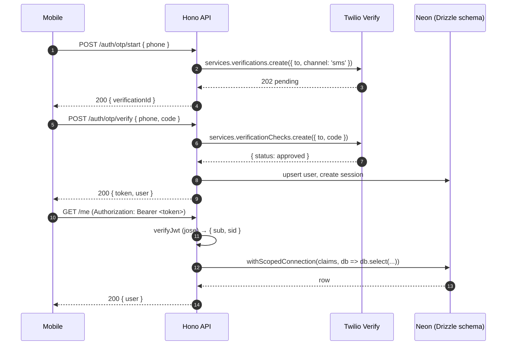

# Auth + per-request DB scope (RLS replacement)

> Resolves [Pitfall 5](pitfalls.md#pitfall-5--auth-glue-done-late-env-handling-brittle)
> and [Pitfall 6](pitfalls.md#pitfall-6--per-request-db-scope-rls-replacement-added-late).

## Why this is its own doc

We're moving off Supabase entirely, which means losing two things at
once:

1. **Supabase Auth** — JWT issuance, OTP, session management.
2. **Postgres RLS as the last line of defence** — Supabase's
   PostgREST forwards a per-request JWT into PG via `set_config`,
   so RLS policies see the actual user. With a Hono API connecting
   as a service role, RLS would be bypassed entirely.

Replacements:

1. **Hand-rolled auth in the Hono API** issues JWTs (via `jose`) and
   runs the OTP flow (delegating SMS to Twilio Verify). We
   deliberately did NOT adopt `better-auth` — its abstractions add
   complexity we don't need. See `packages/api/src/auth/jwt.ts` for
   the rationale recorded next to the code.
2. **`withScopedConnection`** wraps every authenticated DB call,
   acquires a connection from a per-request pool, and runs
   `SET LOCAL role = '<scoped_role>'` and
   `SET LOCAL app.user_id = '<jwt sub>'` so PG sees the user. RLS
   policies use `current_setting('app.user_id')`.

## Auth flow


```mermaid
sequenceDiagram
  autonumber
  participant App as Mobile
  participant API as Hono API
  participant T as Twilio Verify
  participant DB as Neon (Drizzle schema)

  App->>API: POST /auth/otp/start { phone }
  API->>T: services.verifications.create({ to, channel: 'sms' })
  T-->>API: 202 pending
  API-->>App: 200 { verificationId }

  App->>API: POST /auth/otp/verify { phone, code }
  API->>T: services.verificationChecks.create({ to, code })
  T-->>API: { status: approved }
  API->>DB: upsert user, create session
  API-->>App: 200 { token, user }

  App->>API: GET /me  (Authorization: Bearer <token>)
  API->>API: verifyJwt (jose) → { sub, sid }
  API->>DB: withScopedConnection(claims, db => db.select(...))
  DB-->>API: row
  API-->>App: 200 { user }
```

### Why Twilio (not Supabase Auth, not in-house SMS)

- Free tier covers dev.
- Verify is a managed OTP service — no need to roll our own
  rate-limiting / lockout / replay protection.
- Has a sandbox mode (`TWILIO_VERIFY_FAKE_CODE=000000`) that we
  use in tests + `:mock` builds. Real SMS is gated behind
  `TWILIO_LIVE=1`.

## Auth implementation

- Routes are mounted directly at `/auth/*` in `packages/api/src/routes/auth.ts`.
- JWT issue/verify lives in `packages/api/src/auth/jwt.ts` (HS256 via
  `jose`).
- Twilio Verify wrapper lives in `packages/api/src/auth/twilio.ts`;
  the sandbox path returns `TWILIO_VERIFY_FAKE_CODE` so tests + `:mock`
  builds never hit real SMS.
- Session lifecycle lives in `packages/api/src/auth/service.ts` —
  `startOtp` / `verifyOtp` / `issueSessionForPhone`.
- Schema lives in `packages/api/src/db/schema.ts` (users, sessions),
  managed by Drizzle migrations.
- Session model: opaque session IDs in the DB; the issued JWT carries
  `sub` (user id) and `sid` (session id). The `withAuth` middleware
  validates the JWT and re-checks `sid` against the DB on each
  request.
- Token TTL: 7 days. Logout = delete session row.

### Test-account password bypass

A second route — `POST /auth/password/verify` — exists for test
accounts so live deployments (`TWILIO_LIVE=1`) can be exercised
without hitting Twilio. It is **404 unless both `TEST_ACCOUNT_PHONES`
and `TEST_ACCOUNT_PASSWORD` are set** (Doppler `dev` only — production
must leave them unset).

- Per-process random salt; password hashed with `scryptSync` and
  compared with `timingSafeEqual` (no hand-rolled crypto). See
  `packages/api/src/auth/password.ts`.
- Phone must appear in the comma-separated `TEST_ACCOUNT_PHONES` list.
- Rate-limited 10/minute per phone via the `withRateLimit()`
  middleware (same `getRateLimiter()` backend as the OTP routes).
- Successful attempts are audit-logged
  (`msg: 'test_account_password_login'`); failed verifications
  throw 401 without an audit row.
- On success the route reuses `issueSessionForPhone(...)` — identical
  session row + JWT shape as the OTP path.

## Per-request DB scope (RLS replacement)

### Postgres setup (in `packages/api/migrations/0001_scope.sql`)

```sql
-- Application role with no table grants by default.
CREATE ROLE app_authenticated NOLOGIN;
GRANT app_authenticated TO app_api; -- the Fly.io connection role

-- Set-and-forget: every authed connection runs SET LOCAL role.
-- Tables grant USAGE/SELECT/INSERT/UPDATE/DELETE to app_authenticated.
GRANT USAGE ON SCHEMA app TO app_authenticated;
GRANT SELECT, INSERT, UPDATE, DELETE ON ALL TABLES IN SCHEMA app
  TO app_authenticated;

-- RLS policies use the per-request user id.
ALTER TABLE app.projects ENABLE ROW LEVEL SECURITY;
CREATE POLICY projects_member_read ON app.projects
  FOR SELECT TO app_authenticated
  USING (id IN (
    SELECT project_id FROM app.project_members
    WHERE user_id = current_setting('app.user_id')::app.usr_id
  ));
-- … and so on per table.
```

### `withScopedConnection` (in `packages/api/src/db/scope.ts`)

```ts
export async function withScopedConnection<T>(
  claims: { sub: string; sid: string },
  fn: (tx: NodePgDatabase) => Promise<T>,
): Promise<T> {
  const conn = await pool.connect();
  try {
    await conn.query('BEGIN');
    await conn.query(`SET LOCAL role app_authenticated`);
    await conn.query(`SET LOCAL app.user_id = '${assertId('usr', claims.sub)}'`);
    await conn.query(`SET LOCAL app.session_id = '${assertId('ses', claims.sid)}'`);
    const result = await fn(drizzle(conn, { schema }));
    await conn.query('COMMIT');
    return result;
  } catch (err) {
    await conn.query('ROLLBACK');
    throw err;
  } finally {
    conn.release();
  }
}
```

### Auth middleware (in `packages/api/src/middleware/auth.ts`)

```ts
export function withAuth(): MiddlewareHandler<AppEnv> {
  return async (c, next) => {
    const auth = c.req.header('authorization');
    if (!auth?.startsWith('Bearer ')) {
      throw new HTTPException(401, { message: 'Missing bearer token.' });
    }
    const token = auth.slice('Bearer '.length).trim();
    let claims;
    try {
      claims = await verifyJwt(token);
    } catch {
      throw new HTTPException(401, { message: 'Invalid token.' });
    }
    c.set('userId', claims.sub);
    c.set('sessionId', claims.sid);
    c.set('db', (fn) =>
      withScopedConnection({ sub: claims.sub, sid: claims.sid }, fn),
    );
    await next();
  };
}
```

Route handlers use `c.get('db')(fn)` — the raw `db` import is
ESLint-banned in the routes layer.

## Lint guards

- `no-restricted-imports` for `@/db/client` outside
  `packages/api/src/db/` — forces use of the scoped accessor.
- `no-restricted-syntax` for `.set('role'` outside the scope module.
- `no-restricted-syntax` for `setTimeout` inside `apps/mobile/app/(auth)/`.

## Test gates (per Pitfall 1 + 6)

For each authed route, the integration suite ships **two paired tests**:

```ts
test('actor A reads their own project', async () => { /* expect 200 */ });
test('actor A cannot read actor B project', async () => { /* expect 404 */ });
```

There is also a **negative-control** test per resource that runs the
same query *without* the scope wrapper and asserts it returns the
other actor's row — proving the scope wrapper is the thing
protecting it. These live in `packages/api/src/__tests__/scope/`.

CI fails if any new authed route lacks both tests
(grep gate: `scripts/check-scope-tests.sh`).

## Env vars

| Var | Where | Purpose |
|---|---|---|
| `BETTER_AUTH_SECRET` | API | JWT signing key |
| `TWILIO_ACCOUNT_SID` | API | Twilio API |
| `TWILIO_AUTH_TOKEN` | API | Twilio API |
| `TWILIO_VERIFY_SID` | API | Verify service |
| `TWILIO_LIVE` | API | `1` to allow real SMS in this env |
| `TWILIO_VERIFY_FAKE_CODE` | API tests / `:mock` | Bypass code |
| `DATABASE_URL` | API | Neon connection (pooled) |
| `EXPO_PUBLIC_API_URL` | Mobile | API base URL (validated by `lib/env.ts`) |

## Test-account password bypass (live deployments)

SMS OTP via Twilio Verify is the only auth path for real users. For
**live-deployment smoke tests** (`harpa-pro-api-dev`, prod) we need a
way to log in without paying for / waiting on SMS, without weakening
auth for real users.

Solution: a narrow alternate endpoint **`POST /auth/password/verify`**
that accepts `{ phone, password }` and, on success, returns the same
`{ token, user }` payload as `/auth/otp/verify`. Two env vars gate
it:

| Var | Where | Purpose |
|---|---|---|
| `TEST_ACCOUNT_PHONES` | API | Comma-separated E.164 allowlist |
| `TEST_ACCOUNT_PASSWORD` | API | Shared password, min 16 chars |

Both vars are stored in **Doppler under the `dev` config only** —
they must never be set on `prd`. Because the CI workflow pipes every
Doppler secret through `flyctl secrets import` on each deploy (see
[`docs/v4/arch-ops.md` §CI](arch-ops.md#ci)), adding the two keys in
Doppler is the only step required to enable the bypass on
`harpa-pro-api-dev`; removing them disables it on the next deploy.

Rules:

- **Off-by-default**: if either var is missing, the route returns
  `404 Not Found`. Production must not set them unless intentional.
  Env-Zod refines "both-or-neither" to prevent half-configured states.
- **No enumeration**: a non-allow-listed phone gets the same `401`
  as a wrong password. The scrypt comparison runs unconditionally so
  timing does not leak allow-list membership either.
- **Per-boot salt**: the password is hashed once with `scrypt` + a
  random salt at first use, kept in memory only. A restart re-derives
  the hash — that's fine because the password itself is the secret.
- **Rate limit**: 10 attempts per minute per phone (memory-backed,
  per-process). Generous enough for manual testing; bounds password-
  guess throughput.
- **Audit log**: every successful login emits a structured
  `test_account_password_login` log line with the phone, user id and
  request id, so Fly logs show exactly who used the bypass and when.
- **Reuses `issueSessionForPhone`**: the OTP and password paths share
  the user-upsert + session-insert + JWT-mint helper in
  `auth/service.ts`. The resulting JWT is indistinguishable from one
  issued by OTP and goes through the same `withAuth` middleware on
  subsequent requests.

Pitfall 13 compliance: the integration test for this route exercises
the **real** scrypt comparator and **real** DB upsert — no DI stubs
on the hot path. DI stubs would be inappropriate here; the password
check is the entire reason the route exists.

`apps/mobile/lib/env.ts` is the only place that reads
`EXPO_PUBLIC_*` — see [Pitfall 5](pitfalls.md#pitfall-5--auth-glue-done-late-env-handling-brittle).
