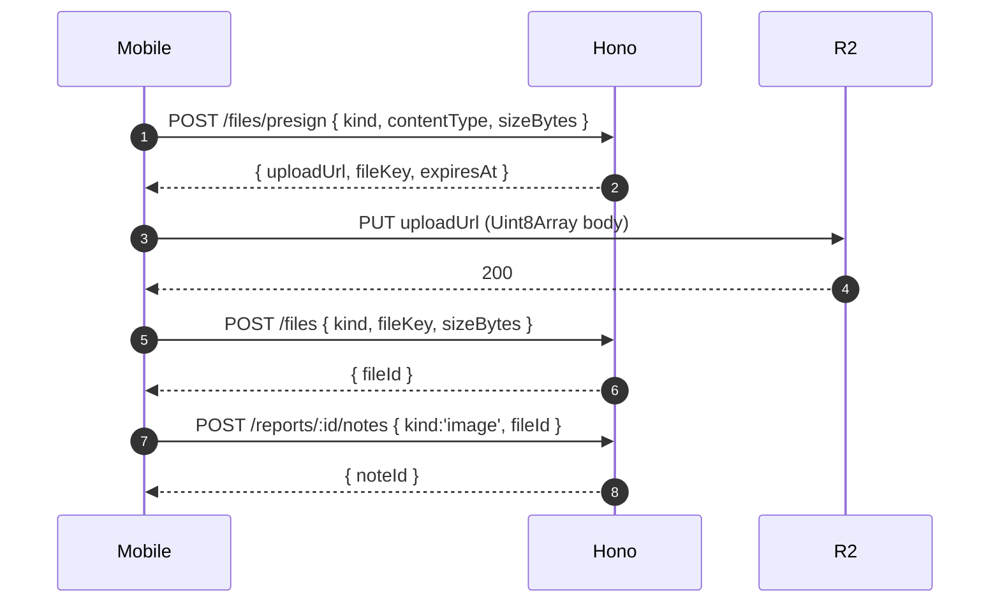

# Storage (Cloudflare R2)

> Replaces Supabase Storage.
> Companion: [arch-api-design.md](arch-api-design.md) §Files.

## Why R2

- S3-compatible (works with `@aws-sdk/client-s3` + presigners).
- Zero egress.
- Free tier covers dev.
- Our deploy lives on Fly.io; R2 is geographically close to all
  edge regions.

## Buckets

| Bucket | Purpose | Access |
|---|---|---|
| `harpa-voice` | Original voice recordings (m4a) | Private. Signed URLs only. |
| `harpa-images` | Photo notes (jpeg) | Private. Signed URLs. |
| `harpa-documents` | User-uploaded documents (pdf, docx, …) | Private. Signed URLs. |
| `harpa-reports` | Rendered report PDFs | Private. Signed URLs. |
| `harpa-fixtures` | Replay assets used in `:mock` (small audio + jpeg) | Public. CDN. |

Bucket setup lives in `infra/r2/bootstrap.ts` (idempotent).

## Upload flow



Pitfall 8 rule: **always** create the timeline note in the same
flow — even for documents. The mobile upload queue calls
`createNote` after `createFile` unconditionally.

## Download flow

`GET /files/:id/url` returns `{ url, expiresAt }`. Signed URLs have
a 5-minute TTL and are scoped to GET. Mobile caches signed URLs in
React Query with `staleTime: 4 minutes`.

## Security

- Presign URLs are scoped to PUT, content-type, content-length, and
  prefix-keyed by `users/<userId>/`. Server constructs the key —
  client cannot specify it.
- Bucket policies deny all public access to non-fixture buckets.
- File metadata (kind, owner, project, report) lives in
  `app.files`, scoped per request like every other table.
- Lifecycle: `harpa-voice` and `harpa-images` files referenced from
  no live note are GC'd after 7 days by an R2 lifecycle rule.

## Live mode (production)

`R2_FIXTURE_MODE=live` selects `R2Storage` in `packages/api/src/services/storage.ts`.
It is backed by `@aws-sdk/client-s3` + `@aws-sdk/s3-request-presigner`
against the R2 S3-compatible endpoint:

```
endpoint  = R2_ENDPOINT ?? https://<R2_ACCOUNT_ID>.r2.cloudflarestorage.com
region    = 'auto'           # R2 ignores region but the SDK requires one
forcePathStyle = true        # R2 requires path-style addressing
```

Required env (asserted at first use, not at boot — fixture mode stays
free of R2 creds):

| Env | Notes |
|---|---|
| `R2_ACCOUNT_ID` | Cloudflare account id (skip if `R2_ENDPOINT` is set) |
| `R2_ACCESS_KEY_ID` | R2 API token access key |
| `R2_SECRET_ACCESS_KEY` | R2 API token secret |
| `R2_BUCKET` | Defaults to `harpa-pro` |
| `R2_ENDPOINT` | Optional override for local S3-compatible mocks |
| `R2_PRESIGN_TTL_SEC` | Defaults to 300 (5 minutes per §Download flow) |

`R2Storage` signs `content-type` and `content-length` into every PUT
URL so a stolen link can't be reused for arbitrary uploads (Pitfall 8).

## Fixture mode

When `EXPO_PUBLIC_USE_FIXTURES=true` (mobile) or `R2_FIXTURE_MODE=replay`
(API):

- `POST /files/presign` returns a fake URL pointing at the local
  fixture server (or a public URL in `harpa-fixtures`).
- The mobile upload queue PUTs to it; in tests we intercept with MSW.
- `POST /files` accepts a synthetic `fileKey` and stores a row
  pointing at a public fixture asset.
- Tests that exercise transcription wire `voice.fixture.m4a` from
  `harpa-fixtures` so the OpenAI fixture replay matches.

This means **no R2 calls in CI**.
