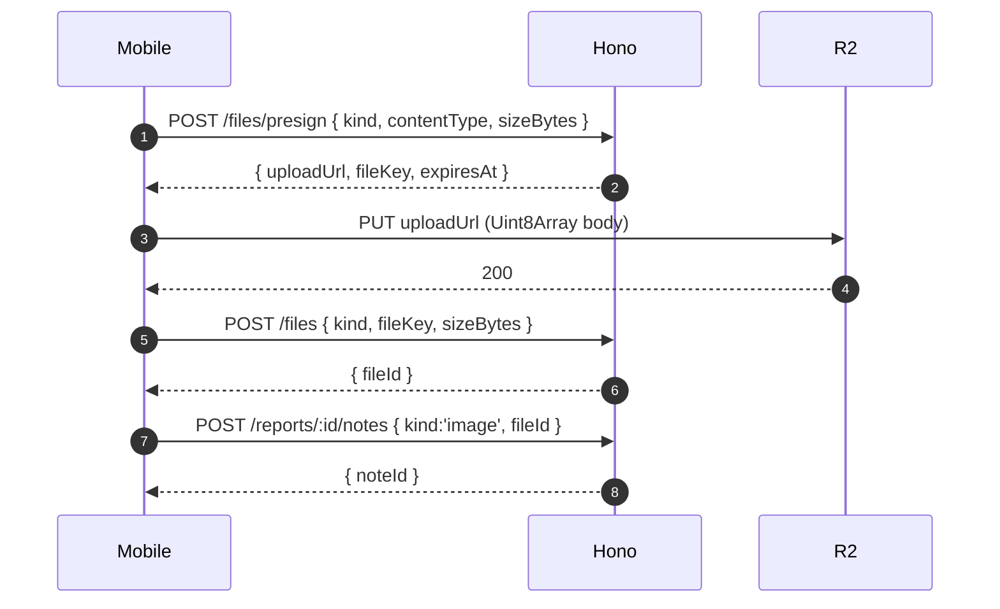

# Storage (Cloudflare R2)

> Replaces Supabase Storage.
> Companion: [arch-api-design.md](arch-api-design.md) §Files.

## Why R2

- S3-compatible (works with `@aws-sdk/client-s3` + presigners).
- Zero egress.
- Free tier covers dev.
- Our deploy lives on Fly.io; R2 is geographically close to all
  edge regions.

## Buckets

| Bucket | Purpose | Access |
|---|---|---|
| `harpa-voice` | Original voice recordings (m4a) | Private. Signed URLs only. |
| `harpa-images` | Photo notes (jpeg) | Private. Signed URLs. |
| `harpa-documents` | User-uploaded documents (pdf, docx, …) | Private. Signed URLs. |
| `harpa-reports` | Rendered report PDFs | Private. Signed URLs. |
| `harpa-fixtures` | Replay assets used in `:mock` (small audio + jpeg) | Public. CDN. |

Bucket setup lives in `infra/r2/bootstrap.ts` (idempotent).

## Upload flow


```mermaid
sequenceDiagram
  autonumber
  participant App as Mobile
  participant API as Hono
  participant R2 as R2

  App->>API: POST /files/presign { kind, contentType, sizeBytes }
  API-->>App: { uploadUrl, fileKey, expiresAt }
  App->>R2: PUT uploadUrl (Uint8Array body)
  R2-->>App: 200
  App->>API: POST /files { kind, fileKey, sizeBytes }
  API-->>App: { fileId }
  App->>API: POST /reports/:id/notes { kind:'image', fileId }
  API-->>App: { noteId }
```

Pitfall 8 rule: **always** create the timeline note in the same
flow — even for documents. The mobile upload queue calls
`createNote` after `createFile` unconditionally.

## Download flow

`GET /files/:id/url` returns `{ url, expiresAt }`. Signed URLs have
a 5-minute TTL and are scoped to GET. Mobile caches signed URLs in
React Query with `staleTime: 4 minutes`.

### Timeline thumbnails (mobile)

Image notes (`kind: 'image'`) carry only a `fileId` — never an inline
URL or base64 payload. `apps/mobile/components/notes/ImageNoteCard.tsx`
resolves the signed GET URL via `useFileSignedUrl(fileId)` (which calls
`GET /files/:id/url`) and renders the thumbnail through `CachedImage`
(expo-image + disk cache, keyed by `fileId`). The card composes
`ImagePreviewModal` for the tap-to-zoom full-screen view, so the same
signed-URL hook backs both surfaces. While the URL is resolving the
card shows a skeleton; on failure it renders an inline retry that
re-runs the query. `NoteTimeline` dispatches `source === 'image'` rows
to `ImageNoteCard` and everything else to `TextNoteCard`.

### Optimistic photo rows (mobile)

Before R2 PUT completes there is no `fileId`, so the optimistic row is
driven by the upload job itself.
`apps/mobile/components/notes/PendingPhotoCard.tsx` reads `UploadJob`
(`sourceUri`, `status`, `progress`, `error`) and renders the local URI
as the thumbnail — bytes never leave the device until R2 PUT. The card
overlays a progress bar driven by `job.progress` and a status label
derived from `job.status` (`Preparing…` / `Uploading…` / `Saving…` /
`Adding to timeline…`). Failed jobs surface a retry + dismiss pair;
in-flight jobs surface cancel only. Once the queue completes the job
the `reportNotes` invalidation produces the real `ImageNoteCard` row;
`UploadQueueStrip` / the timeline parent drop the pending card on the
same tick.

### Upload queue strip (mobile)

`apps/mobile/components/uploads/UploadQueueStrip.tsx` is a compact
footer pinned to the bottom of the Notes tab. It consumes
`useFileUpload()` from the same `QueueProvider` the rest of the app
binds to and renders two lanes: an in-flight summary (count +
aggregated progress bar) and a per-job failed-chip row (filename +
retry + dismiss). Filtered by `reportId` so unrelated jobs from
other reports don't bleed into the current screen. Renders nothing
when both lanes are empty, and gracefully no-ops when no
`<QueueProvider>` is mounted (via
`useOptionalUploadQueueContext`).

### Gallery attachment sheet (mobile)

The attachment sheet on the report Notes tab offers two categories:

- **Photo** → routed to `pickAndEnqueueGalleryImages` in
  `apps/mobile/lib/camera/pick-and-enqueue-gallery-images.ts`. It
  requests `MediaLibraryPermissions`, launches
  `ImagePicker.launchImageLibraryAsync({ allowsMultipleSelection })`,
  and pipes the chosen URIs through the same `enqueueCameraUris`
  entry point the camera flow uses. The helper returns a discriminated
  union (`permission-denied` / `cancelled` / `empty` / `enqueued`)
  so the route can surface the upload-error banner without duplicating
  copy.
- **Document** → currently surfaces a "Coming soon" banner. The note
  kind enum + server-side pipeline already accept `document`/`pdf`,
  but the UI is deferred (see `plan-camera-upload-pipeline.md`).

### Upload queue persistence (mobile)

The in-memory `UploadQueue` survives screen navigation but, by
itself, not app restarts. To honour "kill the app mid-upload,
relaunch, resume automatically" we wire an MMKV-backed
`QueuePersistence` (`apps/mobile/lib/uploads/persistence.ts`) into
`QueueProvider`:

- **On every state transition** the queue serialises a `PersistedJob`
  for each row (`id`, `input`, `status`, `attempt`, `progress`,
  `error`, `fileId`) into the `upload-queue` MMKV instance under
  key `v1`. MMKV is synchronous so this stays out of the hot path's
  await graph.
- **At provider mount** we load the blob, drop jobs whose
  `input.sourceUri` no longer resolves via
  `new File(uri).exists` (the OS sweeps temp capture dirs
  aggressively), coerce in-flight statuses
  (`presigning|uploading|registering|creating_note`) to `pending`
  (presign + R2 PUT are idempotent for our usage — each retry mints
  a fresh key), and hand the survivors to `createUploadQueue` as
  `initialJobs`. The driver kicks immediately.
- **Promise handles are not persisted.** Rehydrated jobs run
  fire-and-forget; the UI just re-subscribes via `useFileUpload()`
  and observes the new state transitions.
- **Test seam.** `createInMemoryPersistence()` satisfies the same
  contract for Vitest. The default wiring (Pitfall 13) is exercised
  by the test that stubs `react-native-mmkv` with a `Map`-backed
  factory in `vitest.setup.ts` — the queue + persistence code path
  runs unchanged.

### Source-URI cleanup

The default `defaultCleanupSource` in `run-upload.ts` runs after each
job reaches `completed`: it deletes `input.sourceUri` via
`new FsFile(uri).delete()` when the URI is `file://`-scoped (skips
`content://`, `ph://`, remote URLs). This keeps the temp/cache
directory bounded for users who shoot bursts. Errors are swallowed
inside the queue's success path — the upload already succeeded, and
disk hygiene must never surface as a queue failure. Cleanup does
not run for `failed` or `cancelled` jobs so the UI's retry button
still has a valid source URI to re-PUT.

### Image processing (mobile)

Before the camera or gallery flows enqueue a photo, the URI is run
through `apps/mobile/lib/camera/process-image.ts` which:

- Resizes the longest edge to ≤ 2048 px (downscale only; never
  upscale).
- Re-encodes as JPEG at quality 0.85 → 0.7 → 0.55 → 0.4 until the
  output is ≤ 2 MB, then shrinks the width by ×0.85 per additional
  pass (floor at 768 px) for up to 6 passes total.
- Strips EXIF as a side effect of the `expo-image-manipulator`
  re-encode pass (only orientation is preserved).
- Throws when the smallest result still exceeds the 50 MB
  server-enforced ceiling — we'd rather fail loud than burn the
  queue's retry budget on a guaranteed `413`.

The processor returns the post-encode `sizeBytes`; the queue uses
that for both the presign body and the R2 PUT Content-Length so the
SigV4 signature always matches the bytes flushed (the failure mode
the camera-upload rewrite was originally fixing).

### Cancellation (`AbortController`)

Each `InternalJob` owns an `AbortController` that is threaded through
`runUploadJob → deps.{presign,putToR2,registerFile,createNote}` via
the new `signal?: AbortSignal` slot on `UploadDeps` and the typed
`request()` client. The pipeline calls `checkAborted(signal)` at
every step boundary so cancellation between network calls short-
circuits cleanly. The default XHR-based `putToR2` wires
`signal.addEventListener('abort', () => xhr.abort())` so a long-
running mobile upload is interrupted immediately; the fetch fallback
passes `{ signal }` straight through.

`queue.remove(jobId)` is now cancellation-aware:

- **Terminal status** (`completed` / `failed` / `cancelled`) — splice
  the row out of the snapshot.
- **In-flight status** — call `controller.abort()` and splice. The
  pipeline rejects with an `AbortError` (recognised via the
  exported `isAbortError(err)` helper). `processJob` maps that to
  the `cancelled` lane — but since `remove()` already spliced the
  job, the cancelled status writes are inert and observers see the
  job disappear in a single notification. Critically, neither
  `registerFile` nor `createNote` runs after the abort, so a
  cancelled upload never produces an orphan `app.files` row or a
  ghost note on the report timeline.

Retries are unaffected: cancellation does **not** consume the
retry budget, and `retry(jobId)` mints a fresh `AbortController`
so a previous abort does not poison the new attempt. The
`'cancelled'` `JobStatus` is also retryable via the same
`retry(jobId)` entry point.

## Security

- Presign URLs are scoped to PUT, content-type, content-length, and
  prefix-keyed by `users/<userId>/`. Server constructs the key —
  client cannot specify it.
- Bucket policies deny all public access to non-fixture buckets.
- File metadata (kind, owner, project, report) lives in
  `app.files`, scoped per request like every other table.
- Lifecycle: `harpa-voice` and `harpa-images` files referenced from
  no live note are GC'd after 7 days by an R2 lifecycle rule.

## Live mode (production)

`R2_FIXTURE_MODE=live` selects `R2Storage` in `packages/api/src/services/storage.ts`.
It is backed by `@aws-sdk/client-s3` + `@aws-sdk/s3-request-presigner`
against the R2 S3-compatible endpoint:

```
endpoint  = R2_ENDPOINT ?? https://<R2_ACCOUNT_ID>.r2.cloudflarestorage.com
region    = 'auto'           # R2 ignores region but the SDK requires one
forcePathStyle = true        # R2 requires path-style addressing
```

Required env (asserted at first use, not at boot — fixture mode stays
free of R2 creds):

| Env | Notes |
|---|---|
| `R2_ACCOUNT_ID` | Cloudflare account id (skip if `R2_ENDPOINT` is set) |
| `R2_ACCESS_KEY_ID` | R2 API token access key |
| `R2_SECRET_ACCESS_KEY` | R2 API token secret |
| `R2_BUCKET` | Defaults to `harpa-pro` |
| `R2_ENDPOINT` | Optional override for local S3-compatible mocks |
| `R2_PRESIGN_TTL_SEC` | Defaults to 300 (5 minutes per §Download flow) |

`R2Storage` signs `content-type` and `content-length` into every PUT
URL so a stolen link can't be reused for arbitrary uploads (Pitfall 8).

## Fixture mode

When `EXPO_PUBLIC_USE_FIXTURES=true` (mobile) or `R2_FIXTURE_MODE=replay`
(API):

- `POST /files/presign` returns a fake URL pointing at the local
  fixture server (or a public URL in `harpa-fixtures`).
- The mobile upload queue PUTs to it; in tests we intercept with MSW.
- `POST /files` accepts a synthetic `fileKey` and stores a row
  pointing at a public fixture asset.
- Tests that exercise transcription wire `voice.fixture.m4a` from
  `harpa-fixtures` so the OpenAI fixture replay matches.

This means **no R2 calls in CI**.
