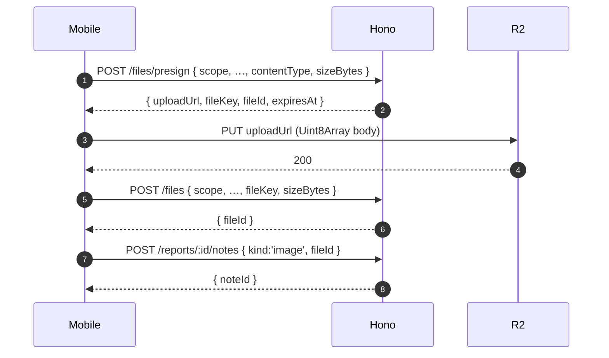

# Storage (Cloudflare R2)

> Replaces Supabase Storage.
> Companion: [arch-api-design.md](arch-api-design.md) §Files.

## Why R2

- S3-compatible (works with `@aws-sdk/client-s3` + presigners).
- Zero egress.
- Free tier covers dev.
- Our deploy lives on Fly.io; R2 is geographically close to all
  edge regions.

## Buckets

| Bucket | Purpose | Access |
|---|---|---|
| `harpa-voice` | Original voice recordings (m4a) | Private. Signed URLs only. |
| `harpa-images` | Photo notes (jpeg) | Private. Signed URLs. |
| `harpa-documents` | User-uploaded documents (pdf, docx, …) | Private. Signed URLs. |
| `harpa-reports` | Rendered report PDFs | Private. Signed URLs. |
| `harpa-fixtures` | Replay assets used in `:mock` (small audio + jpeg) | Public. CDN. |

Bucket setup lives in `infra/r2/bootstrap.ts` (idempotent).

## Object key layout

Migration `0011_files_project_scope.sql` switched from the legacy
owner-keyed layout (`users/<ownerId>/<kind>/<uuid>.<ext>`) to a
three-scope layout that mirrors the data hierarchy:

| Scope | Key pattern |
|---|---|
| Project | `projects/<projectId>/reports/<reportId>/<fileId>.<ext>` |
| Avatar | `users/<userId>/avatar/<fileId>.<ext>` |
| Scratch | `users/<userId>/scratch/<fileId>.<ext>` |

Scratch is the holding pen for personal-but-uncategorized uploads:
the standalone `/voice/transcribe` source files, debug/orphan
captures, and (eventually) any other personal-not-project asset.

The `<fileId>` segment is the literal `fil_*` slug that the API
mints up front and persists as the `app.files.id` row PK. The R2
object key and the DB row share identity — there is no separate
storage UUID. `parseKeyScope()` in
`packages/api/src/services/storage.ts` is the inverse of
`buildKey()` and the route layer uses it to verify the claimed
scope against the embedded prefix before registering the row.

## Upload flow


```mermaid
sequenceDiagram
  autonumber
  participant App as Mobile
  participant API as Hono
  participant R2 as R2

  App->>API: POST /files/presign { scope, …, contentType, sizeBytes }
  API-->>App: { uploadUrl, fileKey, fileId, expiresAt }
  App->>R2: PUT uploadUrl (Uint8Array body)
  R2-->>App: 200
  App->>API: POST /files { scope, …, fileKey, sizeBytes }
  API-->>App: { fileId }
  App->>API: POST /reports/:id/notes { kind:'image', fileId }
  API-->>App: { noteId }
```

The presign + register bodies are discriminated on `scope`:

- `{ scope: 'project', projectId, reportId, kind, contentType,
  sizeBytes }` — server membership-checks the project before
  minting.
- `{ scope: 'avatar', contentType, sizeBytes }` — `kind` is
  implicitly `image`.
- `{ scope: 'scratch', kind, contentType, sizeBytes }` —
  owner-only; no project linkage.

Pitfall 8 rule: **always** create the timeline note in the same
flow — even for documents. The mobile upload queue calls
`createNote` after `createFile` unconditionally.

## Download flow

`GET /files/:id/url` returns `{ url, expiresAt }`. Signed URLs have
a 5-minute TTL and are scoped to GET. Mobile caches signed URLs in
React Query with `staleTime: 4 minutes`.

### Timeline thumbnails (mobile)

Image notes (`kind: 'image'`) carry a `fileId` (full image) and an
optional `thumbnailFileId` (small ~256 px square JPEG generated
client-side at upload time) — never an inline URL or base64 payload.

Everywhere a photo appears outside the fullscreen preview (the
saved-report 3-column grid `ReportPhotos`, the Generate-screen
timeline grid in `PhotoNoteCard`, and the saved-report Notes pane row)
we render the shared `apps/mobile/components/notes/PhotoTile.tsx`
through `PhotoBatchGrid` or `ReportPhotos`. The tile resolves
`thumbnailFileId ?? fileId` via `useFileSignedUrl` and renders the
bytes through `CachedImage` (`expo-image` + disk cache, keyed by the
resolved id). When `thumbnailFileId` is null (legacy rows) we fall
back to the full `fileId` — one-off cost per legacy photo, no
backfill needed.

Tap opens the existing `ImagePreviewModal`, which still uses the full
`fileId` so the fullscreen view shows sharp bytes from the original
upload. While the signed URL is pending the tile shows a small
`ActivityIndicator`; on failure it shows the empty-state camera icon
(callers can still retry by remounting; the tile itself has no retry
affordance — the surrounding row provides one when relevant).

Client-side thumbnail production (`processImageThumbnail` in
`apps/mobile/lib/camera/process-image.ts`) center-crops to a square,
resizes to 256 px, and re-encodes JPEG at q=0.7 — EXIF is stripped by
the re-encode. The upload queue runs the main image and thumbnail
pipelines in parallel (`presign → PUT → registerFile` ×2) before
firing the single `createNote` with both ids. Thumbnail failures
(non-abort) are swallowed: the note is still created with
`thumbnailFileId: null` so a flaky thumb never loses the photo; the
tile falls back to the full `fileId` until the user re-uploads.

### Optimistic photo rows (mobile)

Before R2 PUT completes there is no `fileId`, so the optimistic row is
driven by the upload job itself.
`apps/mobile/components/notes/PendingPhotoCard.tsx` reads `UploadJob`
(`sourceUri`, `status`, `progress`, `error`) and renders the local URI
as a ~110 px square thumbnail — bytes never leave the device until R2
PUT. The card overlays a progress bar driven by `job.progress` and a
status label derived from `job.status` (`Preparing…` / `Uploading…` /
`Saving…` /
`Adding to timeline…`). Failed jobs surface a retry + dismiss pair;
in-flight jobs surface cancel only. Once the queue completes the job
the `reportNotes` invalidation produces the real `PhotoNoteCard` row;
`UploadQueueStrip` / the timeline parent drop the pending card on the
same tick.

### Upload queue strip (mobile)

`apps/mobile/components/uploads/UploadQueueStrip.tsx` is a compact
footer pinned to the bottom of the Notes tab. It consumes
`useFileUpload()` from the same `QueueProvider` the rest of the app
binds to and renders two lanes: an in-flight summary (count +
aggregated progress bar) and a per-job failed-chip row (filename +
retry + dismiss). Filtered by `reportId` so unrelated jobs from
other reports don't bleed into the current screen. Renders nothing
when both lanes are empty, and gracefully no-ops when no
`<QueueProvider>` is mounted (via
`useOptionalUploadQueueContext`).

### Gallery attachment sheet (mobile)

The attachment sheet on the report Notes tab is platform-aware:

- **Android photo library** → routed to `pickAndEnqueueGalleryImages` in
  `apps/mobile/lib/camera/pick-and-enqueue-gallery-images.ts`. It
  requests `MediaLibraryPermissions`, launches
  `ImagePicker.launchImageLibraryAsync({ allowsMultipleSelection })`,
  and pipes the chosen URIs through the same `enqueueCameraUris`
  entry point the camera flow uses. The helper returns a discriminated
  union (`unavailable` / `permission-denied` / `cancelled` / `empty` /
  `enqueued`) so the route can surface the upload-error banner without
  duplicating copy.
- **iOS** → camera capture only. Photo-library picking is intentionally
  hidden; the shared platform policy also returns before importing or
  calling `expo-image-picker`.

Camera capture and in-app previews of already-uploaded photos remain
available on both platforms. Avatar UI is absent on both platforms;
the avatar API/storage scope remains compatible but has no mobile entry
point. See
[`design-ios-photo-library-disablement.md`](design-ios-photo-library-disablement.md).

The note kind enum + server-side pipeline already accept
`document`/`pdf`, but document picking remains deferred (see
`plan-camera-upload-pipeline.md`).

### Upload queue persistence (mobile)

The in-memory `UploadQueue` survives screen navigation but, by
itself, not app restarts. To honour "kill the app mid-upload,
relaunch, resume automatically" we wire an MMKV-backed
`QueuePersistence` (`apps/mobile/lib/uploads/persistence.ts`) into
`QueueProvider`:

- **On every state transition** the queue serialises a `PersistedJob`
  for each row (`id`, `input`, `status`, `attempt`, `progress`,
  `error`, `fileId`) into the `upload-queue` MMKV instance under a
  `v2.<userId>` key. The pre-scoping `v1` blob is discarded because it
  cannot be attributed safely after an account change. MMKV is
  synchronous so this stays out of the hot path's await graph.
- **After auth resolves** `QueueProvider` loads only the current user's
  blob, drops jobs whose
  `input.sourceUri` no longer resolves via
  `new File(uri).exists` (the OS sweeps temp capture dirs
  aggressively), coerce in-flight statuses
  (`presigning|uploading|registering|creating_note`) to `pending`
  (presign + R2 PUT are idempotent for our usage — each retry mints
  a fresh key), and hand the survivors to `createUploadQueue` as
  `initialJobs`. The driver kicks immediately.
- **At an auth boundary** explicit sign-out and the global 401 handler
  clear the active queue before tearing down auth. A user-id change or
  passive session loss also clears the old provider instance. Clearing
  aborts in-flight work and removes both memory and that user's MMKV
  snapshot.
- **Promise handles are not persisted.** Rehydrated jobs run
  fire-and-forget; the UI just re-subscribes via `useFileUpload()`
  and observes the new state transitions.
- **Test seam.** `createInMemoryPersistence()` satisfies the same
  contract for Vitest. The default wiring (Pitfall 13) is exercised
  by the test that stubs `react-native-mmkv` with a `Map`-backed
  factory in `vitest.setup.ts` — the queue + persistence code path
  runs unchanged.

### Pipeline summary (camera + Android photo library)

End-to-end, a photo travels through these stages — every step has a
unit/integration test, and the live round-trips are covered by the
photo modules in `.maestro/regression-journey.yaml`:

1. **Capture / pick.** Camera (`(camera)/capture.tsx`) on both
   platforms, or Android photo-library picking
   (`pickAndEnqueueGalleryImages`), produces one or more local file URIs.
2. **Process.** `processImageForUpload` re-encodes to ≤ 2 MB / ≤ 2048 px
   JPEG via `expo-image-manipulator`. The post-encode `sizeBytes` is
   what flows downstream — presign body, R2 `Content-Length`, and the
   `app.files` row all match the bytes that actually flush. Throws on
   the 50 MB server cap.
3. **Enqueue.** `enqueueCameraUris` pushes a `pending` `UploadJob` onto
   the `UploadQueue` (shared across screens via `QueueProvider`).
   `PendingPhotoCard` rows render against the local URI immediately;
   `UploadQueueStrip` summarises in-flight + failed work in a Notes-tab
   footer.
4. **Run.** `runUploadJob` calls `presign → PUT → registerFile →
   createNote`. Cancellation is wired via `AbortController` (see below)
   and progress flows back to the cards in real time.
5. **Reconcile.** `createNote` returns; React Query invalidates
   `reportNotes`; the `PhotoNoteCard` replaces the pending row. The
   default `cleanupSource` deletes the processed cache file so disk
   stays bounded.
6. **Persist.** MMKV-backed `QueuePersistence` serialises the queue
   snapshot on every transition; relaunch rehydrates and the driver
   resumes pending jobs automatically.

### Document / PDF UI — deferred

The note-kind enum (`image | voice | document | pdf`) and the
server-side pipeline (`POST /files/presign`, `POST /files`,
`POST /reports/:id/notes`) accept document kinds end-to-end, and the
upload queue is kind-agnostic. **Only the mobile UI is deferred.**
The attachment sheet's "Document" option surfaces a "Coming soon"
banner; there is no `DocumentNoteCard`. When document UI lands, it
reuses every pipeline component from steps 2 – 6 above unchanged.

### Source-URI cleanup

The default `defaultCleanupSource` in `run-upload.ts` runs after each
job reaches `completed`: it deletes `input.sourceUri` via
`new FsFile(uri).delete()` when the URI is `file://`-scoped (skips
`content://`, `ph://`, remote URLs). This keeps the temp/cache
directory bounded for users who shoot bursts. Errors are swallowed
inside the queue's success path — the upload already succeeded, and
disk hygiene must never surface as a queue failure. Cleanup does
not run for `failed` or `cancelled` jobs so the UI's retry button
still has a valid source URI to re-PUT.

### Image processing (mobile)

Before the camera or gallery flows enqueue a photo, the URI is run
through `apps/mobile/lib/camera/process-image.ts` which:

- Resizes the longest edge to ≤ 2048 px (downscale only; never
  upscale).
- Re-encodes as JPEG at quality 0.85 → 0.7 → 0.55 → 0.4 until the
  output is ≤ 2 MB, then shrinks the width by ×0.85 per additional
  pass (floor at 768 px) for up to 6 passes total.
- Strips EXIF as a side effect of the `expo-image-manipulator`
  re-encode pass (only orientation is preserved).
- Throws when the smallest result still exceeds the 50 MB
  server-enforced ceiling — we'd rather fail loud than burn the
  queue's retry budget on a guaranteed `413`.

The processor returns the post-encode `sizeBytes`; the queue uses
that for both the presign body and the R2 PUT Content-Length so the
SigV4 signature always matches the bytes flushed (the failure mode
the camera-upload rewrite was originally fixing).

### Cancellation (`AbortController`)

Each `InternalJob` owns an `AbortController` that is threaded through
`runUploadJob → deps.{presign,putToR2,registerFile,createNote}` via
the new `signal?: AbortSignal` slot on `UploadDeps` and the typed
`request()` client. The pipeline calls `checkAborted(signal)` at
every step boundary so cancellation between network calls short-
circuits cleanly. The default XHR-based `putToR2` wires
`signal.addEventListener('abort', () => xhr.abort())` so a long-
running mobile upload is interrupted immediately; the fetch fallback
passes `{ signal }` straight through.

`queue.remove(jobId)` is now cancellation-aware:

- **Terminal status** (`completed` / `failed` / `cancelled`) — splice
  the row out of the snapshot.
- **In-flight status** — call `controller.abort()` and splice. The
  pipeline rejects with an `AbortError` (recognised via the
  exported `isAbortError(err)` helper). `processJob` maps that to
  the `cancelled` lane — but since `remove()` already spliced the
  job, the cancelled status writes are inert and observers see the
  job disappear in a single notification. Critically, neither
  `registerFile` nor `createNote` runs after the abort, so a
  cancelled upload never produces an orphan `app.files` row or a
  ghost note on the report timeline.

Retries are unaffected: cancellation does **not** consume the
retry budget, and `retry(jobId)` mints a fresh `AbortController`
so a previous abort does not poison the new attempt. The
`'cancelled'` `JobStatus` is also retryable via the same
`retry(jobId)` entry point.

## Security

- Presign URLs are scoped to PUT, content-type, content-length, and
  the server-built object key. Clients never specify the key — they
  hand the API a `scope` (`project` | `avatar` | `scratch`) plus the
  payload metadata and receive the key + matching presigned URL back.
- Bucket policies deny all public access to non-fixture buckets.
- `app.files` carries the upload metadata (`owner_id`, `kind`,
  `file_key`, `size_bytes`, `content_type`) plus the nullable
  project-scope linkage: `project_id` (FK → `app.projects.id` ON
  DELETE CASCADE) and `report_id` (FK → `app.reports.id` ON DELETE
  SET NULL). Both are populated for project files; both are NULL for
  avatar and scratch.
- Row-level authorisation lives in four policies on `app.files`
  (migration 0011, see also
  [`arch-auth-and-rls.md` §Files](arch-auth-and-rls.md#files-project-inherited-rls)):
  - `files_member_read` — SELECT for the owner OR any member of
    `project_id`.
  - `files_owner_insert` — INSERT owner-only (the API always sets
    `owner_id` from the JWT, so callers cannot upload "as" someone
    else).
  - `files_member_write` — UPDATE for the owner OR any project
    member.
  - `files_member_delete` — DELETE for the owner OR any project
    member.

  Avatar and scratch rows have `project_id IS NULL`, so the
  membership leg of every policy short-circuits to false and the
  effective rule collapses to owner-only — personal scopes stay
  personal.
- Lifecycle: account deletion and expired upload leases are handled by
  the durable API-owned lifecycle below. Bucket lifecycle expiry remains
  a residual guardrail, not the source of correctness.

### Account-deletion cleanup

`POST /files/presign` stores the exact key and expiry in
`app.file_upload_leases` before returning the URL. `POST /files`
requires the matching unconsumed lease and marks it consumed in the same
transaction that inserts `app.files`. A consumed lease remains until
expiry because registration does not revoke the signed URL.

Server-rendered PDFs use the same durable record before their side effect.
The route first commits an exact-key lease, then in a separate transaction
locks the user and lease across the R2 PUT, atomic lease consumption,
`app.files` insert, and report-pointer update. If the process dies or the
second transaction fails after R2 accepts the bytes, the unconsumed lease
survives for exact-key orphan cleanup.

`app.delete_current_user()` locks the user, relevant projects, every
membership row, owned file rows, and upload leases before it decides
which projects are solo. It then inserts storage jobs and deletes the
account in the same transaction. Concurrent member add/update/remove,
client registration, presign, and server-side PDF upload cannot cross
that decision boundary.

The due-now job contains every owned file key, every lease key, personal
avatar/scratch prefixes, and only the project prefixes actually deleted
as solo. A second job is due at the latest relevant presign expiry plus
30 seconds and repeats every lease key that is unexpired or still inside
that 30-second in-flight PUT safety window, consumed or not.
Shared-project prefixes are never swept.

After commit, the route drains the due-now job as a fast path. The
service-less Fly worker claims durable jobs with `FOR UPDATE SKIP
LOCKED`, retries failures with capped exponential delay, and removes a
job only after its exact claim succeeds. A crash after the database
commit therefore leaves recoverable work in `app.storage_delete_jobs`.
The route returns `204` once the account is committed away even when
storage retry remains pending.

Prefix work is bounded to four 500-key pages per attempt, while
`DeleteObjects` is chunked at 1,000 keys. Truncation is retryable:
objects already removed disappear from the next listing, so subsequent
attempts make progress. Failures remain queryable through
`attempt_count` and `last_error`, and also produce structured worker logs
and Sentry events.

The same worker bounds lease metadata. After expiry plus the 30-second
safety window it drops consumed leases, and it row-locks expired
unconsumed leases while deleting their exact orphan objects before
removing the rows. R2 failure rolls the transaction back; concurrent
registration waits and then receives `409` rather than creating a file
whose object was deleted.

Idle polling is deliberately bounded for Neon cost. In the current low-traffic
mode, the worker sleeps until the next known `run_after`, with a 24-hour
maximum so a newly inserted job cannot be missed indefinitely. It reconciles
the queue and prunes leases at startup, then prunes once per 24 hours while the
process remains running. `DELETE /me` still drains its immediate job after
commit. If that fast path fails just after the worker goes to sleep, durable
cleanup and expired lease/orphan cleanup can lag by up to one day. This leaves
long idle gaps in which Neon may suspend, while the service-less Fly Machine
remains an explicit always-on cost.

The first rolling deploy is gated by
`app.storage_lifecycle_rollout`. Account deletion returns `503` until
old lease-less presigns have expired. Lease enforcement is armed once,
330 seconds after a successful deploy, and later deploys never reopen
the grace. See
[`design-r2-object-lifecycle.md`](design-r2-object-lifecycle.md) for
the full race analysis and operational queries.

## Live mode (production)

`R2_FIXTURE_MODE=live` selects `R2Storage` in `packages/api/src/services/storage.ts`.
It is backed by `@aws-sdk/client-s3` + `@aws-sdk/s3-request-presigner`
against the R2 S3-compatible endpoint:

```
endpoint  = R2_ENDPOINT ?? https://<R2_ACCOUNT_ID>.r2.cloudflarestorage.com
region    = 'auto'           # R2 ignores region but the SDK requires one
forcePathStyle = true        # R2 requires path-style addressing
```

Required env (asserted at API boot whenever live mode is selected;
fixture mode stays free of R2 creds):

| Env | Notes |
|---|---|
| `R2_ACCOUNT_ID` | Cloudflare account id (skip if `R2_ENDPOINT` is set) |
| `R2_ACCESS_KEY_ID` | R2 API token access key |
| `R2_SECRET_ACCESS_KEY` | R2 API token secret |
| `R2_BUCKET` | Defaults to `harpa-pro` |
| `R2_ENDPOINT` | Optional override for local S3-compatible mocks |
| `R2_PRESIGN_TTL_SEC` | Defaults to and is capped at 300 seconds; rollout grace is 330 seconds |

`R2Storage` signs `content-type` and `content-length` into every PUT
URL so a stolen link can't be reused for arbitrary uploads (Pitfall 8).

## Fixture mode

When `EXPO_PUBLIC_USE_FIXTURES=true` (mobile) or `R2_FIXTURE_MODE=replay`
(API):

- `POST /files/presign` returns a fake URL pointing at the local
  fixture server (or a public URL in `harpa-fixtures`).
- The mobile upload queue PUTs to it; in tests we intercept with MSW.
- `POST /files` consumes the lease minted by the fixture presign and
  stores a row pointing at the fixture key.
- Tests that exercise transcription wire `voice.fixture.m4a` from
  `harpa-fixtures` so the OpenAI fixture replay matches.

This means normal CI makes **no Cloudflare R2 calls**. The dedicated
default-wiring lane uses local MinIO to exercise the real S3 client.
