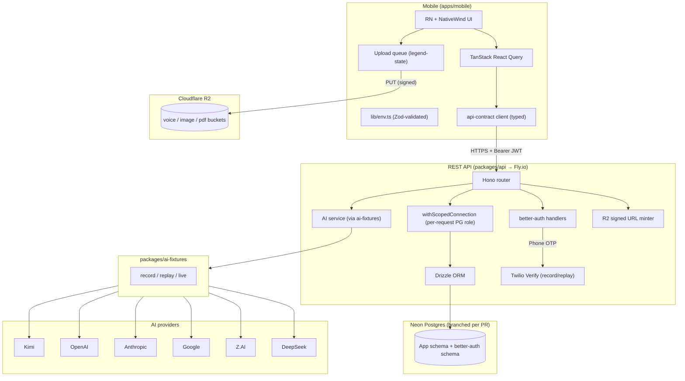

# v4 Architecture

> **Status**: planning — the source of truth for the v4 rewrite.
>
> Read [`pitfalls.md`](pitfalls.md) before this doc. The architecture
> below is shaped by the lessons recorded there.

## North-star principles

1. **Self-hostable, no Supabase.** Auth, db, file storage, and edge
   functions all run on services we control or can swap.
2. **Tested-first.** Every layer has its test strategy decided before
   it's built. No phase exits without its coverage gate.
3. **Visual parity is acceptance.** P2+ ships only what matches the
   canonical port source at `../haru3-reports/apps/mobile` on `dev`.
   Review is manual against that source — there is no automated
   screenshot-diff gate. JSX + Tailwind classes copy across (both
   sides are NativeWind v4); only the data layer changes.
4. **Fixtures everywhere expensive.** LLMs, Twilio, R2 PUT — every
   external boundary has a record/replay layer baked in from P0.

## High-level component diagram



## Stack at a glance

| Layer | v3 (deprecated) | v4 (this rewrite) | Why we changed |
|---|---|---|---|
| Auth | Supabase Auth (JWT, JWKS) | **better-auth** + Twilio Verify | No Supabase. Self-hosted, easier to test. |
| DB | Supabase Postgres + RLS | **Neon Postgres** + per-request scoped roles | Free PR branching; RLS replaced by API-layer scope (no API service-role bypass risk). |
| Storage | Supabase Storage | **Cloudflare R2** + signed URLs | No Supabase. R2 has zero egress, S3-compatible. |
| Mobile styling | Unistyles (P2 onwards) | **NativeWind v4** | v3's switch to Unistyles caused the realignment. NativeWind matches mobile-old's class strings; faster ports. |
| API | Hono + Drizzle | **same** | Working pattern, keep. |
| Contract | Zod + OpenAPI generated types | **same** | Working pattern, keep. |
| LLM mocking | Bolt-on mock-ai (P5.3) | **`ai-fixtures` package, P0** | Fixtures-first per Pitfall 2. |
| Mobile state | React Query + legend-state | **same** | Worked. |
| E2E | Maestro | **Maestro behaviour flows** | Per-page interaction tests; no automated visual diff (manual review against canonical port). |
| CI gates | Coverage at end | **Per-phase gates** | Gates listed in each `plan-p*.md`. |

## Section index

| # | Section | File | Description |
|---|---|---|---|
| 1 | API design | [arch-api-design.md](arch-api-design.md) | Endpoints, auth model, error format, pagination, rate limiting, OpenAPI strategy |
| 2 | Auth + per-request scope | [arch-auth-and-rls.md](arch-auth-and-rls.md) | better-auth flow, JWT, Twilio Verify, scoped Postgres roles, RLS replacement, scope tests |
| 3 | Data layer (mobile) | [arch-data-layer.md](arch-data-layer.md) | Generated client, React Query hooks, optimistic updates, error handling |
| 4 | Mobile architecture | [arch-mobile.md](arch-mobile.md) | Directory structure, navigation, state, NativeWind tokens, primitives, upload queue, audio |
| 5 | Storage (R2) | [arch-storage.md](arch-storage.md) | R2 buckets, signed URL flow, lifecycle, security, fixture mode |
| 6 | AI fixtures | [arch-ai-fixtures.md](arch-ai-fixtures.md) | record/replay/live modes, redaction, packaging |
| 7 | Database (Neon) | [arch-database.md](arch-database.md) | Neon branching per PR, migrations, scoped roles, schema layout |
| 7a | IDs + URL shapes | [arch-ids-and-urls.md](arch-ids-and-urls.md) | Prefixed slugs, UUIDv7 keys, per-project report numbers, long + short URLs, deep-link readiness |
| 8 | Shared packages | [arch-shared-packages.md](arch-shared-packages.md) | api-contract, ai-fixtures, ui (optional) |
| 9 | Testing strategy | [arch-testing.md](arch-testing.md) | Test pyramid, Testcontainers, MSW, Maestro behaviour flows, fixture replay |
| 10 | Observability + ops | [arch-ops.md](arch-ops.md) | Fly metrics, Sentry, log shipping, deploy flow |

## Repo layout (target end of P0)

```
apps/
  mobile/                 # Expo + NativeWind
    app/                  # expo-router routes
    components/           # screen-scoped components
    features/             # domain logic (voice, upload, reports, …)
    lib/                  # env, date, uuid, dialogs, …
    tailwind.config.js
  docs/                   # Next.js docs site (in-app guides + visual ref)

packages/
  api/                    # Hono REST API
    src/
      routes/             # one file per resource
      middleware/         # auth, scope, rate-limit, request-id
      services/           # ai, files, otp, …
      db/                 # Drizzle schema + migrations
      __tests__/
        integration/      # Testcontainers
        scope/            # per-request scope (RLS replacement)
        contract/         # OpenAPI shape match
    Dockerfile
    fly.toml
  api-contract/           # Zod schemas + generated OpenAPI types
  ai-fixtures/            # record/replay/live providers + fixtures
  ui/                     # shared primitives (P2.1; optional split later)

infra/
  neon/                   # branching scripts (create/delete on PR)
  fly/                    # deploy scripts
  r2/                     # bucket setup, lifecycle policies

scripts/
  check-no-supabase.sh
  check-no-unistyles.sh
  check-no-alert-alert.sh

docs/
  v4/                     # current
  legacy-v3/              # reference
  bugs/                   # recurring bugs log

skills/                   # auto-loaded
```

## Phases

| Phase | Name | Exit gate (binding) |
|---|---|---|
| P0 | Foundation | All packages scaffold compiles. `ai-fixtures` works (replay + record). better-auth OTP route hits Twilio sandbox + integration test green. Neon branch script tested in CI. |
| P1 | API Core | All routes implemented (zero stubs). `pnpm test:api && pnpm test:api:integration` green at ≥90% line coverage. Per-request scope tests cover every authed route. Fixture replay covers every AI route. |
| P2 | Mobile Shell | Auth + nav + every primitive built. Every auth screen + projects list ported from `../haru3-reports/apps/mobile@dev` and reviewed manually. NativeWind tokens locked in `tailwind.config.js`. Dev-gallery routes (`app/(dev)/`) render every screen with mock props. |
| P3 | Feature Build | Every screen from `../haru3-reports/apps/mobile@dev` ported, with: behaviour test for each interaction, Maestro flow. No screen is "stubbed" or "TODO redesign". |
| P4 | E2E + Hardening | Full Maestro journey green on iOS + Android. Sentry wired. Fly + Neon prod deploy green. PDF export bit-for-bit equivalent to mobile-old samples. |
| P5 | Beta + GA | TestFlight + Play internal track distribution. Rollout monitor. Cutover. |

Each phase's exit gate is enforced by a single CI workflow named
after the phase (e.g. `.github/workflows/p1-exit-gate.yml`). PRs
labelled `phase/p1-exit` must pass it before merge.

See [`implementation-plan.md`](implementation-plan.md).

---

*All deeper detail lives in the per-section docs above. This page
stays short on purpose.*
