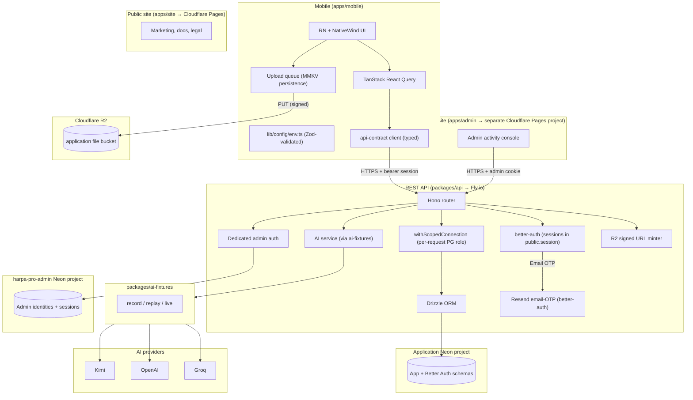

# v4 Architecture

> **Status: live.** The application, API, public site, and admin console
> are deployed, and the iOS app is public. Phase plans are historical
> delivery records. Current code, tests, and live architecture sections
> define present behavior.
>
> Read [`pitfalls.md`](pitfalls.md) before this doc. The architecture
> below is shaped by the lessons recorded there.

## North-star principles

1. **Self-hostable, no Supabase.** Auth, db, file storage, and edge
   functions all run on services we control or can swap.
2. **Tested-first.** Every layer has its test strategy decided before
   it's built. No phase exits without its coverage gate.
3. **Visual acceptance is explicit.** The relevant `design-*.md` or
   `plan-*.md` file defines a screen specification. If neither
   exists, the current implementation and tests are the baseline.
   A design change needs a task-specific design doc. Review is manual
   on the iOS simulator. There is no automated screenshot-diff gate.
4. **Fixtures everywhere expensive.** LLMs, Resend email, R2 PUT — every
   external boundary has a record/replay layer baked in from P0.

## High-level component diagram


```mermaid
flowchart TB
    subgraph Mobile["Mobile (apps/mobile)"]
        UI["RN + NativeWind UI"]
        RQ["TanStack React Query"]
        QUEUE["Upload queue (MMKV persistence)"]
        ENV["lib/config/env.ts (Zod-validated)"]
        APIC["api-contract client (typed)"]
    end

    subgraph Site["Public site (apps/site → Cloudflare Pages)"]
        PUBLICUI["Marketing, docs, legal"]
    end

    subgraph AdminSite["Admin site (apps/admin → separate Cloudflare Pages project)"]
        ADMINUI["Admin activity console"]
    end

    subgraph API["REST API (packages/api → Fly.io)"]
        HONO["Hono router"]
        SCOPE["withScopedConnection (per-request PG role)"]
        BA["better-auth (sessions in public.session)"]
        ADMINAUTH["Dedicated admin auth"]
        DRIZZLE["Drizzle ORM"]
        AISVC["AI service (via ai-fixtures)"]
        OTP["Resend email-OTP (better-auth)"]
        R2SIGN["R2 signed URL minter"]
    end

    subgraph Neon["Application Neon project"]
        PG[("App + Better Auth schemas")]
    end

    subgraph AdminNeon["harpa-pro-admin Neon project"]
        ADMINPG[("Admin identities + sessions")]
    end

    subgraph R2["Cloudflare R2"]
        FILES[("application file bucket")]
    end

    subgraph AI["AI providers"]
        K[Kimi]
        OAI[OpenAI]
        GR[Groq]
    end

    subgraph FIX["packages/ai-fixtures"]
        REC["record / replay / live"]
    end

    UI --> RQ --> APIC
    UI --> QUEUE
    APIC -- "HTTPS + bearer session" --> HONO
    ADMINUI -- "HTTPS + admin cookie" --> HONO
    QUEUE -- "PUT (signed)" --> FILES
    HONO --> BA
    HONO --> ADMINAUTH --> ADMINPG
    HONO --> SCOPE --> DRIZZLE --> PG
    HONO --> AISVC --> FIX --> K & OAI & GR
    HONO --> R2SIGN
    BA -- "Email OTP" --> OTP
```

## Stack at a glance

| Layer          | v3 (deprecated)               | v4 (this rewrite)                                                         | Why we changed                                                                                                     |
| -------------- | ----------------------------- | ------------------------------------------------------------------------- | ------------------------------------------------------------------------------------------------------------------ |
| Auth           | Supabase Auth (JWT, JWKS)     | **Better Auth for the app; isolated password auth for the admin console** | App and admin identities cannot authorize each other. See [arch-auth-and-rls.md](arch-auth-and-rls.md).            |
| DB             | Supabase Postgres + RLS       | **Independent app and admin Neon projects**                               | App data keeps per-request scoped roles; admin credentials have an independent restore boundary.                   |
| Storage        | Supabase Storage              | **Cloudflare R2** + signed URLs                                           | No Supabase. R2 has zero egress, S3-compatible.                                                                    |
| Mobile styling | Unistyles (P2 onwards)        | **NativeWind v4**                                                         | v3's switch to Unistyles caused the realignment. NativeWind matches mobile-old's class strings; faster ports.      |
| API            | Hono + Drizzle                | **same**                                                                  | Working pattern, keep.                                                                                             |
| Contract       | Zod + OpenAPI generated types | **same**                                                                  | Working pattern, keep.                                                                                             |
| LLM mocking    | Bolt-on mock-ai (P5.3)        | **`ai-fixtures` package, P0**                                             | Fixtures-first per Pitfall 2.                                                                                      |
| Mobile state   | React Query + legend-state    | **TanStack Query + MMKV-backed caches and upload jobs**                   | User-scoped persistence protects account boundaries and resumes uploads.                                           |
| E2E            | Maestro                       | **Maestro behaviour flows**                                               | Per-page interaction tests. No automated visual diff. Manual review uses the relevant v4 spec or current baseline. |
| CI gates       | Coverage at end               | **Per-phase gates**                                                       | Gates listed in each `plan-p*.md`.                                                                                 |

## Section index

| #   | Section                                      | File                                                                                     | Description                                                                                                                                                                                                                                                 |
| --- | -------------------------------------------- | ---------------------------------------------------------------------------------------- | ----------------------------------------------------------------------------------------------------------------------------------------------------------------------------------------------------------------------------------------------------------- |
| 1   | API design                                   | [arch-api-design.md](arch-api-design.md)                                                 | Endpoints, auth model, error format, pagination, rate limiting, OpenAPI strategy                                                                                                                                                                            |
| 1a  | **Rate limiting**                            | [arch-rate-limiting.md](arch-rate-limiting.md)                                           | **Per-route + shared AI + catch-all budgets; PostgresRateLimiter; SMS-pump protection on /api/auth/email-otp/\*; multi-machine correctness**                                                                                                                |
| 2   | Auth + per-request scope                     | [arch-auth-and-rls.md](arch-auth-and-rls.md)                                             | Better Auth email OTP, isolated admin password auth, scoped Postgres roles, and scope tests                                                                                                                                                                 |
| 3   | Data layer (mobile)                          | [arch-data-layer.md](arch-data-layer.md)                                                 | Generated client, React Query hooks, optimistic updates, error handling                                                                                                                                                                                     |
| 4   | Mobile architecture                          | [arch-mobile.md](arch-mobile.md)                                                         | Directory structure, navigation, state, NativeWind tokens, primitives, upload queue, audio                                                                                                                                                                  |
| 4a  | **Mobile navigation policy**                 | [arch-mobile-navigation.md](arch-mobile-navigation.md)                                   | **push/replace/back/dismiss policy; per-call audit; back-stack pitfalls and `dismissOrReplaceTo` helper**                                                                                                                                                   |
| 5   | Storage (R2)                                 | [arch-storage.md](arch-storage.md)                                                       | R2 buckets, signed URL flow, lifecycle, security, fixture mode                                                                                                                                                                                              |
| 6   | AI fixtures                                  | [arch-ai-fixtures.md](arch-ai-fixtures.md)                                               | record/replay/live modes, redaction, packaging                                                                                                                                                                                                              |
| 7   | Databases (Neon)                             | [arch-database.md](arch-database.md)                                                     | Independent application and admin projects, branching, migrations, roles, and restore boundaries                                                                                                                                                            |
| 7a  | IDs + URL shapes                             | [arch-ids-and-urls.md](arch-ids-and-urls.md)                                             | Prefixed slugs, UUIDv7 keys, per-project report numbers, long + short URLs, deep-link readiness                                                                                                                                                             |
| 7b  | **P3.0 IDs/slugs design**                    | [design-p30-ids-slugs.md](design-p30-ids-slugs.md)                                       | **Migration plan, slug generator, API routes, scope tests, mobile routing (implementation-ready)**                                                                                                                                                          |
| 8   | Shared packages                              | [arch-shared-packages.md](arch-shared-packages.md)                                       | api-contract, ai-fixtures, ui (optional)                                                                                                                                                                                                                    |
| 9   | Testing strategy                             | [arch-testing.md](arch-testing.md)                                                       | Test pyramid, Testcontainers, MSW, Maestro behaviour flows, fixture replay                                                                                                                                                                                  |
| 10  | Observability + ops                          | [arch-ops.md](arch-ops.md)                                                               | Fly metrics, Sentry, log shipping, deploy flow                                                                                                                                                                                                              |
| 10a | **CI/CD + migrations**                       | [arch-cicd-and-migrations.md](arch-cicd-and-migrations.md)                               | **Release-command migration apply, `/readyz` schema-head check, expand-contract rules, rollback playbook**                                                                                                                                                  |
| 11  | **CLI**                                      | [arch-cli.md](arch-cli.md)                                                               | **Debug and API-journey tool (`apps/cli`); stateless and environment-driven**                                                                                                                                                                               |
| 12  | **Project members**                          | [arch-project-members.md](arch-project-members.md)                                       | **Roles, invite (POST), role-change (PATCH), removal (DELETE), owner-demotion guard, error codes, scope tests**                                                                                                                                             |
| 13  | **Maestro full regression**                  | [design-maestro-full-regression.md](design-maestro-full-regression.md)                   | **P4.8 two-actor nightly E2E journey: members permissions, voice/photo/text notes, generate/finalize, Report Debug surface**                                                                                                                                |
| 14  | **Usage limits**                             | [arch-usage-limits.md](arch-usage-limits.md)                                             | **Per-account monthly caps: plan model (free/pro/enterprise) + admin overrides, `enforceUsageLimit` chokepoint, 403 `usage_limit_exceeded` envelope, mobile dialog + near-limit toast**                                                                     |
| 15  | **Batch photo notes**                        | [arch-batch-photo-notes.md](arch-batch-photo-notes.md)                                   | **One note → many photos; `note_files` join table, upload batch coordinator, `PhotoBatchGrid` UI**                                                                                                                                                          |
| 15a | **Photo placement**                          | [design-photo-placement.md](design-photo-placement.md)                                   | **Lets the user attach a photo group to a specific issue or summary section: `report.body.*.attachments.images[]`, `PATCH /projects/{project}/reports/{number}/attachments`, `MapPin` chip + `AppDialogSheet` picker, server-side attachment sanitization** |
| 16  | **Report auto-regen**                        | [arch-report-auto-regen.md](arch-report-auto-regen.md)                                   | **DB-driven dirty flag (`notes_changed_at > generated_at`), race-safe snapshot semantic, mobile `useAutoRegenerate` hook**                                                                                                                                  |
| 16a | **Published report review**                  | [design-report-review-comments.md](design-report-review-comments.md)                     | **Finalized Report / Review tabs, append-only member comments, RLS-scoped GET/POST routes, and full-width wrapping report titles**                                                                                                                          |
| 17  | **Voice pipeline**                           | [arch-voice-pipeline.md](arch-voice-pipeline.md)                                         | **End-to-end record → upload → transcribe → summarise → render pipeline; mobile recorder + API aggregator route + `VoiceNoteCard` (companion plan: [plan-voice-pipeline.md](plan-voice-pipeline.md))**                                                      |
| 18  | **Mobile skeletons**                         | [arch-mobile-skeletons.md](arch-mobile-skeletons.md)                                     | **Per-screen skeleton geometry policy to prevent layout-shift on hydrate**                                                                                                                                                                                  |
| 19  | **App shell (P2.6)**                         | [arch-p2-6-app-shell.md](arch-p2-6-app-shell.md)                                         | **Root provider tree, auth gate redirect, `(app)` tab/stack shape — design notes for the shell that landed in P2.6**                                                                                                                                        |
| 20  | **Admin business activity (implemented)**    | [design-admin-business-activity.md](design-admin-business-activity.md)                   | **Append-oriented business events, an admin-only API, and the activity console**                                                                                                                                                                            |
| 20a | **Separate admin authentication (deployed)** | [design-separate-admin-auth.md](design-separate-admin-auth.md)                           | **Dedicated `@harpapro.com` identities, long-password login, opaque browser sessions, and an independent Neon project**                                                                                                                                     |
| 20b | **Separate admin site (deployed)**           | [design-separate-admin-site.md](design-separate-admin-site.md)                           | **Independent `apps/admin` static artifact, Pages project, exact browser origins, and deployment workflows for `admin.harpapro.com`**                                                                                                                       |
| 20c | **Cloudflare Pages Git deployments**         | [design-cloudflare-pages-git-deployments.md](design-cloudflare-pages-git-deployments.md) | **Tokenless Git publishing, exact `pr-N` preview refs, build-time environment selection, and exact-SHA deployment verification**                                                                                                                            |
| 21  | **Office dashboard (preview and dev)**       | [design-office-dashboard.md](design-office-dashboard.md)                                 | **Project/member/report management companion with keyboard-first report editing and mobile-first field capture**                                                                                                                                            |
| 21a | **Dashboard visual system**                  | [design-dashboard-visual-system.md](design-dashboard-visual-system.md)                   | **Mobile-authored color, type, spacing, control, and shape contract for the office dashboard only**                                                                                                                                                         |
| 22  | **Ponytail simplification stack**            | [design-ponytail-simplification-stack.md](design-ponytail-simplification-stack.md)       | **Stacked PR plan for dead-edge deletion, report-model convergence on `api-contract`, Maestro cleanup, CLI delegation, and narrower admin/provider transport boundaries**                                                                                   |

## Repository layout

```
apps/
  mobile/                 # Expo + NativeWind
    app/                  # expo-router routes
    components/           # screen-scoped components
    features/             # domain logic (voice, upload, reports, …)
    lib/                  # env, date, uuid, dialogs, …
    tailwind.config.js
  dashboard/              # React + Vite office project/report workspace
  site/                   # Astro marketing, guides, and legal pages
  admin/                  # standalone admin console
  cli/                    # API and journey CLI

packages/
  api/                    # Hono REST API
    admin-migrations/     # isolated harpa-pro-admin migration stream
    src/
      routes/             # one file per resource
      middleware/         # auth, scope, rate-limit, request-id
      services/           # ai, files, otp, …
      db/                 # app/admin clients, schemas, scope + migrators
      __tests__/
        integration/      # Testcontainers
        scope/            # per-request scope (RLS replacement)
        contract/         # OpenAPI shape match
    Dockerfile
    fly.toml
  api-contract/           # Zod schemas + generated OpenAPI types
  ai-fixtures/            # record/replay/live providers + fixtures
  design-tokens/          # mobile-authored CSS tokens for the dashboard
infra/
  neon/                   # branching scripts (create/delete on PR)
  fly/                    # deploy scripts
  r2/                     # bucket setup, lifecycle policies

scripts/
  check-no-supabase.sh
  check-no-unistyles.sh

docs/
  v4/                     # current
  bugs/                   # recurring bugs log

```

## Historical phases

The phase table records the original delivery model. It is not a
current release-status dashboard. Use active pull requests, CI, and
the release documentation for present work.

| Phase | Name            | Exit gate (binding)                                                                                                                                                                                                                                                   |
| ----- | --------------- | --------------------------------------------------------------------------------------------------------------------------------------------------------------------------------------------------------------------------------------------------------------------- |
| P0    | Foundation      | All packages scaffold compiles. `ai-fixtures` works (replay + record). better-auth email-OTP route hits Resend sandbox + integration test green. Neon branch script tested in CI.                                                                                     |
| P1    | API Core        | All routes implemented (zero stubs). `pnpm test:api && pnpm test:api:integration` green at ≥90% line coverage. Per-request scope tests cover every authed route. Fixture replay covers every AI route.                                                                |
| P2    | Mobile Shell    | Auth + nav + every primitive built. Every auth screen + projects list implemented and reviewed against its relevant v4 spec. NativeWind tokens locked in `tailwind.config.js`. Screen bodies in `screens/<name>.tsx` are props-driven and unit-testable in isolation. |
| P3    | Feature Build   | Every screen in the relevant v4 plans implemented, with a behaviour test for each interaction and a Maestro flow. No screen is "stubbed" or "TODO redesign".                                                                                                          |
| P4    | E2E + Hardening | Full Maestro journey green on iOS + Android. Sentry wired. Fly + Neon prod deploy green. PDF export bit-for-bit equivalent to mobile-old samples.                                                                                                                     |
| P5    | Beta + GA       | TestFlight + Play internal track distribution. Rollout monitor. Cutover.                                                                                                                                                                                              |

Each phase's exit gate is enforced by a single CI workflow named
after the phase (e.g. `.github/workflows/p1-exit-gate.yml`). PRs
labelled `phase/p1-exit` must pass it before merge.

See [`implementation-plan.md`](implementation-plan.md).

---

_All deeper detail lives in the per-section docs above. This page
stays short on purpose._
