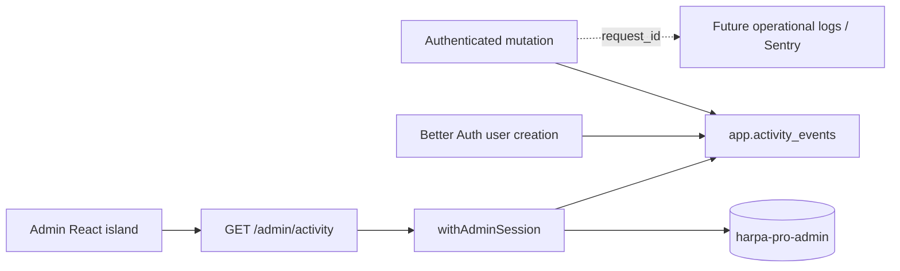

# Design — Admin business activity

Status: implemented and deployed. The first detail-level expansion was
approved on 2026-07-30. The separate admin-auth boundary is live; see
[Separate admin console authentication](design-separate-admin-auth.md).

Implementation status:

- [x] Phase 1 — contract, ID family, storage, RLS, and recorder.
- [x] Phase 2 — initial signup, project, and report event writers.
- [x] Phase 3 — admin read API and credentialed browser CORS.
- [x] Phase 4 — admin page.
- [x] Phase 5 — deployment.
- [x] Phase 6 — detail levels and advanced filtering.

## Problem

Harpa Pro has several vendor-owned operational log surfaces, but none is the
right source for product-level questions such as:

- Who signed up?
- Who created a project?
- Who created a report?
- When did each action happen?

Reconstructing these facts from Fly, Neon, Cloudflare, Resend, or Sentry would
couple product history to vendor retention, pricing, and incompatible log
formats. Harpa Pro should record its own curated business events and expose
them through one admin-authenticated page.

This design deliberately separates:

- **business activity**, which is durable, curated, and owned by Harpa Pro; and
- **operational telemetry**, which is detailed, short-lived, and intended for
  debugging through Sentry or a future log aggregator.

## Goals

- Record curated business events at two levels in the application Neon
  project: high-signal milestones and lower-level product details.
- Show them newest-first at `admin.harpapro.com`.
- Require the dedicated admin identity and session system. App users, Better
  Auth sessions, and `public."user".is_admin` do not authorize this page.
- Keep the admin browser artifact and deployment separate from the public
  Astro site.
- Preserve a request ID where one exists so an activity row can later link to
  operational telemetry.
- Make event writes synchronous and testable at the existing mutation
  chokepoints.

## Non-goals

- Ingesting vendor platform logs.
- Replacing Sentry or designing the lower-level log pipeline.
- Capturing every API request or database mutation.
- Product analytics, funnels, charts, alerts, or real-time live tail.
- A compliance-grade, tamper-evident audit system.
- A general admin dashboard beyond this one read-only activity page.

## Decision

Add an append-oriented `app.activity_events` table, a typed
`GET /admin/activity` API, and an Astro page containing one React island.

The page renders a dense native list. Filtering and pagination remain
server-side. The API is the only data source; the browser never connects to
Neon directly. TanStack Table is not installed.

Business events remain in the application Neon project. Administrator
identities and sessions live in the independent `harpa-pro-admin` Neon
project. The API authenticates against the admin database before reading the
business feed from the application database; the databases are never joined.

The browser implementation now lives in the independent `apps/admin`
application and Cloudflare Pages project. This supersedes the original shared
public-site deployment decision; see
[Separate admin site](design-separate-admin-site.md).



## Curated event taxonomy

The feed has two derived levels. `milestone` is the quiet default view for
major business events. `detail` contains successful user-facing product
actions that are useful when investigating what happened within a project.
The level comes from the typed event registry rather than a stored database
column.

| Level       | Event                   | Actor         | Subject | Metadata              |
| ----------- | ----------------------- | ------------- | ------- | --------------------- |
| `milestone` | `user.signed_up`        | New user      | User    | Authentication method |
| `milestone` | `project.created`       | Project owner | Project | None                  |
| `milestone` | `report.created`        | Report author | Report  | Report number         |
| `detail`    | `note.text_created`     | Note author   | Note    | None                  |
| `detail`    | `note.voice_created`    | Note author   | Note    | None                  |
| `detail`    | `note.image_created`    | Note author   | Note    | None                  |
| `detail`    | `note.document_created` | Note author   | Note    | None                  |

An image or document event means that the upload became a note in a report
timeline. Raw `POST /files` registration is deliberately not an activity
event: thumbnails, abandoned uploads, and objects not yet attached to report
content would otherwise create misleading noise. A multi-file image note
produces one creation event for the note, not one event per stored object.

Waitlist confirmation, report generation/finalization, membership, comments,
email delivery, later files appended to an existing note, and admin changes
remain candidates. Add them only when they answer a recurring operator
question.

`app.llm_usage_events` remains a separate usage ledger. It must not be copied
row-for-row into business activity.

## Data model

The ledger uses the reserved `aud_*` ID family and
`app.activity_events` with:

| Column          | Shape                 | Notes                                   |
| --------------- | --------------------- | --------------------------------------- |
| `id`            | `app.aud_id`          | API-minted primary key                  |
| `occurred_at`   | `timestamptz`         | Database default `now()`                |
| `event_type`    | `text`                | Constrained to the curated registry     |
| `actor_user_id` | nullable `app.usr_id` | No cascading foreign key                |
| `subject_type`  | `text`                | `user`, `project`, `report`, or `note`  |
| `subject_id`    | nullable `text`       | Preserved across normal entity deletion |
| `project_id`    | nullable `app.prj_id` | Context for project/report filtering    |
| `request_id`    | nullable `text`       | Validated request ID, when available    |
| `dedupe_key`    | nullable `text`       | Unique idempotency key                  |
| `metadata`      | `jsonb` object        | Event-specific, schema-validated values |

Indexes cover:

- `(occurred_at DESC, id DESC)` for the default cursor;
- `(event_type, occurred_at DESC, id DESC)`;
- `(actor_user_id, occurred_at DESC, id DESC)`; and
- `(project_id, occurred_at DESC, id DESC)`.

`dedupe_key` has a partial unique index when non-null. Creation events use
`<event_type>:<subject_id>`, allowing a failed or retried hook to be repaired
without duplicating the activity row.

### Data minimization

The event row does not copy email addresses, display names, project names,
report or note bodies, transcripts, filenames, client names, addresses, AI
prompts, or other free-form content. The admin read query left-joins current
labels from their source tables. If an entity has been deleted, the API returns
a `Deleted user/project/report/note` fallback. The admin UI presents that value
as a bracketed deleted-entity placeholder and keeps stable IDs available in
filters, the detail drawer, and the plain-text view.

This trades perfect historical labels for less duplicated personal and client
data. Historical label snapshots can be added later only with an explicit
retention and erasure policy.

`metadata` is not an arbitrary caller-supplied object. A discriminated Zod
union defines the permitted shape for every event type. The registry allows
only:

- `{ method: 'email_otp' }` for `user.signed_up`;
- `{}` for `project.created`;
- `{ reportNumber: number }` for `report.created`; and
- `{}` for each `note.*_created` event.

### Append behavior and deletion

Normal application roles receive no `UPDATE` or `DELETE` path. The
authenticated role may insert only when `actor_user_id` equals the scoped
`app.user_id`; the raw API role may insert the auth-created event and select
rows only after route-level admin authorization.

Account deletion is the one planned redaction exception. A privileged
database trigger nulls matching actor IDs and user-subject IDs and replaces a
signup's user-derived dedupe key with `redacted:<activity_event_id>` before
the account row is deleted. The event type and timestamp remain, but the row
no longer contains the deleted user ID. The trigger covers the existing
account-deletion helper and any future privileged deletion path.
This exception is documented alongside
`docs/v4/arch-auth-and-rls.md#account-deletion`.

No automatic retention job is needed at the current scale. Retention must be
revisited before the activity feed stores broader or more sensitive events.

## Recording events

`packages/api/src/services/activity-events.ts`:

- accepts a Drizzle handle rather than importing a route-level raw database;
- accepts a typed event union;
- mints `aud_*` IDs through `newId('aud')`;
- validates metadata before writing;
- inserts with `ON CONFLICT (dedupe_key) DO NOTHING`; and
- never swallows database errors.

### Project and report creation

`project.created` and `report.created` are written inside the same scoped
database callback as the entity creation. A successful entity and its event
commit together; a failed transaction leaves neither.

The current project route performs creation and reload in separate scoped
callbacks. Implementation should combine the creation and event write into
one callback while preserving the response reload behavior.

### Note creation

Every successful note creation records one detail event inside the same
scoped database callback:

- the generic note route maps the validated `text`, `voice`, `image`, or
  `document` note kind to its matching event type; and
- the voice aggregation route records `note.voice_created` after
  transcription and summarization have succeeded.

The note and activity row commit together. The event stores only the note ID,
project context, actor, request ID, and strict empty metadata. It does not
copy note contents, AI output, filenames, storage keys, or provider details.
The dedupe key is `<event_type>:<note_id>`.

### User signup

Better Auth owns creation of `public."user"`. Extend its existing
`databaseHooks.user.create` configuration with an `after` hook that records
`user.signed_up` only for the real email-OTP signup path. Internal test/demo
account seeding must not be classified as a customer signup.

The hook uses a deterministic `dedupe_key`. A focused integration test must
exercise the real email-OTP flow and assert exactly one user and one activity
row. Before implementation, verify Better Auth 1.6.13 hook failure and
transaction behavior rather than assuming the hook shares the adapter's
transaction.

The hook is not transactionally coupled, so it reports insert failures without
breaking the completed signup. Repair is explicit and idempotent:
`pnpm --filter @harpa/api activity:reconcile-signups -- --user-id <usr_id>`
previews one or more named users, and `--apply` inserts only their missing
events using the source `created_at`. The command cannot scan or silently
backfill all historical users. Do not add a queue or scheduled worker for the
initial volume.

### Existing rows

The default is to begin tracking at deployment time and show a visible
`Activity recorded since <date>` note. Do not synthesize history silently.

An optional, dry-run-first backfill command may be designed separately if the
existing production rows are worth importing. It must use source
`created_at` values and the same dedupe keys.

## API contract

Add:

```text
GET /admin/activity
```

Authentication and authorization use the dedicated admin session:

```text
withAdminSession() -> admin activity handler
```

Supported query fields:

| Field                 | Purpose                               |
| --------------------- | ------------------------------------- |
| `cursor`              | Opaque `(occurred_at, id)` cursor     |
| `limit`               | Default 50, maximum 100               |
| `level`               | `milestone`, `detail`, or `all`       |
| `eventType`           | Exact curated event type              |
| `actorUserId`         | Exact actor                           |
| `excludeActorUserIds` | Comma-separated actor IDs, maximum 20 |
| `projectId`           | Exact project context                 |
| `from` / `to`         | Optional ISO-8601 time window         |

`level` defaults to `milestone`, preserving the original quiet feed. An exact
`eventType` takes precedence over `level`. Excluding actors retains redacted
events whose `actor_user_id` is `NULL`; it hides only rows whose current actor
ID appears in the exclusion list.

The API keeps exact `from` and `to` fields for compatibility and automation.
The admin UI exposes only Past week, Past month, Past 6 months, Past year, and
All time. It converts the chosen preset to `from` and leaves `to` unset.

The response follows the existing envelope:

```text
{ items: ActivityEvent[], nextCursor: string | null }
```

Items are display-ready and contain current actor/project labels when they
still exist. The endpoint has fixed newest-first ordering; the first release
does not expose arbitrary server sorting or a total row count.

Responses include `Cache-Control: private, no-store`. Callers without a valid
dedicated admin session get `401`. An app bearer token or Better Auth cookie
does not authorize the route, even when the app user has
`public."user".is_admin = true`. The route uses an unscoped application
database read service only after `withAdminSession()` validates the cookie
against the independent admin database.

Contract schemas live in `packages/api-contract`, and timestamps use the
shared ISO-8601 transform from Pitfall 7.

## Browser authentication and CORS

The browser uses the separate admin-auth service described in
[design-separate-admin-auth.md](design-separate-admin-auth.md). An exact,
pre-provisioned `@harpapro.com` address and long password create a revocable
server-side session. Better Auth email OTP and app sessions are not accepted.
The browser stores only an opaque, secure, HttpOnly cookie; it does not store
a bearer token or password in `localStorage`, session storage, or JavaScript
state after an attempt completes.

`admin.harpapro.com` and `api.harpapro.com` are separate origins but the same
HTTPS site. Browser requests use `credentials: 'include'`; the dedicated
admin cookie remains host-only to `api.harpapro.com`. Do not enable a
parent-domain cookie, because the public marketing host does not need the
admin session.

API changes:

- remove admin browser origins from Better Auth `trustedOrigins`;
- add exact per-environment admin web origins through parsed API env;
- mount credentialed CORS only on `/admin/*`, not `/api/auth/*`;
- echo only an exact configured origin, never `*`;
- allow only required methods and headers; and
- cover successful and rejected preflights with integration tests.

Production, stable development, and localhost origins must be configured
separately. Production must not trust a development or wildcard Pages
hostname.

The React island provides:

1. session-loading state;
2. email and password sign-in;
3. generic invalid-credentials state;
4. activity loading/error/empty/table states; and
5. sign-out.

The existing Expo bearer flow remains unchanged.

## Admin page

Render `apps/admin/src/pages/index.astro` with a single React island at
`apps/admin/src/components/admin/AdminActivity.tsx`.

The presentation and interaction model is refined by
[Dense admin activity log view](design-admin-activity-log-view.md). The page
includes:

- `Time period` and `Detail level` controls in a filter region above the feed,
  with no separate event-type control;
- compact non-modal filter popups attached only to the `User` and `Project`
  column headers, without changing table row positions;
- immediately applied time, detail-level, included-user, multiple
  excluded-user, and project choices;
- one user list with an email or stable user ID for duplicate-name clarity;
- project choices with stable project IDs for duplicate-name clarity;
- local user and project choice search by name and displayed identifier, with
  contradictory user inclusion and exclusion resolved before the request;
- page and column-header filters that remain available when a query returns no
  rows;
- dense, non-wrapping log lines with clear information hierarchy;
- local refresh baselines and `New` markers;
- a browser-local plain-text view of the currently loaded rows;
- a `Load older` cursor action;
- a row detail drawer showing IDs, request ID, and safe metadata; and
- clear deleted-entity and tracking-started states.

Sorting remains fixed on the server. TanStack Virtual, TanStack Query, a JSON
viewer, charts, persisted exports, and live updates are all deferred.

The route has `noindex` metadata, the admin host disallows crawling, and the
page remains useful at narrow desktop/tablet widths. The activity data is not
embedded in the static HTML.

## Domain and deployment

The admin console uses `apps/admin` and the independent `harpa-pro-admin`
Cloudflare Pages project. `admin.harpapro.com` renders business activity at `/`
and read-only service monitoring at `/operations`; unknown browser paths return
a static 404, and there is no browser compatibility alias. `/admin/activity`
remains the API resource path, and the public `apps/site` artifact has no admin
route.

Admin authentication uses its own Neon project and database. The Hono API
service remains shared, but its browser-origin allowlist trusts only the exact
admin origin for each environment. Development uses the long-lived `dev`
branch in the admin Neon project; production uses `main`. Admin PRs use
matching per-PR branches in both Neon projects and a matching Fly preview app.

Cloudflare Access may protect the complete admin hostname as a perimeter
gate. It is defense in depth, not the application authorization source. The
API must still require `withAdminSession()`. Because Access and dedicated
admin authentication can create a double-login experience, enable it as an
explicit deployment choice after the password flow is verified.

## Failure behavior

- A failed project/report event insert rolls back the originating mutation.
- A failed note event insert rolls back the originating note creation.
- A failed auth event insert is reported and repaired idempotently if Better
  Auth cannot make it transactional.
- A missing current actor, project, report, or note label does not fail the
  feed.
- A malformed cursor or filter returns `400`.
- An unavailable API renders a retryable error without exposing cached rows.
- The browser never falls back to direct database access.
- Event metadata validation fails closed before insertion.

## Verification

### Database and API

- Migration test covers the domain, indexes, grants, RLS, and dedupe key.
- Scope tests prove an authenticated user may insert only their own event and
  cannot select the activity table.
- Integration tests prove project and report creation write exactly one event
  and failed mutations write none.
- Integration tests prove each note kind writes one detail event in the same
  transaction, with no content copied into metadata.
- A real Better Auth email-OTP integration test proves signup recording.
- Admin API tests prove app sessions cannot authorize the feed, then cover
  admin-session success, level and actor-exclusion filters, stable cursor
  pagination, deleted-label fallback, ISO dates, and `no-store`.
- Account-deletion tests prove user identifiers are redacted from retained
  events.
- Contract/code-generation drift checks remain green.

### Admin site

- Component tests cover password auth, loading, generic failure, empty,
  populated, pagination, the above-feed time and detail controls, User and
  Project header popups, local choice search, duplicate-name labels, immediate
  requests, multiple user exclusions, include/exclude conflict resolution,
  stable table geometry, refresh/new markers, plain-text output, deleted
  entities, and the detail drawer.
- A Playwright smoke covers the local admin page against the real API/default
  wiring, including CORS and a persisted event (Pitfall 13).
- Run the admin workspace typecheck, lint, unit, build, and focused Playwright
  checks, plus the public-site guard that proves no admin artifact is emitted.

Cloudflare hostname, redirect, and Access changes are verified manually
before being treated as complete.

## Phased implementation plan

### Phase 1 — Contract and storage

- Add `aud` to the shared ID registry and factories.
- Add the migration, Drizzle schema, RLS/grants, and migration tests.
- Add activity schemas to `packages/api-contract`.
- Add the typed event recorder and unit tests.

### Phase 2 — Initial writers

- Record `project.created` transactionally.
- Record `report.created` transactionally.
- Record `user.signed_up` through the verified Better Auth hook.
- Add route-level and default-wiring integration assertions.

### Phase 3 — Admin read API

- Add the display read model and cursor encoding.
- Add `GET /admin/activity`.
- Add exact-origin `/admin/*` CORS and remove admin origins from Better Auth.
- Add admin, scope, filter, pagination, and cache-header tests.
- Regenerate OpenAPI/types and update API/auth/database docs.

### Phase 4 — Admin page

- Add the dedicated admin-auth fetch client and password states.
- Add the dense activity-list island.
- Add the Astro route, noindex/robots exclusions, tests, and responsive
  styling.

### Phase 5 — Deployment

- Ensure and migrate the independent admin `dev` branch, configure
  `ADMIN_DATABASE_URL`, and provision the development administrator.
- Deploy and verify the stable development route.
- Configure the production API origin allowlist and migrate the independent
  admin `main` database before provisioning production.
- Attach `admin.harpapro.com` to the independent Pages project and verify the
  root console and verify that unknown browser paths return 404.
- Decide whether to enable Cloudflare Access.
- Run a production smoke: sign up, create a project and report, add selected
  note kinds, and verify both milestone and detail rows with request IDs where
  available.

### Phase 6 — Detail levels and advanced filtering

- Derive `milestone` and `detail` from a central curated registry.
- Default the feed to milestone events and allow milestone, detail, or all.
- Replace exact date controls with Past week, Past month, Past 6 months, Past
  year, and All time presets.
- Allow up to 20 actor IDs to be excluded at once while retaining redacted
  actor rows.
- Record text, voice, image, and document note creation transactionally.
- Keep raw file-registration traffic out of the business feed.
- Re-evaluate additional event types only after operators use this layer.

## Alternatives considered

### Query current source tables only

A `UNION ALL` over users, projects, and reports would avoid a new table and
can provide an immediate diagnostic query. It cannot preserve deleted
entities, represent transitions, or provide one governed event taxonomy.
Keep the query as a temporary operator tool, not the long-term page backend.

### Send business events only to Better Stack or Sentry

This gives a convenient interface but couples durable product history to
retention and vendor availability. These systems may receive a mirrored
structured event later, but Neon remains authoritative.

### Keep the admin route in `apps/site`

Rejected after the initial implementation. It minimizes deployment work but
lets every public-site artifact serve the admin shell and couples marketing
and admin releases. The accepted split is documented in
[Separate admin site](design-separate-admin-site.md).

### Trust Cloudflare Access without app authorization

Rejected. Access is a useful outer gate, but app-level authorization must
continue to validate the dedicated admin session at the API boundary.

## Documentation affected during implementation

- `docs/v4/architecture.md`
- `docs/v4/arch-api-design.md`
- `docs/v4/arch-auth-and-rls.md`
- `docs/v4/arch-database.md`
- `docs/v4/arch-ops.md`
- the public privacy/account-deletion documentation if retention semantics
  change

## Default planning choices

Unless the user changes them before implementation:

- use the independent `apps/admin` application and `harpa-pro-admin` Pages
  project;
- keep admin identities and sessions in the independent `harpa-pro-admin`
  Neon project;
- default to the three milestone events and keep note creation in the optional
  detail level;
- do not backfill old rows;
- use HttpOnly cookie auth, not a browser-stored bearer token;
- keep current labels out of stored activity rows;
- defer Cloudflare Access until the app-auth flow works; and
- do not build lower-level log collation in this feature.
