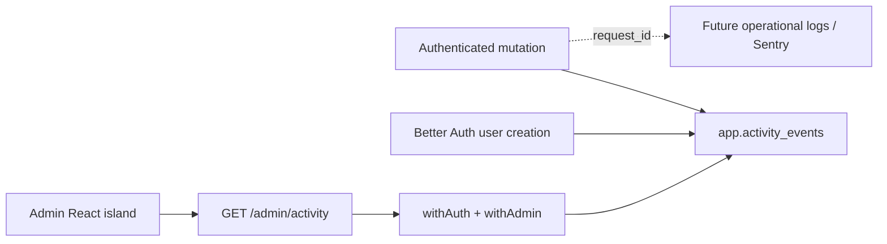

# Design — Admin business activity

Status: approved on 2026-07-29. Local implementation is in progress.

Implementation status:

- [x] Phase 1 — contract, ID family, storage, RLS, and recorder.
- [x] Phase 2 — initial signup, project, and report event writers.
- [x] Phase 3 — admin read API and credentialed browser CORS.
- [x] Phase 4 — admin page.
- [ ] Phase 5 — deployment.
- [ ] Phase 6 — evaluate before expanding.

## Problem

Harpa Pro has several vendor-owned operational log surfaces, but none is the
right source for product-level questions such as:

- Who signed up?
- Who created a project?
- Who created a report?
- When did each action happen?

Reconstructing these facts from Fly, Neon, Cloudflare, Resend, or Sentry would
couple product history to vendor retention, pricing, and incompatible log
formats. Harpa Pro should record its own curated business events and expose
them through one admin-authenticated page.

This design deliberately separates:

- **business activity**, which is durable, curated, and owned by Harpa Pro; and
- **operational telemetry**, which is detailed, short-lived, and intended for
  debugging through Sentry or a future log aggregator.

## Goals

- Record a small set of high-signal business events in Neon.
- Show them newest-first at `admin.harpapro.com`.
- Use the existing Better Auth session and `is_admin` authorization.
- Keep the first version inside the existing Astro site and Cloudflare Pages
  deployment.
- Preserve a request ID where one exists so an activity row can later link to
  operational telemetry.
- Make event writes synchronous and testable at the existing mutation
  chokepoints.

## Non-goals

- Ingesting vendor platform logs.
- Replacing Sentry or designing the lower-level log pipeline.
- Capturing every API request or database mutation.
- Product analytics, funnels, charts, alerts, or real-time live tail.
- A compliance-grade, tamper-evident audit system.
- A general admin dashboard beyond this one read-only activity page.

## Decision

Add an append-oriented `app.activity_events` table, a typed
`GET /admin/activity` API, and an Astro page containing one React island.

The page uses TanStack Table for table state and rendering. Filtering and
pagination remain server-side. The API is the only data source; the browser
never connects to Neon directly.

The implementation stays in `apps/site` while this remains one or two admin
pages. A separate `apps/admin` application and Pages project would add
duplicate environment, deployment, and styling work without improving the
API security boundary. Split it later only if the admin surface needs an
independent release cadence, server-side proxy, or several workflows.



## Initial event taxonomy

The first release records exactly three events:

| Event             | Actor         | Subject | Additional metadata   |
| ----------------- | ------------- | ------- | --------------------- |
| `user.signed_up`  | New user      | User    | Authentication method |
| `project.created` | Project owner | Project | None                  |
| `report.created`  | Report author | Report  | Report number         |

Waitlist confirmation, report generation/finalization, membership, comments,
email delivery, and admin changes are useful candidates, but they stay out of
the first release. Event coverage expands only after the initial feed proves
useful.

`app.llm_usage_events` remains a separate usage ledger. It must not be copied
row-for-row into business activity.

## Data model

The next migration adds the reserved `aud_*` ID family and
`app.activity_events` with:

| Column          | Shape                 | Notes                                    |
| --------------- | --------------------- | ---------------------------------------- |
| `id`            | `app.aud_id`          | API-minted primary key                   |
| `occurred_at`   | `timestamptz`         | Database default `now()`                 |
| `event_type`    | `text`                | Constrained to the curated registry      |
| `actor_user_id` | nullable `app.usr_id` | No cascading foreign key                 |
| `subject_type`  | `text`                | Initially `user`, `project`, or `report` |
| `subject_id`    | nullable `text`       | Preserved across normal entity deletion  |
| `project_id`    | nullable `app.prj_id` | Context for project/report filtering     |
| `request_id`    | nullable `text`       | Validated request ID, when available     |
| `dedupe_key`    | nullable `text`       | Unique idempotency key                   |
| `metadata`      | `jsonb` object        | Event-specific, schema-validated values  |

Indexes cover:

- `(occurred_at DESC, id DESC)` for the default cursor;
- `(event_type, occurred_at DESC, id DESC)`;
- `(actor_user_id, occurred_at DESC, id DESC)`; and
- `(project_id, occurred_at DESC, id DESC)`.

`dedupe_key` has a partial unique index when non-null. Creation events use
`<event_type>:<subject_id>`, allowing a failed or retried hook to be repaired
without duplicating the activity row.

### Data minimization

The event row does not copy email addresses, display names, project names,
report bodies, client names, addresses, AI prompts, or other free-form
content. The admin read query left-joins current labels from their source
tables. If an entity has been deleted, the UI displays its stable ID and a
`Deleted user/project/report` label.

This trades perfect historical labels for less duplicated personal and client
data. Historical label snapshots can be added later only with an explicit
retention and erasure policy.

`metadata` is not an arbitrary caller-supplied object. A discriminated Zod
union defines the permitted shape for every event type. The first release
allows only:

- `{ method: 'email_otp' }` for `user.signed_up`;
- `{}` for `project.created`; and
- `{ reportNumber: number }` for `report.created`.

### Append behavior and deletion

Normal application roles receive no `UPDATE` or `DELETE` path. The
authenticated role may insert only when `actor_user_id` equals the scoped
`app.user_id`; the raw API role may insert the auth-created event and select
rows only after route-level admin authorization.

Account deletion is the one planned redaction exception. A privileged
database trigger nulls matching actor IDs and user-subject IDs and replaces a
signup's user-derived dedupe key with `redacted:<activity_event_id>` before
the account row is deleted. The event type and timestamp remain, but the row
no longer contains the deleted user ID. The trigger covers the existing
account-deletion helper and any future privileged deletion path.
This exception is documented alongside
`docs/v4/arch-auth-and-rls.md#account-deletion`.

No automatic retention job is needed at the current scale. Retention must be
revisited before the activity feed stores broader or more sensitive events.

## Recording events

Add one service, tentatively
`packages/api/src/services/activity-events.ts`, which:

- accepts a Drizzle handle rather than importing a route-level raw database;
- accepts a typed event union;
- mints `aud_*` IDs through `newId('aud')`;
- validates metadata before writing;
- inserts with `ON CONFLICT (dedupe_key) DO NOTHING`; and
- never swallows database errors.

### Project and report creation

`project.created` and `report.created` are written inside the same scoped
database callback as the entity creation. A successful entity and its event
commit together; a failed transaction leaves neither.

The current project route performs creation and reload in separate scoped
callbacks. Implementation should combine the creation and event write into
one callback while preserving the response reload behavior.

### User signup

Better Auth owns creation of `public."user"`. Extend its existing
`databaseHooks.user.create` configuration with an `after` hook that records
`user.signed_up` only for the real email-OTP signup path. Internal test/demo
account seeding must not be classified as a customer signup.

The hook uses a deterministic `dedupe_key`. A focused integration test must
exercise the real email-OTP flow and assert exactly one user and one activity
row. Before implementation, verify Better Auth 1.6.13 hook failure and
transaction behavior rather than assuming the hook shares the adapter's
transaction.

The hook is not transactionally coupled, so it reports insert failures without
breaking the completed signup. Repair is explicit and idempotent:
`pnpm --filter @harpa/api activity:reconcile-signups -- --user-id <usr_id>`
previews one or more named users, and `--apply` inserts only their missing
events using the source `created_at`. The command cannot scan or silently
backfill all historical users. Do not add a queue or scheduled worker for the
initial volume.

### Existing rows

The default is to begin tracking at deployment time and show a visible
`Activity recorded since <date>` note. Do not synthesize history silently.

An optional, dry-run-first backfill command may be designed separately if the
existing production rows are worth importing. It must use source
`created_at` values and the same dedupe keys.

## API contract

Add:

```text
GET /admin/activity
```

Authentication and authorization remain:

```text
withAuth() -> withAdmin() -> admin activity handler
```

Supported query fields:

| Field         | Purpose                           |
| ------------- | --------------------------------- |
| `cursor`      | Opaque `(occurred_at, id)` cursor |
| `limit`       | Default 50, maximum 100           |
| `eventType`   | Exact curated event type          |
| `actorUserId` | Exact actor                       |
| `projectId`   | Exact project context             |
| `from` / `to` | Optional ISO-8601 time window     |

The response follows the existing envelope:

```text
{ items: ActivityEvent[], nextCursor: string | null }
```

Items are display-ready and contain current actor/project labels when they
still exist. The endpoint has fixed newest-first ordering; the first release
does not expose arbitrary server sorting or a total row count.

Responses include `Cache-Control: private, no-store`. Anonymous callers get
`401`; authenticated non-admins get `403`. The route uses an unscoped read
service only after `withAdmin()` re-checks `public."user".is_admin`.

Contract schemas live in `packages/api-contract`, and timestamps use the
shared ISO-8601 transform from Pitfall 7.

## Browser authentication and CORS

The browser uses Better Auth's normal secure, HttpOnly cookie session. It
does not store an API bearer token in `localStorage`, session storage, or
JavaScript state.

`admin.harpapro.com` and `api.harpapro.com` are separate origins but the same
HTTPS site. Browser requests use `credentials: 'include'`; the auth cookie
remains host-only to `api.harpapro.com`. Do not enable parent-domain
`crossSubDomainCookies`, because the public marketing host does not need the
admin session cookie.

API changes:

- add `https://admin.harpapro.com` to Better Auth `trustedOrigins`;
- add explicit per-environment admin web origins through parsed API env;
- mount credentialed CORS only on `/api/auth/*` and `/admin/*`;
- echo only an exact configured origin, never `*`;
- allow only required methods and headers; and
- cover successful and rejected preflights with integration tests.

Production, stable development, and localhost origins must be configured
separately. Production must not trust a development or wildcard Pages
hostname.

The React island provides:

1. session-loading state;
2. email entry and email-OTP verification;
3. non-admin denial state;
4. activity loading/error/empty/table states; and
5. sign-out.

The existing Expo bearer flow remains unchanged.

## Admin page

Add `apps/site/src/pages/admin/activity.astro` and a single React island,
tentatively `apps/site/src/components/admin/AdminActivity.tsx`.

The page includes:

- event-type and date filters;
- optional actor/project filters selected from a row;
- columns for time, event, actor, project/report, and subject;
- a `Load older` cursor action;
- a row detail drawer showing IDs, request ID, and safe metadata; and
- clear deleted-entity and tracking-started states.

TanStack Table runs in manual-pagination mode. Sorting remains fixed on the
server. TanStack Virtual, TanStack Query, a JSON viewer, charts, CSV export,
and live updates are all deferred.

The route has `noindex` metadata, does not enter the public sitemap or
navigation, and remains useful at narrow desktop/tablet widths. The activity
data is not embedded in the static HTML.

## Domain and deployment

Reuse the current `@harpa/site` static build, Pages project, and workflows:

- local/dev verification uses `/admin/activity` on the existing site host;
- production adds `admin.harpapro.com` as another Pages custom domain; and
- a host-specific Cloudflare redirect sends the admin hostname root to
  `/admin/activity`.

No separate preview, database, Fly app, or Pages project is created.

Because all custom domains serve the same static build, the empty page shell is
also addressable at `/admin/activity` on the apex and Pages hostnames. It
contains no activity data in its HTML; Better Auth plus `withAdmin()` protects
every data request. If hiding even the shell becomes a requirement, add
host/path Access rules or split the admin site into its own Pages project.

Cloudflare Access may protect the complete admin hostname as a perimeter
gate. It is defense in depth, not the application authorization source. The
API must still require Better Auth plus `withAdmin()`. Because Access and
Better Auth can create a double-login experience, enable it as an explicit
deployment choice after the app-auth flow is verified.

If the admin surface later exceeds two screens or needs Pages Functions,
extract it to `apps/admin` and a separate Pages project in its own design.

## Failure behavior

- A failed project/report event insert rolls back the originating mutation.
- A failed auth event insert is reported and repaired idempotently if Better
  Auth cannot make it transactional.
- A missing current actor/project label does not fail the feed.
- A malformed cursor or filter returns `400`.
- An unavailable API renders a retryable error without exposing cached rows.
- The browser never falls back to direct database access.
- Event metadata validation fails closed before insertion.

## Verification

### Database and API

- Migration test covers the domain, indexes, grants, RLS, and dedupe key.
- Scope tests prove an authenticated user may insert only their own event and
  cannot select the activity table.
- Integration tests prove project and report creation write exactly one event
  and failed mutations write none.
- A real Better Auth email-OTP integration test proves signup recording.
- Admin API tests cover `401`, `403`, admin success, every filter, stable
  cursor pagination, deleted-label fallback, ISO dates, and `no-store`.
- Account-deletion tests prove user identifiers are redacted from retained
  events.
- Contract/code-generation drift checks remain green.

### Site

- Component tests cover auth, loading, failure, empty, populated, pagination,
  filters, deleted entities, and the detail drawer.
- A Playwright smoke covers the local admin page against the real API/default
  wiring, including CORS and a persisted event (Pitfall 13).
- Run the existing site typecheck, lint, unit, build, and focused Playwright
  checks.

Cloudflare hostname, redirect, and Access changes are verified manually
before being treated as complete.

## Phased implementation plan

### Phase 1 — Contract and storage

- Add `aud` to the shared ID registry and factories.
- Add the migration, Drizzle schema, RLS/grants, and migration tests.
- Add activity schemas to `packages/api-contract`.
- Add the typed event recorder and unit tests.

### Phase 2 — Initial writers

- Record `project.created` transactionally.
- Record `report.created` transactionally.
- Record `user.signed_up` through the verified Better Auth hook.
- Add route-level and default-wiring integration assertions.

### Phase 3 — Admin read API

- Add the display read model and cursor encoding.
- Add `GET /admin/activity`.
- Add exact-origin auth/admin CORS and trusted-origin configuration.
- Add admin, scope, filter, pagination, and cache-header tests.
- Regenerate OpenAPI/types and update API/auth/database docs.

### Phase 4 — Admin page

- Add the web Better Auth client and OTP states.
- Add TanStack Table and the activity island.
- Add the Astro route, noindex/sitemap exclusions, tests, and responsive
  styling.

### Phase 5 — Deployment

- Deploy and verify the stable development route.
- Configure the production API origin allowlist.
- Attach `admin.harpapro.com` and configure the root redirect.
- Decide whether to enable Cloudflare Access.
- Run a production smoke: sign up, create project, create report, and verify
  three rows with request IDs where available.

### Phase 6 — Evaluate before expanding

Use the initial feed before adding more events. The next candidates are
waitlist confirmation, report generation/finalization, membership changes,
and existing admin mutations. Add only events that answer a recurring
operator question.

## Alternatives considered

### Query current source tables only

A `UNION ALL` over users, projects, and reports would avoid a new table and
can provide an immediate diagnostic query. It cannot preserve deleted
entities, represent transitions, or provide one governed event taxonomy.
Keep the query as a temporary operator tool, not the long-term page backend.

### Send business events only to Better Stack or Sentry

This gives a convenient interface but couples durable product history to
retention and vendor availability. These systems may receive a mirrored
structured event later, but Neon remains authoritative.

### Create `apps/admin` immediately

This gives cleaner deployment isolation but duplicates a static app,
environment handling, workflow, Pages project, and styling for one page.
Revisit when the admin surface materially grows.

### Trust Cloudflare Access without app authorization

Rejected. Access is a useful outer gate, but app-level authorization must
continue to re-check `is_admin` at the API boundary.

## Documentation affected during implementation

- `docs/v4/architecture.md`
- `docs/v4/arch-api-design.md`
- `docs/v4/arch-auth-and-rls.md`
- `docs/v4/arch-database.md`
- `docs/v4/arch-ops.md`
- the public privacy/account-deletion documentation if retention semantics
  change

## Default planning choices

Unless the user changes them before implementation:

- use the existing `apps/site` and Pages project;
- track only the three initial creation events;
- do not backfill old rows;
- use HttpOnly cookie auth, not a browser-stored bearer token;
- keep current labels out of stored activity rows;
- defer Cloudflare Access until the app-auth flow works; and
- do not build lower-level log collation in this feature.
