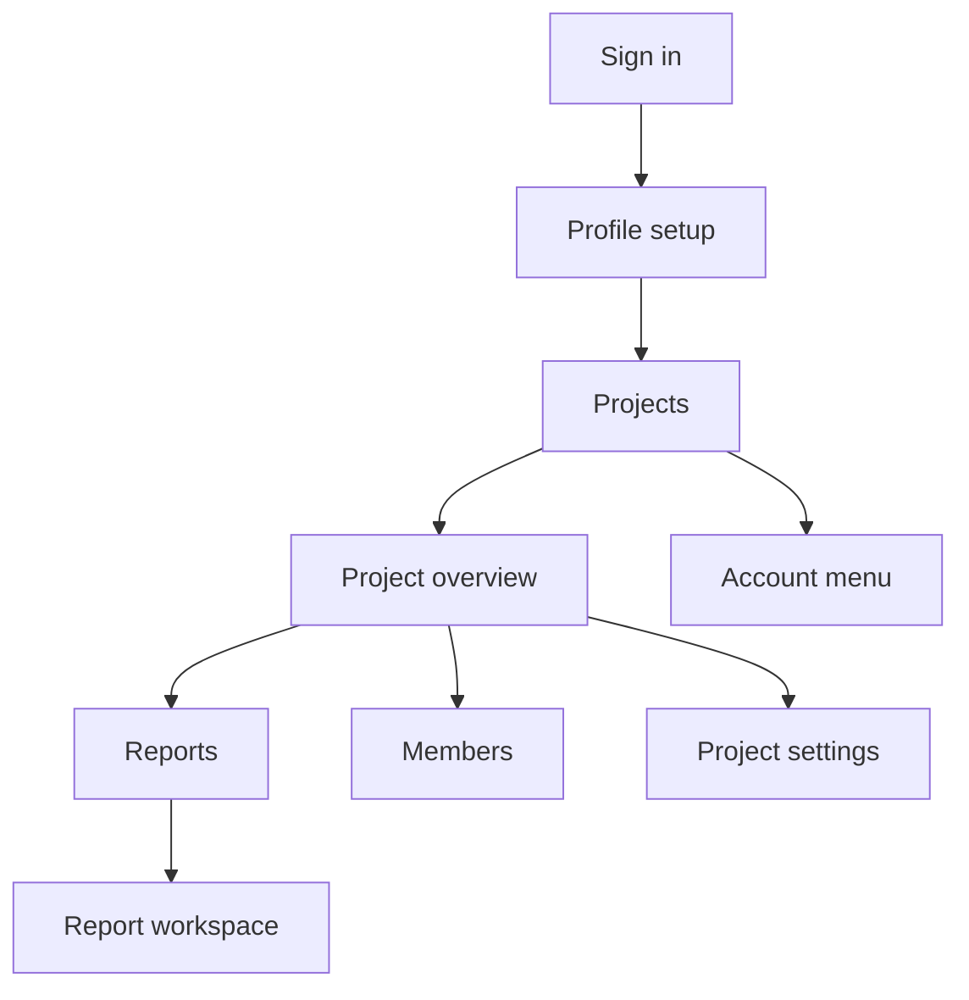

# Design — Office dashboard

Status: **implemented for PR preview and release testing. Production
availability still requires successful checks, merge, and an intentional
production deployment.**

Primary surface: `app.harpapro.com`

Touches: `apps/dashboard`, `packages/api`, `packages/api-contract`,
`packages/report-core`, Cloudflare Pages, and browser authentication.

Companions:
[`arch-auth-and-rls.md`](arch-auth-and-rls.md),
[`arch-project-members.md`](arch-project-members.md),
[`design-p3x-generate-update-finalize.md`](design-p3x-generate-update-finalize.md),
and
[`design-report-review-comments.md`](design-report-review-comments.md).

## 1. Decision summary

Build a separate authenticated office dashboard, not authenticated pages
inside the public Astro site.

The dashboard is a desktop companion to the mobile app:

- Mobile remains the best place to capture site activity with voice, camera,
  gallery, and uploads.
- The dashboard is the best place to manage projects and people, review work,
  edit report text with a physical keyboard, finalize reports, and download
  exports.
- Both clients use the same API, roles, report body, and finalized/draft
  lifecycle. There is no desktop-only report format.

The first release deliberately leaves field-capture features out. They are
not free just because the API exists: each adds browser permissions, upload
recovery, progress/error states, and another end-to-end path. They can be
added when desktop demand is demonstrated.

The implementation includes two backend safety changes:

1. Enforce the intended `owner | editor | viewer` permissions in the API,
   rather than relying on mobile buttons being hidden.
2. Add optimistic concurrency to every operation that can replace or lock a
   report body, so a phone and browser cannot silently overwrite each other.

## 2. Product intent

### Primary user

A project manager, administrator, or report author working from an office,
home, or site trailer after field information has been captured.

### Primary jobs

1. Find a project and understand its report status.
2. Add, remove, or change the role of a project member.
3. Open a draft created on mobile and improve its wording with a keyboard.
4. Review the source notes without changing them.
5. Generate or update the report, resolve any missing content, and finalize it.
6. Open a finalized report, discuss it in Review, and download its PDF.

### Success criteria

- An owner or editor can change report text, leave the page, return, and see
  the saved version.
- Concurrent phone/browser changes never produce an unannounced last-write
  win.
- A viewer cannot mutate projects, reports, notes, or membership through the
  API, even if they bypass the UI.
- Finalized reports remain read-only until an owner or editor explicitly
  reopens them as drafts; only owners can finalize.
- The dashboard can ship without camera, microphone, or browser upload
  permissions.

## 3. Parity model

“One-to-one” means capability and data parity where the task belongs on both
devices. It does not mean copying every mobile screen or native interaction
into a browser.

| Capability                               | Mobile today              | Dashboard MVP           | Decision                                          |
| ---------------------------------------- | ------------------------- | ----------------------- | ------------------------------------------------- |
| Sign in with email code                  | Yes                       | Yes                     | Same account and session model                    |
| List, create, and open projects          | Yes                       | Yes                     | Full parity                                       |
| Edit project details                     | Owner/editor UI           | Yes                     | Full parity                                       |
| Delete a project                         | Owner only                | Owner only              | API and both UIs agree                            |
| List and filter members                  | Yes                       | Yes                     | Full parity                                       |
| Add an existing user by email            | Owner/editor/viewer       | Owner/editor/viewer     | Full parity                                       |
| Change member role                       | Yes                       | Yes                     | Full parity                                       |
| Remove a member                          | Owner UI                  | Yes                     | Preserve last-owner protection                    |
| List and create reports                  | Yes                       | Yes                     | Full parity                                       |
| View source notes                        | Yes                       | Read-only               | Enough for office review in MVP                   |
| Add/edit/delete text notes               | Yes                       | No                      | Defer with all field capture                      |
| Voice, camera, gallery, document capture | Yes                       | No                      | Mobile-first                                      |
| Generate and update a report             | Yes                       | Yes                     | Same API and usage limits                         |
| Edit report text                         | Yes                       | Yes, desktop-enhanced   | Keyboard-first structured editor                  |
| Place photos into report sections        | Yes                       | No                      | Defer specialized placement UI                    |
| Finalize and reopen a report             | Yes                       | Yes                     | Owner finalizes; owner/editor reopens             |
| View/download PDF                        | Yes                       | Yes                     | Browser downloads server-rendered PDF             |
| Review comments                          | Yes                       | Yes                     | Append-only for all current members               |
| Developer/debug surface                  | Dev-only                  | No                      | Not a customer dashboard feature                  |
| Usage/account administration             | Yes                       | Basic account menu only | Add fuller parity later                           |
| Cross-project insights and bulk work     | Roadmap                   | No                      | Separate future feature                           |

The current member endpoint adds a registered user immediately. It does not
create a pending invitation or send an acceptance workflow. The dashboard
must say “Add member,” explain that the person needs a Harpa Pro account, and
must not claim “Invitation sent.” Pending invitations are a separate future
data model.

## 4. Information architecture



Canonical routes:

| Route                                | Purpose                                                   |
| ------------------------------------ | --------------------------------------------------------- |
| `/sign-in`                           | Email and six-digit code flow                             |
| `/onboarding`                        | Required name and optional company setup for new accounts |
| `/projects`                          | All projects and create-project action                    |
| `/projects/:project`                 | Project overview                                          |
| `/projects/:project/reports`         | Paginated reports table                                   |
| `/projects/:project/reports/:number` | Draft editor or finalized viewer                          |
| `/projects/:project/members`         | Team and role management                                  |
| `/projects/:project/settings`        | Project metadata and deletion                             |

The project/report URL shape mirrors the canonical API and mobile long URLs.
Links remain understandable and reloadable without adding a second resource
identifier.

## 5. Application shell

Use a project-focused shell:

- A persistent left rail contains the Harpa Pro wordmark, project switcher,
  `Overview`, `Reports`, `Members`, and `Project settings`.
- The bottom of the rail contains the signed-in user menu and sign out.
- The page header contains the current page title, role/status context, and
  the one primary action for that page.
- Content uses tables for dense management data and cards only for summaries,
  empty states, and report presentation.

On `/projects`, the project rail becomes a simple global rail and no project
is preselected.

After the first successful email-code sign-in, an account without a display
name completes the same profile setup required by mobile before entering the
project shell.

## 6. Page designs

### 6.1 Projects

The landing page is a project table on wide screens and a card list on narrow
screens.

Columns:

- project name;
- client;
- address;
- current user's role;
- last project update.

Primary action: `New project`.

Opening a row goes to the project overview. No cross-project analytics or
activity feed is required. Report counts stay on the single-project overview;
the current project-list endpoint does not return per-project report stats.

### 6.2 Project overview

The overview answers “what needs attention?” without becoming an analytics
product.

It contains:

- project name, client, address, and the current user's role;
- stat cards for total reports, drafts, and latest report;
- a recent-reports table with status and last-updated time;
- a compact team preview with a link to all members;
- `New report` for owners and editors.

Documents, materials, equipment, money, and cross-project insights stay out
until their underlying product features exist.

### 6.3 Reports

The reports page uses a paginated table.

Columns:

- site visit number;
- report title, falling back to `Untitled report`;
- visit date;
- status (`Draft` or `Finalized`);
- `Needs update` when `needsRegeneration` is true;
- last updated;
- row actions allowed by the user's role.

Initial controls are a server-backed status filter and pagination. The API
applies `status=draft|finalized` before cursor pagination. Filtering only the
currently loaded page would be misleading. Title search, arbitrary sorting,
saved views, and bulk actions should wait for server-backed query support.

`New report` creates a draft and opens the report workspace. The user may
either work from mobile-captured notes or start with an empty structured body.

### 6.4 Members

The members page uses a table with:

- name;
- email;
- role;
- joined date;
- actions.

All project members can read the list. Owners can:

- add an existing user by email as owner, editor, or viewer;
- change an existing member's role;
- remove a member.

The last-owner rule is visible before submission and still enforced by the
server. An owner may remove or demote themselves only when another owner
remains.

### 6.5 Project settings

Owners and editors can edit:

- project name;
- client name;
- address.

Only owners see project deletion. The confirmation names the project and
states that its reports and attached project records are removed.

### 6.6 Report workspace

The same route has two explicit states.

#### Draft state

Drafts open in the editing workspace. The header contains:

- `Site Visit #N`;
- a wrapping descriptive title on its own line;
- `Draft` and, when applicable, `Needs update` badges;
- save state: `Saving…`, `Saved`, `Save failed`, or `Changed elsewhere`;
- `Update report`, `Finalize`, and overflow actions.

The wide layout has three regions:

```text
┌────────────────┬─────────────────────────────────┬──────────────────────┐
│ Report sections│ Structured text editor          │ Live report preview  │
│                │                                 │                      │
│ Overview       │ Summary                         │ What the exported     │
│ Weather        │ ┌─────────────────────────────┐ │ report will look like│
│ Workers        │ │ Large keyboard-friendly     │ │                      │
│ Materials      │ │ text area                   │ │                      │
│ Issues         │ └─────────────────────────────┘ │                      │
│ Next steps     │                                 │                      │
│ Other sections │ Source notes drawer / panel     │                      │
└────────────────┴─────────────────────────────────┴──────────────────────┘
```

The editor operates directly on the canonical
`packages/api-contract` `ReportBody`, not a desktop-specific rich-text
document and not a lossy display adapter.

Editable sections:

1. Overview: title, visit date, and summary.
2. Weather: condition, temperature, wind, and impact.
3. Workers: role, count, hours, and notes rows.
4. Materials: name, quantity, unit, status, condition, and notes rows.
5. Issues: title, severity, description, and required action.
6. Next steps: ordered text rows.
7. Other sections: title and body rows.

Users can add and remove repeatable rows. Reordering, Markdown, inline images,
tables inside text fields, and arbitrary rich-text formatting are out of
scope. Attached photos/documents appear as read-only references in the first
release because placement is deferred.

The source-notes panel is read-only. It shows text, transcript/summary, photo
thumbnails, documents, and timestamps. It gives the editor evidence without
introducing another capture/edit workflow.

Autosave waits briefly after typing, shows persistent status, and can be
forced with `Cmd+S` or `Ctrl+S`. Finalize remains disabled while a save is
dirty, pending, failed, or conflicted.

`Update report` uses the current report body as AI context, preserving the
same mobile behavior. If source notes changed while the user was editing, the
UI explains that update will merge those notes into the current draft.

#### Finalized state

Finalized reports are read-only and preserve the approved two-surface model:

- `Report` is always the default.
- `Review` contains the append-only member discussion.

The title remains full-width and wrapping. Actions are:

- download PDF;
- copy report link;
- open source notes read-only;
- reopen as draft for owner/editor;
- delete for owner/editor.

Reopening is an explicit confirmation because Review becomes unavailable
until the report is finalized again. Existing comments remain stored.

## 7. Save and conflict behavior

A full-body `PATCH` without a precondition would be last-write-wins. That is
not safe when a phone and browser can edit the same draft.

The initial implementation adds an `expectedUpdatedAt` precondition to these
report mutations:

- report body `PATCH`;
- generate/regenerate;
- finalize/unfinalize.

The client sends the `updatedAt` value from the report it edited. The SQL
write includes that value in its predicate. A stale request returns `409`
with the current server report.

For generate/regenerate, the comparison happens again in the final body write
after the AI call. Checking only when the route first loads the report would
still allow an edit made during the AI call to be overwritten.

Roll this out additively:

1. The field is optional while currently shipped mobile clients are upgraded.
2. Dashboard and updated mobile clients always send it.
3. After the compatibility window, make it required for body/state mutations.

On `409`, the dashboard:

1. stops autosave and finalize;
2. preserves the user's local draft in session storage;
3. shows `This report changed on another device`;
4. offers `Reload latest` and an explicit, confirmed
   `Overwrite with my draft`;
5. never retries silently.

A full field-by-field merge tool is not required for MVP. The existing
attachment-placement route keeps its `expectedBodyVersion` precondition.
Desktop attachment placement remains deferred.

## 8. Permissions

The API, not the client, is the authorization boundary.

| Operation                                  | Owner | Editor | Viewer |
| ------------------------------------------ | ----: | -----: | -----: |
| Read project, members, reports, notes, PDF |   Yes |    Yes |    Yes |
| Edit project metadata                      |   Yes |    Yes |     No |
| Delete project                             |   Yes |     No |     No |
| Manage membership and roles                |   Yes |     No |     No |
| Create/edit/delete report                  |   Yes |    Yes |     No |
| Generate/regenerate report                 |   Yes |    Yes |     No |
| Finalize report                            |   Yes |     No |     No |
| Reopen report                              |   Yes |    Yes |     No |
| Create a note                              |   Yes |    Yes |     No |
| Edit/delete own note                       |   Yes |    Yes |     No |
| Place report attachments                   |   Yes |    Yes |     No |
| Read/post finalized review comments        |   Yes |    Yes |    Yes |

The implementation adds route-level role checks and matching Postgres
policies for every write row above. The checks replace the former
member-wide policies that allowed viewer mutations.

Required tests include owner, editor, viewer, and non-member cases. Viewer
denials must hit the real route and database scope, not only a disabled
button test.

## 9. Technical architecture

### 9.1 Application boundary

The implementation creates `apps/dashboard` as a React single-page
application deployed separately at `app.harpapro.com`.

Keep:

- `apps/site` as the static public marketing/docs/roadmap site;
- `packages/api` as the only application backend;
- `@harpa/api-contract` as the HTTP source of truth;
- the canonical `ReportBody` as the saved report model.

Reuse pure formatting/domain helpers from `@harpa/report-core` where they are
lossless. Do not try to share React Native components with the browser and do
not create a shared UI package before a second browser product proves it is
useful.

Dashboard environment variables load through a Zod-parsed
`apps/dashboard/src/lib/env.ts` at boot.

### 9.2 Browser auth and API access

Use the browser better-auth client with the existing email OTP flow.

API wiring:

- includes `https://app.harpapro.com`, Cloudflare Pages previews, and local
  dashboard development in better-auth `trustedOrigins`;
- uses a dedicated dashboard CORS allowlist for auth and authenticated API
  routes;
- allows credentials and the required content, authorization, and
  idempotency headers;
- keeps the waitlist CORS policy separate and public-only.

Do not reuse the Expo auth client or SecureStore code in the browser.

### 9.3 Client data

Use TanStack Query and a browser-safe typed client generated from
`@harpa/api-contract`.

Query ownership stays page-oriented:

- global shell owns the session;
- project shell owns current project and members summary;
- list pages own their cursor state;
- report workspace owns report, notes, comments, local draft, autosave, and
  conflict state.

Do not copy the mobile generated hooks if doing so also copies Expo env/auth
dependencies. Share the contract and invalidation rules; keep browser wiring
browser-specific.

### 9.4 API improvements

Included in the editor release:

- role enforcement described in section 8;
- `expectedUpdatedAt` concurrency on report mutations;
- browser auth origins and CORS.

Included with the reports-list page:

- a server-backed `status` query parameter that composes with cursor
  pagination.

Useful but not blocking:

- a lightweight report-list projection without the full `body`;
- a server-backed report title query parameter;
- canonical nested note URLs using `(project, report number)`;
- a signed URL for an existing stored PDF without rendering it again.

Not required for MVP:

- cross-project aggregate endpoints;
- pending member invitations;
- comment edit/delete/resolve/unread state;
- bulk mutation endpoints;
- file inventory and file deletion endpoints.

## 10. Visual and interaction language

The binding values and measurements live in
[the cross-surface visual system](design-cross-surface-visual-system.md).
The mobile app is the visual source of truth; desktop adds room and keyboard
reach, not a separate palette or component grammar. Carry its “warm paper +
navy ink” language into the dashboard:

- warm neutral page background;
- white, bordered cards and table surfaces with 8 px radii;
- navy primary text/actions;
- orange accent for focus and one primary action;
- restrained raised shadows and one-pixel borders;
- 44 px controls, 20–32 px page gutters, and the mobile system type scale.

The report workspace may own its responsive editor/preview grid, but it must
not define a second set of colours, fields, buttons, tabs, or radii.

Do not use the current light-on-orange combination for normal-size body text;
the public-site token documentation already records that it misses WCAG AA.
Use darker orange text on light backgrounds or reserve the vivid fill for
large/bold labels.

Interaction rules:

- every action is keyboard reachable;
- focus remains visible;
- tables have accessible headers and row-action labels;
- destructive actions require named confirmation;
- status is communicated with text, not color alone;
- reduced-motion settings are respected;
- long report titles wrap rather than truncate.

Responsive behavior:

- at `1280px+`, show section navigation, editor, and preview together;
- from `1024px–1279px`, collapse preview behind a toggle;
- below `1024px`, collapse the rail and stack editor/preview while preserving
  all management and editing actions;
- do not recreate mobile camera/voice capture in the responsive web layout.

## 11. Delivery plan

This change covers phases 0 through 4 for a PR release candidate. The
preview is a test surface, not production availability. Production
promotion remains a separate release gate after the PR passes review.

### Phase 0 — contracts and safety

- Enforce the role matrix in routes, services/RLS, and integration tests.
- Add report mutation concurrency and conflict responses.
- Add browser trusted origins, CORS, and a default-wiring auth test.
- Close current mobile parity leaks: member role editing, adding a co-owner,
  and the owner-only project deletion affordance.

Exit gate: viewer mutation tests fail closed and two concurrent editors cannot
silently overwrite each other.

### Phase 1 — read-first dashboard

- Scaffold `apps/dashboard`, validated env, auth, shell, and typed client.
- Ship projects list and project overview.
- Ship reports list with server-backed status filtering and the finalized
  report viewer.
- Ship PDF download and finalized Review comments.
- Ship read-only members and source notes.

Exit gate: an authenticated viewer can navigate and review everything they
should see, but cannot discover a write control.

### Phase 2 — management

- Create/edit/delete projects with role-aware actions.
- Add member, change role, remove member, and handle last-owner conflicts.
- Create/delete reports.
- Add empty, loading, retry, forbidden, and destructive-confirmation states.

Exit gate: owner/editor/viewer Playwright journeys match the API role matrix.

### Phase 3 — keyboard report editing

- Build the canonical structured editor and live preview.
- Add autosave, forced save, failure recovery, and stale-write conflict UI.
- Add generate/regenerate, finalize/reopen, and usage-limit feedback.
- Preserve local draft content across refresh/crash until a server save
  succeeds.

Exit gate: editing, reload persistence, finalize-after-save, and two-browser
conflict journeys pass.

### Phase 4 — release hardening

- Cross-browser coverage for current Chrome, Safari, Firefox, and Edge.
- Keyboard and screen-reader review.
- Performance pass on large reports and long member/report lists.
- PR-preview deployment, Sentry, readiness checks, and rollback notes.
- Update public docs and explain the dashboard preview state on the roadmap.

Production deployment runs only after the change passes its release gates.
Until then, the public roadmap keeps the feature marked as planned.

Field capture, attachment placement, richer comments, bulk work, and insights
remain separately prioritizable follow-ups.

## 12. Verification

### API

- Testcontainers role matrix for every affected project/report/note mutation.
- Positive and negative scope tests for browser-used authenticated routes.
- Stale report update returns `409` plus the latest report.
- Generate/finalize cannot race and clobber a newer body.
- Browser auth/CORS test uses the default better-auth wiring.
- Regenerate still preserves manual edits and note dirty-state semantics.

### Dashboard

- Component tests for tables, forms, role gates, editor sections, save states,
  and conflict banner.
- Contract fixtures for empty, large, partial, draft, finalized, and malformed
  reports.
- Accessibility checks for headings, table semantics, dialogs, focus return,
  and keyboard-only editing.

### Playwright

1. Owner signs in, creates a project, adds an editor, changes a role, and
   removes a member.
2. Mobile-seeded draft opens in the browser, is edited, autosaved, reloaded,
   and finalized.
3. Finalized report opens on `Report`, accepts a Review comment, and downloads
   a PDF.
4. Viewer can read and comment but cannot mutate project/report/note state.
5. Two browser contexts edit one draft; the stale context gets a conflict and
   neither version disappears silently.

Run the smallest focused checks while building each slice. Full browser E2E
and production deployment remain explicit release gates rather than per-file
edit checks.

## 13. Deferred decisions

These defaults are intentional, not missing requirements:

- source notes are read-only on desktop;
- no microphone, camera, gallery, or document upload;
- no attachment placement in the first release;
- no rich text or Markdown report format;
- no pending invitation workflow;
- no comment editing, deletion, threads, mentions, or unread state;
- no bulk operations or cross-project insights;
- no offline/PWA mode.

Revisit them from observed office workflows after the core editor is in use.
